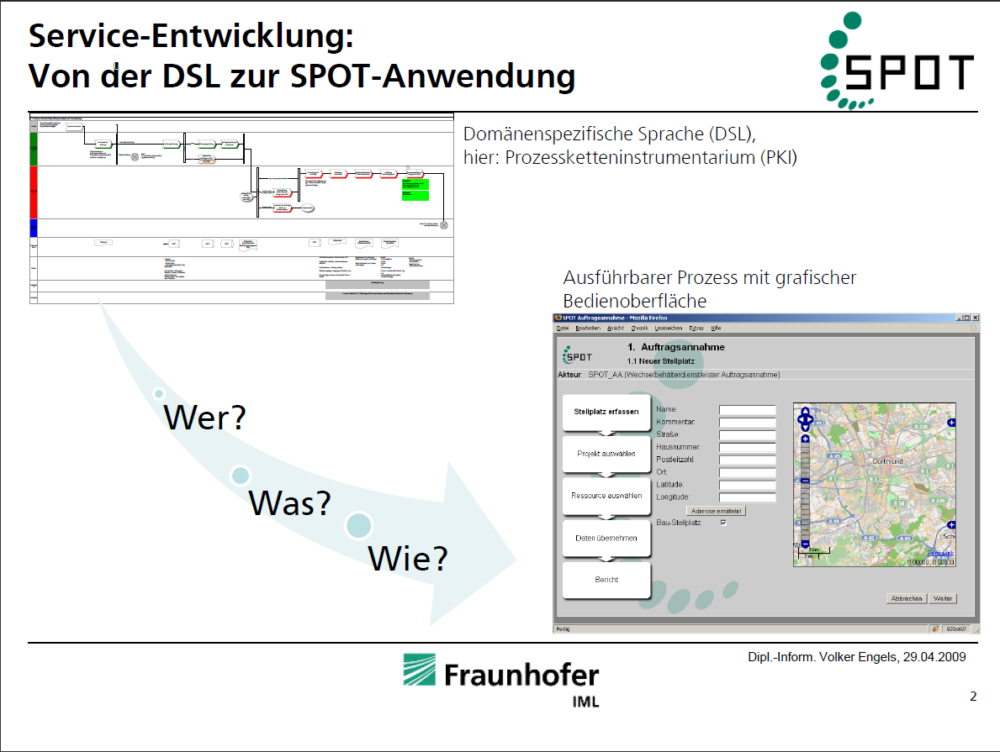
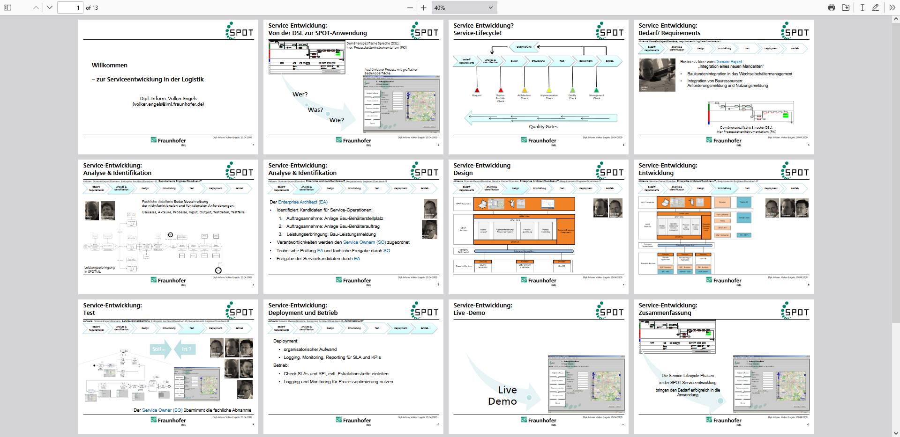
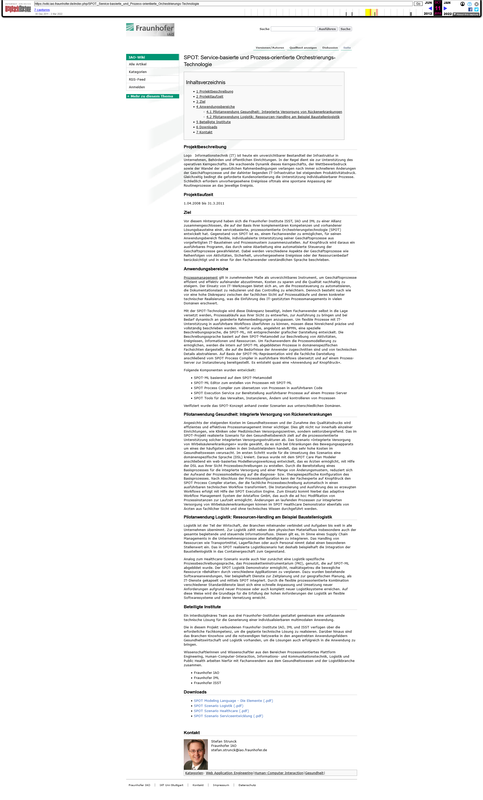
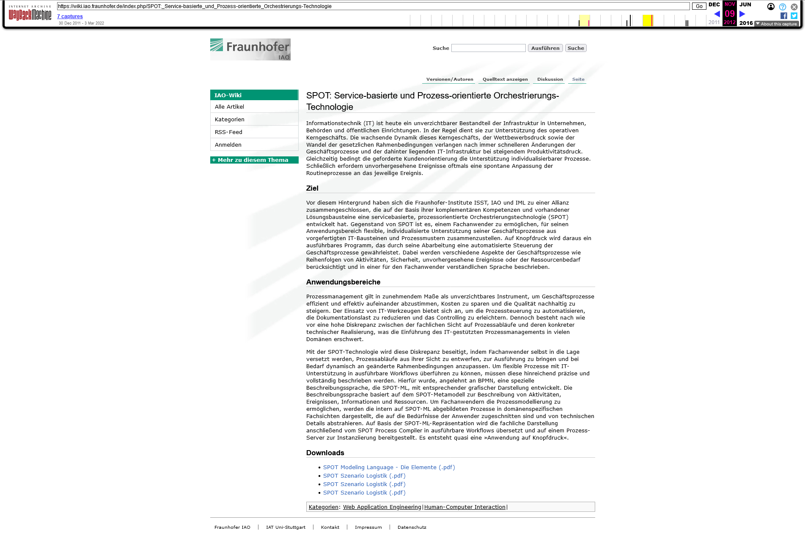

# SPOT Serviceengineering - von der DSL zur Anwendung 

# Links 
- <https://softwareengel.github.io/data/SPOT-Serviceentwicklung.pdf>

Stand 2016 
- <https://web.archive.org/web/20161011201502/https://wiki.iao.fraunhofer.de/index.php/SPOT:_Service-basierte_und_Prozess-orientierte_Orchestrierungs-Technologie>

Stand 2012

- <https://web.archive.org/web/20121109004319/https://wiki.iao.fraunhofer.de/index.php/SPOT:_Service-basierte_und_Prozess-orientierte_Orchestrierungs-Technologie>

