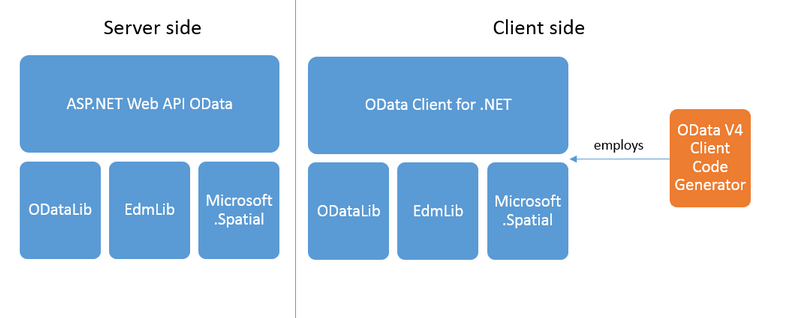

---
layout: post
title: OData in Asp.net core 
categories: [OData]
tags: [Odata, ASP.net core]
---

# OData 
OData (Open Data Protocol) ist ein Protokoll zum Erstellen und Konsumieren von RESTful APIs (Application Programming Interfaces), die Daten auf standardisierte Weise bereitstellen. Es wurde ursprünglich von Microsoft entwickelt und ist nun ein Standard des OASIS (Organization for the Advancement of Structured Information Standards).

OData ermöglicht die Erstellung und Nutzung von Datendiensten, die es Clients ermöglichen, CRUD (Create, Read, Update, Delete)-Operationen auf Daten mithilfe von standardisierten HTTP-Protokollen durchzuführen. Es bietet einen einheitlichen Weg, um Daten aus verschiedenen Quellen wie Datenbanken, Dateisystemen, Content-Management-Systemen und mehr freizugeben und darauf zuzugreifen.

Einige wichtige Funktionen von OData sind:

1. RESTful-Prinzipien: OData folgt den Prinzipien des Representational State Transfer (REST) und verwendet HTTP-Verben und einheitliche Ressourcenidentifikatoren (URIs) für die Datenmanipulation und -navigation.

2. Standardisierte Abfragesprache: OData unterstützt eine standardisierte Abfragesprache namens OData Query Options. Damit können Clients Daten filtern, sortieren, paginieren und formen, die sie aus der API abrufen.

3. Metadatenrepräsentation: OData stellt ein standardisiertes Metadatenformat namens Entity Data Model (EDM) bereit. Die Metadaten beschreiben die Struktur der bereitgestellten Daten, einschließlich Entitätstypen, Eigenschaften, Beziehungen und Operationen.

4. Navigation zwischen Ressourcen: OData unterstützt die Navigation zwischen verwandten Ressourcen, indem vordefinierten Verknüpfungen und Beziehungen gefolgt wird.

5. Formatflexibilität: OData ermöglicht es Clients, Daten in verschiedenen Formaten wie JSON (JavaScript Object Notation) und XML (eXtensible Markup Language) anzufordern.

Insgesamt vereinfacht OData die Entwicklung datengetriebener Anwendungen, indem es einen einheitlichen und standardisierten Weg bietet, um mit Datendiensten zu interagieren. Es fördert die Interoperabilität und ermöglicht die Datenintegration über verschiedene Plattformen und Technologien hinweg.
## OData in Asp.net Core 

- <https://docs.microsoft.com/de-de/odata/>

- <https://www.youtube.com/watch?v=ZCDWUBOJ5FU&feature=youtu.be>

## Overview Odata Lib 
 
- <https://www.odata.org/libraries/> 

## OData Java Apache Olingo

- <http://olingo.apache.org/> 
- <https://olingo.apache.org/doc/odata4/index.html> 
