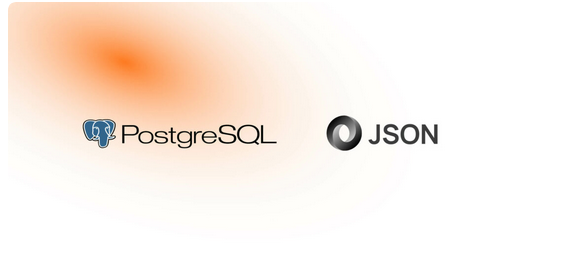

# PostgresSQL JSON ab Version 9.2 als JSON-Datenbank 

* <http://www.postgresqltutorial.com/postgresql-json/>

* <https://blog.codeship.com/unleash-the-power-of-storing-json-in-postgres/>

* <https://stackoverflow.com/questions/39835304/insert-json-string-into-postgres-and-return-field> 

* <https://clarkdave.net/2013/06/what-can-you-do-with-postgresql-and-json/>

How to use the JSON Datatype in PostgreSQL: A Brief Manual

* <https://datavirtuality.de/blog-json-datenformat-in-postgresql-verwenden/>

* <https://www.enterprisedb.com/de/blog/crud-json-postgresql>

* <https://www.postgresql.org/docs/9.6/datatype-json.html>

# Create an advanced search engine with PostgreSQL (2023)

<https://xata.io/blog/postgres-full-text-search-engine>

# Postgres vs. MySQL: A Complete Comparison in 2023 

<https://www.bytebase.com/blog/postgres-vs-mysql/>