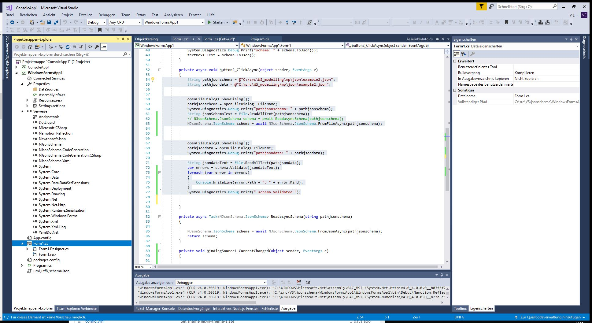
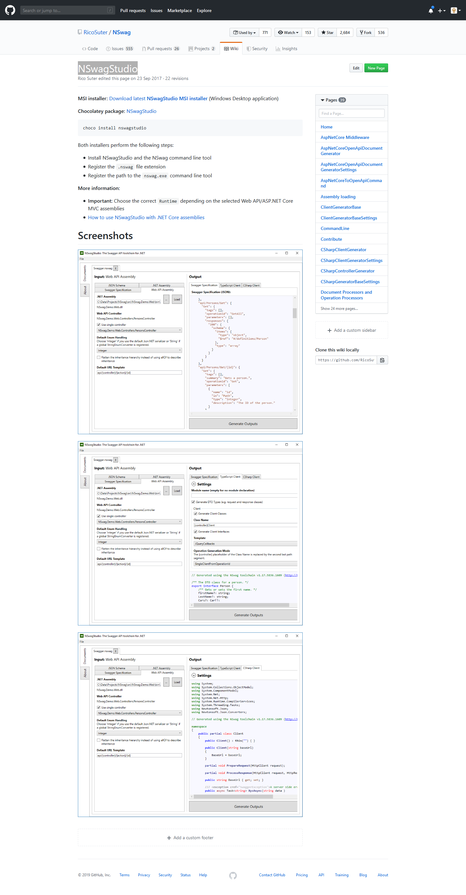
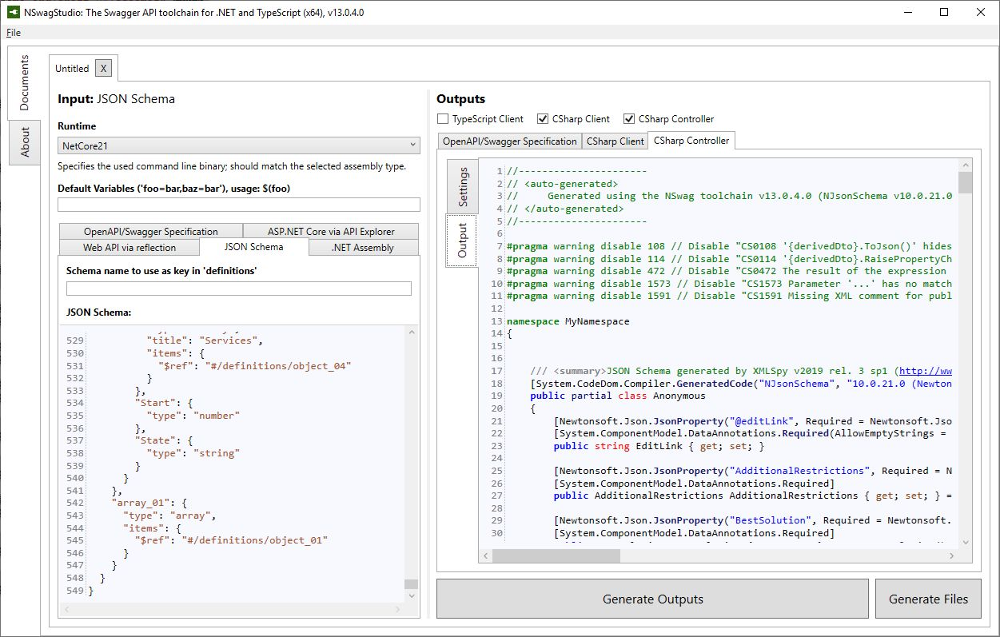

## dotnet Tool NJsonSchema
(https://github.com/RicoSuter/NJsonSchema)

Tool zum erstellen von JsonSchema aus JsonData 

'''

    String pathjsonschema = @"C:\src\WS_modelling\mp\json\example2.json";
    String pathjsondata = @"C:\src\WS_modelling\mp\json\example2.json";

    openFileDialog1.ShowDialog();
    pathjsonschema = openFileDialog1.FileName;
    System.Diagnostics.Debug.Print("pathjsonschema: " + pathjsonschema);
    String jsonSchemaText = File.ReadAllText(pathjsonschema);
    // NJsonSchema.JsonSchema schema = await ReadasyncSchema(pathjsonschema);
    NJsonSchema.JsonSchema schema = await NJsonSchema.JsonSchema.FromFileAsync(pathjsonschema);

    openFileDialog1.ShowDialog();
    pathjsondata = openFileDialog1.FileName;
    System.Diagnostics.Debug.Print("pathjsondata: " + pathjsondata);

    String jsondataText = File.ReadAllText(pathjsondata);
    var errors = schema.Validate(jsondataText);
    foreach (var error in errors)
    {
        Console.WriteLine(error.Path + ": " + error.Kind);
    }
    System.Diagnostics.Debug.Print(" schema.Validated ");
'''

## dotnet Tool NSwagStudio 

https://github.com/RicoSuter/NSwag/wiki/NSwagStudio 

Screenshot from web:

Screenshot from usage:

