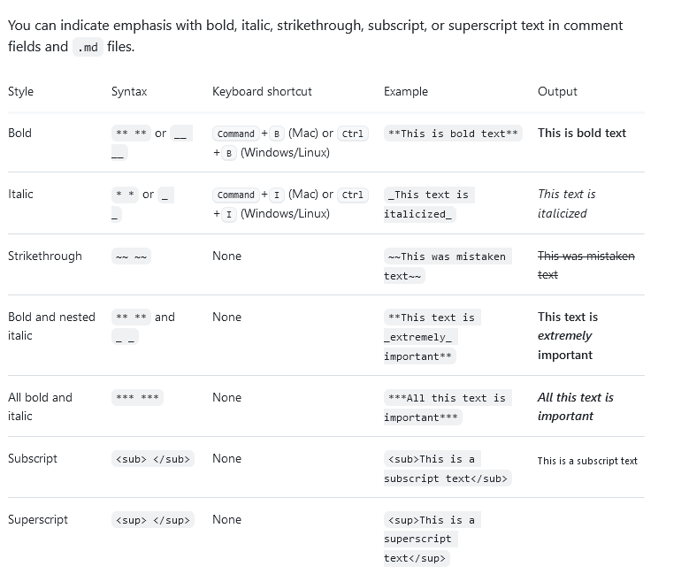

---
layout: post
title: Markdown Blog Tag Hints 
categories: [JSON]
tags: [JSON, Schema, dotnet]
---

# Markdown Blog Tag Hints 
Hinweise für Markdown Tags

- <https://guides.github.com/features/mastering-markdown/>

- <https://docs.microsoft.com/de-de/contribute/how-to-write-use-markdown>

- <https://marketplace.visualstudio.com/items?itemName=njLeonZhang.markdown-image-paste>

## Markdown CheatSheet

<https://github.com/adam-p/markdown-here/wiki/Markdown-Cheatsheet> 

# Beispiel 

## Quellcode (Javascript Beispiel)

```javascript
if (isAwesome){
  return true
}
```

## Markierter Text 

    Beispiel code / Markierter Text durch Einrückung mit <Tab>

    zweite Zeile 

    
## Visual Studio Code als Blog editor 


Bild einfügen 

[Reference to Markdown Pic](../pic/2019-07-17-md.png)


Bild inline:


