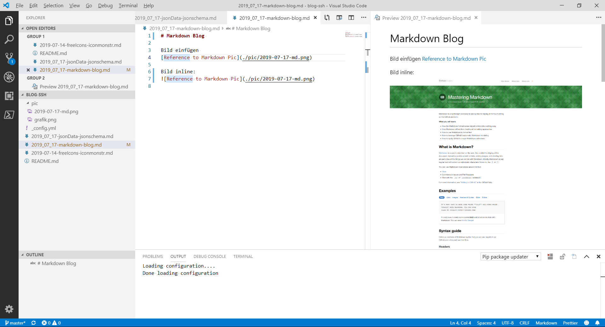
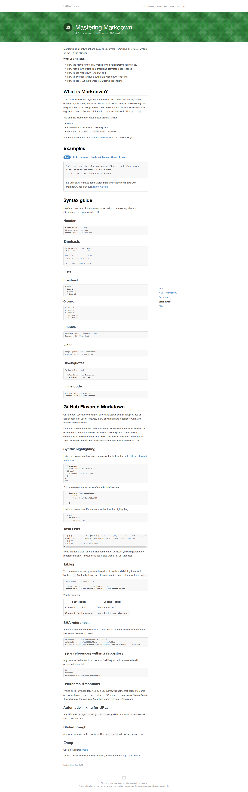

# Markdown Blog 
Hinweise für Markdown Tags:
https://guides.github.com/features/mastering-markdown/

https://docs.microsoft.com/de-de/contribute/how-to-write-use-markdown

https://marketplace.visualstudio.com/items?itemName=njLeonZhang.markdown-image-paste 


# Beispiel 

## Quellcode 

```javascript
if (isAwesome){
  return true
}
```

## Markierter TExt 

    Beispiel code / Markierter TExt durch Einrückung mit <Tab>

    zweite Zeile 


## Visual Studio Code als Blog editor 



Bild einfügen 
[Reference to Markdown Pic](./pic/2019-07-17-md.png)


Bild inline:



