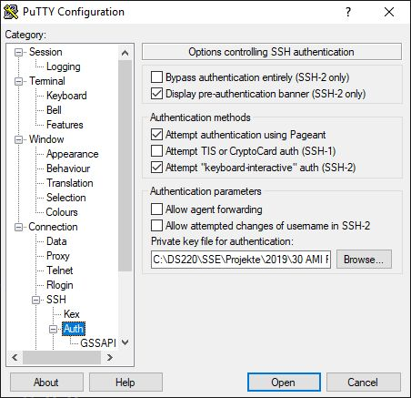
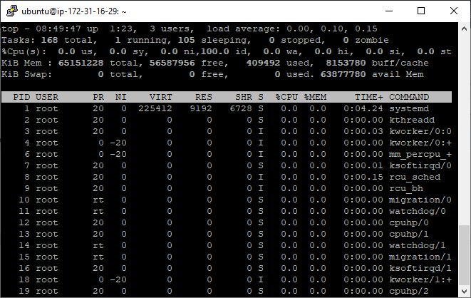

# ec2 ami mit barefoot 

# launch ec2-instance - use ubuntu 18 

# connect with putty 

# install docker 
    sudo apt-get update 
    sudo apt-get install docker.io

# clone barefoot 

    git clone <https://github.com/bmwcarit/barefoot.git> 

# Java 

    sudo apt-get install openjdk-8-jdk-headless

# build docker image 

    cd barefoot
    sudo docker build -t barefoot-map ./map

    sudo docker run -it -p 5432:5432 --name="barefoot-oberbayern" -v ${PWD}/map/:/mnt/map barefoot-map

    sudo docker run -it -p 5432:5432 --name="barefoot-europe" -v ${PWD}/map/:/mnt/map barefoot-map

# mc

    sudo apt-get install mc

# docker 
    sudo docker ls -a 
    sudo docker start barefoot-oberbayern
    sudo docker stop barefoot-oberbayern
    sudo docker attach barefoot-oberbayern

    sudo docker start barefoot-europe

Escape Docker shell: 

    crtl-p ctrl-q

# psql

    sudo -u postgres psql
    sudo -u postgres psql -d <database>
    sudo -u postgres psql -d barefoot-oberbayern
    
    SHOW hba_file;

    /etc/postgresql/9.3/main/pg_hba.conf

sudo /etc/init.d/postgresql stop

# OSM 2 pgSQL in docker container 
    bash /mnt/map/osm/import.sh
    bash /mnt/map/osm/import-rail.sh

# Putty remote port tunnel 

# use tunnel in PGAdmin 

# config europe.properies

    database.host=localhost
    database.port=5432
    database.name=europe
    database.table=bfmap_ways
    database.user=osmuser
    database.password=pass
    database.road-types=./map/tools/rail-types.json

# run barefoot Matcher server 

    mvn package -DskipTests

    java -jar target/barefoot-0.1.5-matcher-jar-with-dependencies.jar  --geojson config/server.properties config/europe.properties

# test client 

    python util/submit/batch.py --host localhost --port 1234  --file src/test/resources/com/bmwcarit/barefoot/matcher/x0001-015.json

## Log test client 

    ubuntu@ip-172-31-18-42:~/barefoot$ python util/submit/batch.py --host localhost --port 1234  --file src/test/resources/com/bmwcarit/barefoot/matcher/x0001-015.json
    SUCCESS
    {"coordinates":[[[11.53410550143942,48.143154561260104],[11.5336485,48.1432696],[11.5335069,48.1433052],[11.532958,48.14339],[11.5324413,48.1434805],[11.532382,48.1434909],[11.5319097,48.1435416],[11.5315781,48.14355],[11.5311887,48.1435473],[11.5316886,48.1433964],[11.5318341,48.1433524],[11.5321238,48.1432854],[11.5332802,48.143051],[11.533716,48.1429622],[11.5341119,48.1429086],[11.5345922,48.142850200000005]],[[11.5345922,48.1428502],[11.5345922,48.1428502],[11.5341119,48.1429086],[11.533716,48.1429622],[11.5332802,48.143051],[11.5321238,48.1432854],[11.5318341,48.1433524],[11.5316795,48.1433788],[11.5310817,48.1434807],[11.5304286,48.1435332],[11.5298268,48.1435314],[11.529056,48.1434689],[11.528717,48.1434206],[11.5282687,48.1433985],[11.5277039,48.1433766],[11.5270204,48.1433768],[11.5262919,48.1434189],[11.5223955,48.1437004],[11.5217175,48.1437296],[11.5212355,48.1437562],[11.5208756,48.1437624],[11.5202116,48.143779],[11.5199591,48.1437819],[11.5193818,48.1437988],[11.5185249,48.1438236],[11.5164878,48.1439247],[11.515117,48.1440119],[11.514617,48.144044],[11.5140131,48.1440759],[11.5137098,48.1440959],[11.5132112,48.1441295],[11.5122912,48.1441859],[11.5127741,48.1441198],[11.5139713,48.1438311],[11.5142148,48.1437761],[11.5145367,48.1436721],[11.5148339,48.1435518],[11.5168308,48.142897],[11.5172688,48.1427569],[11.5177573,48.1425669],[11.5180494,48.1424297],[11.5186373,48.1421008],[11.5191,48.1418128],[11.5193414,48.1416486],[11.5196861,48.1413724],[11.5200857,48.1410937],[11.5202063,48.141004],[11.5205727,48.1407348],[11.5215124,48.1400545],[11.5233155,48.1387486],[11.5261654,48.1366216],[11.5263994,48.1364448],[11.5272273,48.1357599],[11.5273874,48.1356326],[11.5275574,48.1355032],[11.5279131,48.1352451],[11.5282798,48.1349913],[11.5289907,48.1345026],[11.5296961,48.134014],[11.5310646,48.1330671],[11.5312674,48.1329277],[11.5318109,48.1325567],[11.532076306400837,48.13237445836797]],[[11.532076306400839,48.13237445836796],[11.5318109,48.1325567],[11.5312674,48.1329277],[11.5310646,48.1330671],[11.5296961,48.134014],[11.5289907,48.1345026],[11.5282798,48.1349913],[11.5279131,48.1352451],[11.5275574,48.1355032],[11.5273874,48.1356326],[11.5272273,48.1357599],[11.5263994,48.1364448],[11.5261654,48.1366216],[11.5233155,48.1387486],[11.5215124,48.1400545],[11.5205727,48.1407348],[11.5202063,48.141004],[11.5200857,48.1410937],[11.5197279,48.1413009],[11.5196052,48.1413802],[11.519123,48.1416491],[11.5186207,48.141919],[11.5177091,48.1424007],[11.5174392,48.1425163],[11.5173049,48.1425656],[11.517146,48.1426204],[11.5169448,48.1426763],[11.5166894,48.1427393],[11.5164763,48.1427825],[11.5162367,48.1428159],[11.515988,48.1428431],[11.5157226,48.1428587],[11.5145636,48.1428864],[11.5133365,48.1429153],[11.5126105,48.1429518],[11.5120968,48.1429994],[11.510769,48.143136],[11.5050039,48.1437624],[11.5030023,48.1439769],[11.5023143,48.1440546],[11.4980364,48.1445054],[11.4967078,48.1446514],[11.4953566,48.1447822],[11.4940017,48.1449182],[11.4933285,48.1449909],[11.492659,48.1450782],[11.4913943,48.1452735],[11.4908917,48.1453437],[11.4903374,48.1454047],[11.4895567,48.1454571],[11.4882129,48.1455301],[11.4863136,48.1456594],[11.4844178,48.1458043],[11.4839911,48.1458359],[11.480708,48.1460789],[11.4783089,48.1462541],[11.4753237,48.1464826],[11.4734036,48.1466254],[11.4724426,48.1466936],[11.4719609,48.1467386],[11.4714925,48.1467929],[11.470955,48.1468755],[11.4704332,48.1469739],[11.4700374,48.1470628],[11.4695733,48.1471855],[11.4687535,48.1474411],[11.4681758,48.1476225],[11.4664475,48.1481843],[11.4647048,48.1487463],[11.4639976,48.1489562],[11.4635169,48.149094],[11.4624013,48.1494142],[11.4614502,48.1497025],[11.4608258,48.1498835],[11.4605698,48.1499639],[11.4603139,48.1500622],[11.4600494,48.1501747],[11.4596651,48.1503177],[11.4595477,48.1503577],[11.4588249,48.1506131],[11.4584023,48.1507666],[11.4576255,48.1510335],[11.4573509,48.1511244],[11.4566857,48.1513261],[11.4566633,48.1513317],[11.4562873,48.151425],[11.4559007,48.1515074],[11.4551815,48.1516373],[11.4546608,48.1517042],[11.4542677,48.1517407],[11.4538642,48.1517696],[11.4534388,48.1517845],[11.4529359,48.1517872],[11.4525999,48.1517796],[11.4521464,48.1517477],[11.4514097,48.151681],[11.4506611,48.1515618],[11.4500834,48.1514399],[11.4491605,48.1512268],[11.4482595,48.151],[11.4478804,48.1508882],[11.4475008,48.1507701],[11.4472675,48.15069],[11.4470276,48.1506076],[11.4467545,48.1504982],[11.4464886,48.1503831],[11.4459224,48.1501314],[11.4455113,48.1499131],[11.4451845,48.1497188],[11.4450027,48.1496107],[11.4447124,48.14942],[11.4444344,48.1492226],[11.4443857,48.1491845],[11.4442581,48.1490847],[11.4441291,48.1489808],[11.4440973,48.1489552],[11.4439438,48.1488224],[11.4437992,48.1486904],[11.4436585,48.1485604],[11.4435274,48.1484286],[11.4433705,48.148263],[11.4432218,48.1480918],[11.4431019,48.1479436],[11.4429699,48.1477734],[11.4428442,48.147601],[11.4428138,48.1475563],[11.4426428,48.1472986],[11.4424565,48.1469976],[11.441673,48.1457217],[11.4415334,48.1454932],[11.4409191,48.1445032],[11.4390101,48.1413835],[11.4375252,48.1389567],[11.4364356,48.137176],[11.4328512,48.1313176],[11.4322847,48.1303831],[11.4317372,48.1294859],[11.4316207,48.1292952],[11.431518258305868,48.129128831186776]]],"type":"MultiLineString"}

## Log matcher start 

    ubuntu@ip-172-31-18-42:~/barefoot$ java -jar target/barefoot-0.1.5-matcher-jar-w                                                                                                                                                             ith-dependencies.jar  --jeojson config/server.properties config/europe.propertie                                                                                                                                                             s
    2019-07-26 10:56:52,123 WARN  [main] ServerControl: invalid option --jeojson ign                                                                                                                                                             ored
    2019-07-26 10:56:52,125 INFO  [main] ServerControl: initialize server
    2019-07-26 10:56:52,125 INFO  [main] ServerControl: read database properties fro                                                                                                                                                             m file config/europe.properties
    2019-07-26 10:56:52,127 INFO  [main] Loader: load map from database europe
    2019-07-26 10:56:52,127 INFO  [main] Loader: open road reader for database europ                                                                                                                                                             e at localhost:5432
    2019-07-26 10:56:52,127 INFO  [main] Loader: database.host=localhost
    2019-07-26 10:56:52,127 INFO  [main] Loader: database.port=5432
    2019-07-26 10:56:52,127 INFO  [main] Loader: database.name=europe
    2019-07-26 10:56:52,127 INFO  [main] Loader: database.table=bfmap_ways
    2019-07-26 10:56:52,127 INFO  [main] Loader: database.user=osmuser
    2019-07-26 10:56:52,127 INFO  [main] Loader: database.road-types=./map/tools/rai                                                                                                                                                             l-types.json
    2019-07-26 10:56:52,141 INFO  [main] PostGISReader: open reader (standard)
    2019-07-26 10:56:52,141 INFO  [main] PostGISReader: open reader (parameterized)
    2019-07-26 10:56:52,194 INFO  [main] RoadMap: inserting roads ...
    2019-07-26 10:56:52,194 INFO  [main] PostGISReader: execute query
    2019-07-26 10:56:53,924 INFO  [main] RoadMap: inserted 100000 (197727) roads
    2019-07-26 10:56:55,385 INFO  [main] RoadMap: inserted 200000 (395561) roads
    2019-07-26 10:56:56,837 INFO  [main] RoadMap: inserted 300000 (593290) roads
    2019-07-26 10:56:58,329 INFO  [main] RoadMap: inserted 400000 (790981) roads
    2019-07-26 10:56:59,644 INFO  [main] RoadMap: inserted 500000 (988771) roads
    2019-07-26 10:57:01,170 INFO  [main] RoadMap: inserted 600000 (1186552) roads
    2019-07-26 10:57:02,498 INFO  [main] RoadMap: inserted 700000 (1384266) roads
    2019-07-26 10:57:03,835 INFO  [main] RoadMap: inserted 800000 (1582014) roads
    2019-07-26 10:57:05,139 INFO  [main] RoadMap: inserted 900000 (1779659) roads
    2019-07-26 10:57:06,612 INFO  [main] RoadMap: inserted 1000000 (1977251) roads
    2019-07-26 10:57:07,877 INFO  [main] RoadMap: inserted 1100000 (2174960) roads
    2019-07-26 10:57:09,114 INFO  [main] RoadMap: inserted 1200000 (2372629) roads
    2019-07-26 10:57:10,390 INFO  [main] RoadMap: inserted 1300000 (2570414) roads
    2019-07-26 10:57:11,705 INFO  [main] RoadMap: inserted 1400000 (2768172) roads
    2019-07-26 10:57:13,204 INFO  [main] RoadMap: inserted 1500000 (2965900) roads
    2019-07-26 10:57:13,398 INFO  [main] RoadMap: inserted 1515438 (2996424) roads a                                                                                                                                                             nd finished
    2019-07-26 10:57:13,398 INFO  [main] PostGISReader: close reader
    2019-07-26 10:57:13,672 INFO  [main] RoadMap: ~601 megabytes used for road data                                                                                                                                                              (estimate)
    2019-07-26 10:57:24,639 INFO  [main] RoadMap: index and topology constructing ..                                                                                                                                                             .
    2019-07-26 10:57:30,253 INFO  [main] RoadMap: index and topology constructed
    2019-07-26 10:57:30,664 INFO  [main] RoadMap: ~248 megabytes used for spatial index (estimate)
    2019-07-26 10:57:30,664 INFO  [main] ServerControl: read tracker properties from file config/server.properties
    2019-07-26 10:57:30,674 INFO  [main] MatcherServer: matcher.radius.max=200.0
    2019-07-26 10:57:30,675 INFO  [main] MatcherServer: matcher.distance.max=15000.0
    2019-07-26 10:57:30,675 INFO  [main] MatcherServer: matcher.lambda=0.0
    2019-07-26 10:57:30,675 INFO  [main] MatcherServer: matcher.sigma=10.0
    2019-07-26 10:57:30,675 INFO  [main] MatcherServer: matcher.threads=8
    2019-07-26 10:57:30,675 INFO  [main] MatcherServer: matcher.shortenturns=true
    2019-07-26 10:57:30,675 INFO  [main] MatcherServer: matcher.interval.min=1000
    2019-07-26 10:57:30,675 INFO  [main] MatcherServer: matcher.distance.min=0.0
    2019-07-26 10:57:30,675 INFO  [main] AbstractServer: server.port=1234
    2019-07-26 10:57:30,675 INFO  [main] AbstractServer: server.timeout.request=15000
    2019-07-26 10:57:30,675 INFO  [main] AbstractServer: server.timeout.response=60000
    2019-07-26 10:57:30,675 INFO  [main] AbstractServer: server.connections=20
    2019-07-26 10:57:30,675 INFO  [main] ServerControl: starting server on port 1234 with map europe
    2019-07-26 10:57:30,676 INFO  [main] AbstractServer: listening on port 1234 ...

# start tracker server 

    sudo apt-get install maven
    sudo apt-get install openjdk-1.7-jdk
    sudo apt-get install libzmq3-dev
    sudo apt-get install nodejs
    sudo apt-get install npm

    cd util/monitor && npm install && cd ../..

    node util/monitor/monitor.js 3000 127.0.0.1 1235

    java -jar target/barefoot-0.1.5-tracker-jar-with-dependencies.jar config/tracker.properties  config/europe.properties

# History 

    ubuntu@ip-172-31-16-29:~$ history
        1  sudo docker ps -a
        2  sudo docker attach barefoot-oberbayern
        3  exit
        4  sudo apt install docker.io
        5  sudo apt-get update
        6  sudo apt-get install docker.io
        7  sudo apt-get install openjdk-8-jdk-headles
        8  sudo docker build -t barefoot-map ./map
        9  sudo docker run -it -p 5432:5432sudo docker run -it -p 5432:5432 --name="                                                                                                                                                             barefoot-oberbayern" -v ${PWD}/map/:/mnt/map barefoot-map
    10  sudo docker run -it -p 5432:5432 --name="barefoot-oberbayern" -v ${PWD}/m                                                                                                                                                             ap/:/mnt/map barefoot-map
    11  sudo apt-get install mc
    12  sudo mc
    13  sudo psql
    14  sudo pgsql
    15  psql
    16  sudo docker attach barefoot-oberbayern
    17  exit
    18  sudo apt-get install mc
    19  psql
    20  top
    21  exit
    22  mc
    23  sudo mc
    24  history

# startups 

    node util/monitor/monitor.js 3000 127.0.0.1 1235
    
    java -jar target/barefoot-0.1.5-matcher-jar-with-dependencies.jar  --geojson config/server.properties config/europe.properties

    

