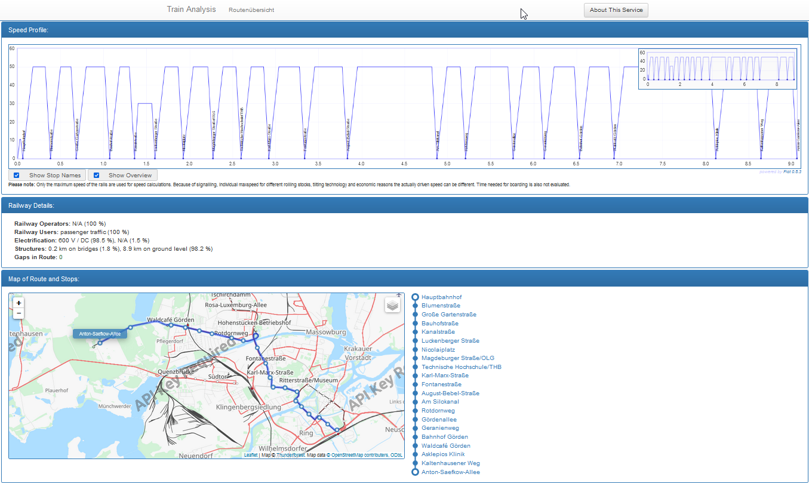
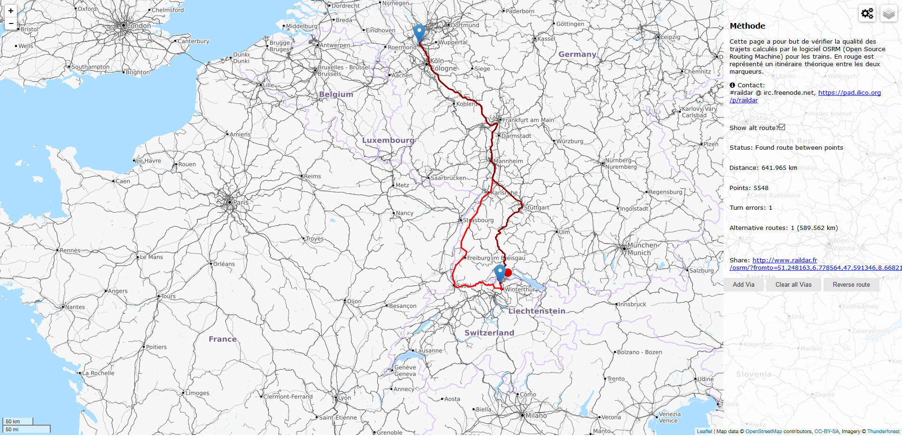
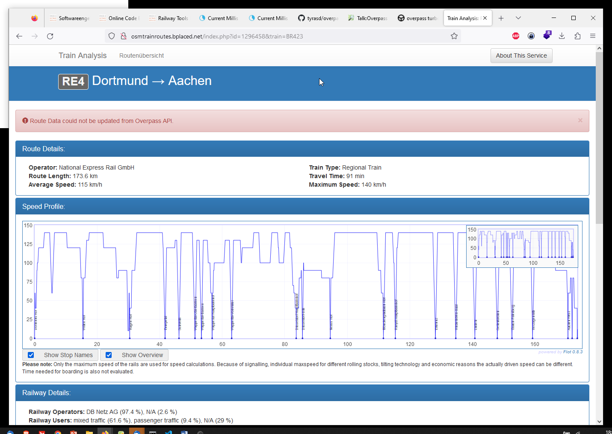

---
layout: post
title: OSM Rail Tools & Links
categories: [OSM]
tags: [OSM , Rail]
--- 

# OSM Rail Tools & Links

## Raildar.fr

<http://www.raildar.fr/osrm/?fromto=48.801210,9.218044,48.690734,9.193153#7/48.622/7.526>

## michreichert.de

<http://michreichert.de/projects/trade-fair-bookmark-collection/bookmarks.html>

## http://osmtrainroutes.bplaced.net - Zuganalyse 

RE4 Dortmund -> Aachen

## Osrm OSM Routing 

## OSM Overpass Api & Tool

<https://github.com/tyrasd/overpass-turbo>
<https://wiki.openstreetmap.org/wiki/Talk:Overpass_turbo>
<http://overpass-turbo.eu/>

