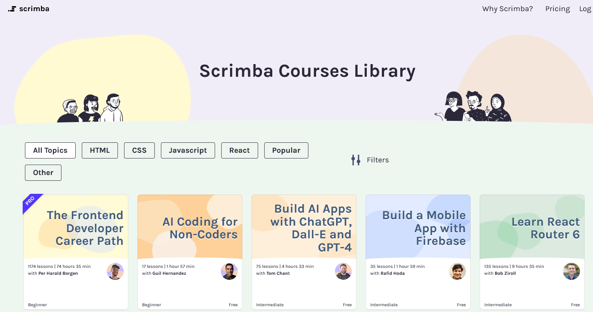

# Web Dev Screen Casts

vue , React, JS, HTML, CSS, Bootstrap, TS 

<https://scrimba.com/>

Bootstrap 4 course <https://scrimba.com/p/pD5KUE/cnbpRU9> 

## React

- React.js Examples 

<https://reactjsexample.com/tag/table/>

<https://revolist.github.io/revogrid/guide/framework.react.overview.html>

## React Datatable Component 

<https://github.com/jbetancur/react-data-table-component#readme>

## Bootstrap 

Examples 

<https://getbootstrap.com/docs/5.0/examples/>

## Vue.js

Tables

<https://vuejsexamples.com/tag/table/>

## JS Grid / Table 

### Revogrid (I am support all famous frameworKs and much more) 
Frameworks:    JavaScript;    VueJs;    Svelte;    React;    Angular;    Ember.

<https://revolist.github.io/revogrid/> 
<https://github.com/revolist/revogrid>

### Grid JS 

<https://github.com/grid-js/gridjs>
