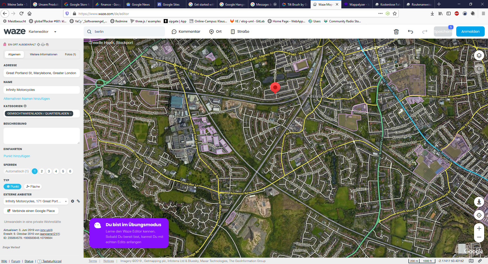
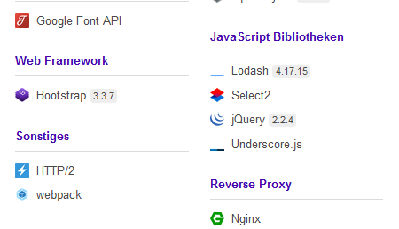
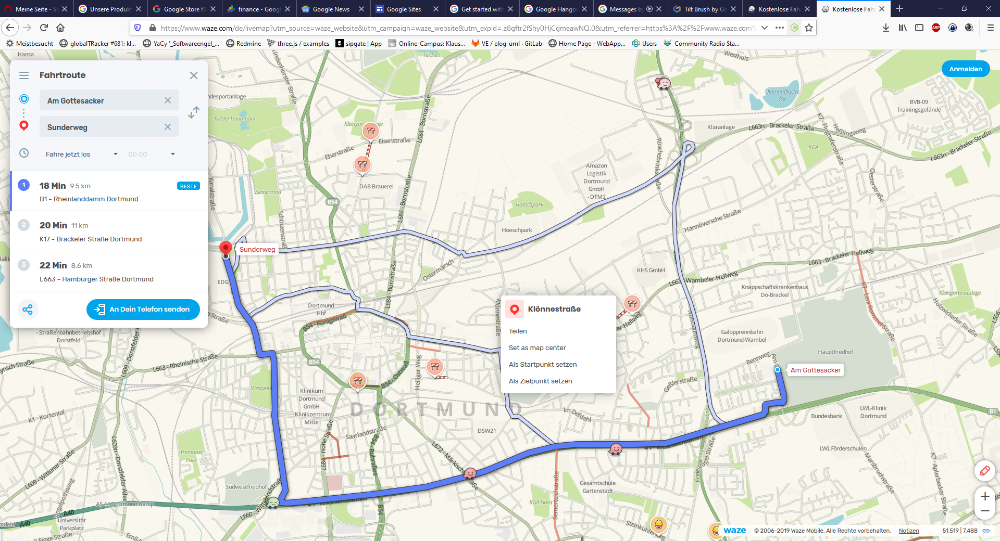
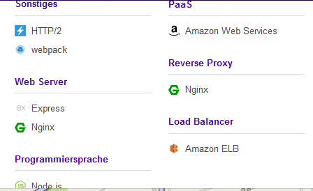

#

# Google Waze Web Editor JS Toolsset

https://www.waze.com/de/editor 

## JS Toolset

### Statistiken
Google Analytics

### JavaScript Framework
Backbone.js1.3.3

Socket.io0.9.17

Schrift Script

Google Font API

### Web Framework

Bootstrap3.3.7

### Sonstiges

HTTP/2

webpack

### Web Server

Nginx

### Programmiersprache

Node.js

### CDN
Google Cloud

### Map
OpenLayers2.13.1

### JavaScript Bibliotheken
Lodash4.17.15

Select2

jQuery2.2.4

Underscore.js

### Reverse Proxy
Nginx

# Goole Waze map 

## Und die Js - Toolchain 

### Als TExt 

Statistiken
Google Analytics
Captcha
reCAPTCHA
Web Framework
Express
Sonstiges
HTTP/2
webpack
Web Server
Express
Nginx
Programmiersprache
Node.js
CDN
Google Cloud
Map
Leaflet1.5.1+build.2e3e0ffb
Schlagwort Manager
Google Tag Manager
PaaS
Amazon Web Services
Reverse Proxy
Nginx
Load Balancer
Amazon ELB

