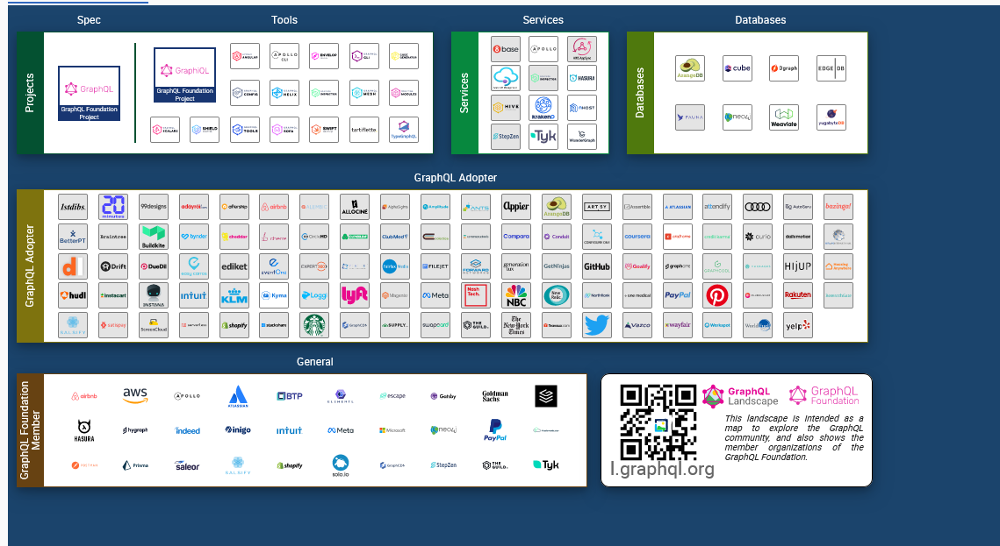
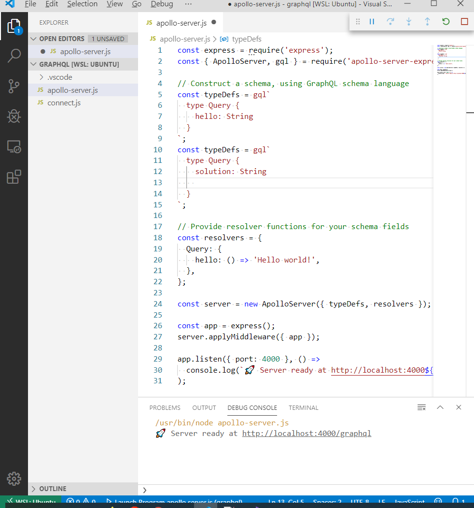

# GraphQL - Hack - Neo4J - Node Server - JS Client 

GraphQL SPEC 
- <http://spec.graphql.org/> 
- <http://spec.graphql.org/June2018/>
- <https://graphql.org/>

<https://landscape.graphql.org/>

<https://graphql.org/learn/queries/> 

<https://graphql.org/graphql-js/mutations-and-input-types/> 

https://www.youtube.com/watch?v=etax3aEe2dA

https://www.youtube.com/watch?v=zVNrqo9XGOs


# Use GraphQL by API Tools GraphiQL


GraphiQL    <https://lucasconstantino.github.io/graphiql-online/> 


GraphQL Playground <https://www.graphqlbin.com/>


## Simple GraphQL - Client and Server Apollo JS 

used by airbnb, cnbc

<https://github.com/apollographql/graphql-tools> 

<https://github.com/apollographql/apollo-server/> 

<https://www.apollographql.com/platform>

<https://www.apollographql.com/docs/apollo-server/> 

<https://www.apollographql.com/docs/tutorial/data-source/> (Add SqLite Data Source)





## Relay GraphQL Client used by FB, Github

https://www.youtube.com/watch?v=9sc8Pyc51uU 


# Neo4J

<https://neo4j.com/developer/docker-run-neo4j/>

```bash
    docker run \
        --name testneo4j \
        -p7474:7474 -p7687:7687 \
        -d \
        -v $HOME/neo4j/data:/data \
        -v $HOME/neo4j/logs:/logs \
        -v $HOME/neo4j/import:/var/lib/neo4j/import \
        -v $HOME/neo4j/plugins:/plugins \
        --env NEO4J_AUTH=neo4j/test \
        neo4j:latest
```

```bash 
    curl http://localhost:7474/db/data/
```
<http://localhost:7474/webadmin/>

<http://localhost:7474/db/data/relationship/0>

