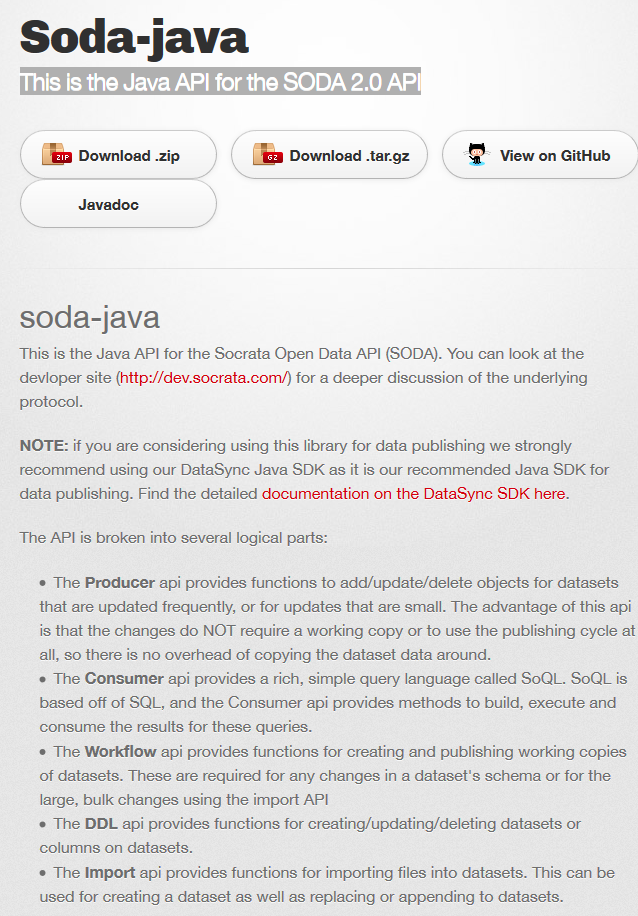

# Socrata Open Data API (SODA)

https://dev.socrata.com/ 

https://stackoverflow.com/search?tab=newest&q=soda%20OR%20socrata (14 Results)

https://dev.socrata.com/changelog/ (last update 29.11.2016)

http://socrata.github.io/soda-java/  (This is the Java API for the SODA 2.0 API) 

## Time Series Analysis with Jupyter Notebooks and Socrata

https://dev.socrata.com/blog/2019/10/07/time-series-analysis-with-jupyter-notebooks-and-socrata.html

# ckan 

https://docs.ckan.org/en/latest/maintaining/installing/install-from-package.html 
https://github.com/ckan/ckan

https://ckan.org/about/instances/ 
