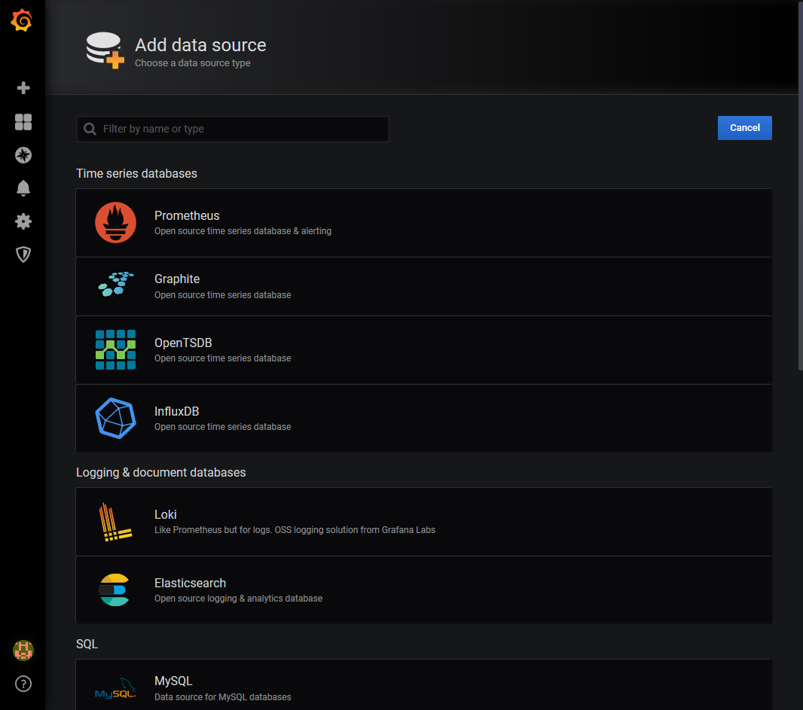
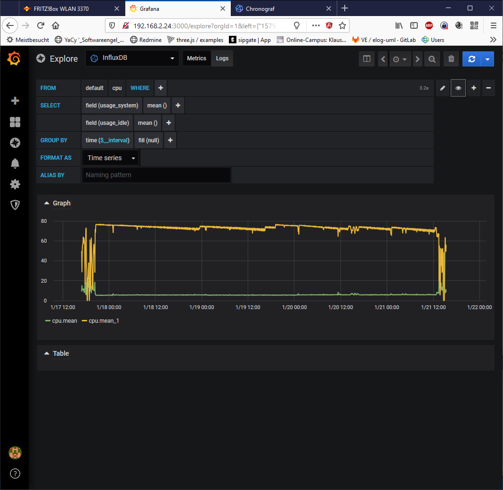
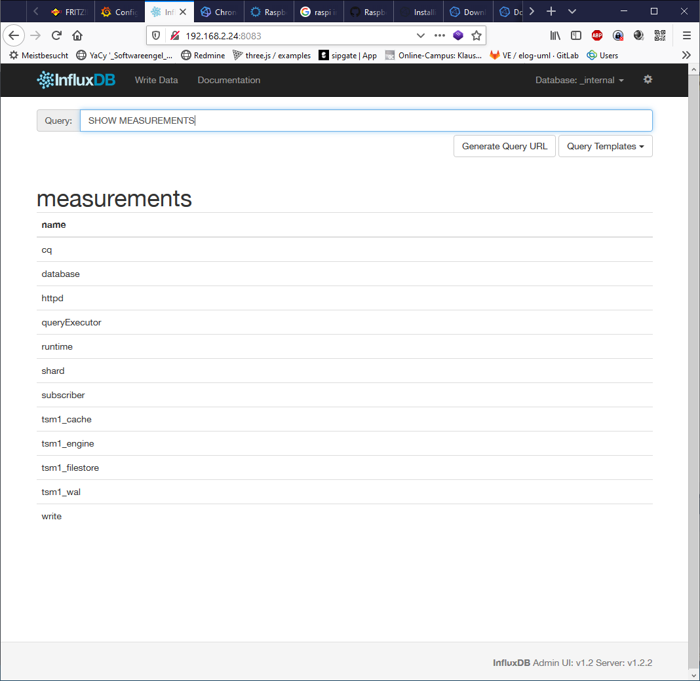

# InfluxDB 

InfluxDB is the open source time series database
https://portal.influxdata.com/downloads/ 

https://hub.docker.com/_/influxdb 

# Telegraf 

Telegraf is the open source server agent to help you collect metrics from your stacks, sensors and systems.

https://www.influxdata.com/time-series-platform/telegraf/ 

# Grafana

https://github.com/torkelo/grafana

docker run -d -p 3000:3000 --name=grafana -e "GF_INSTALL_PLUGINS=grafana-clock-panel,grafana-simple-json-datasource" -e "GF_SECURITY_ADMIN_PASSWORD=secret" grafana/grafana

## Grafana on Raspi 

https://github.com/fg2it/grafana-on-raspberry/

https://bintray.com/fg2it/deb/grafana-on-raspberry/v5.1.4

,

# Grafana + Telegraf + Influx 

https://www.bjoerns-techblog.de/2017/05/installation-von-influxdb-telegraf-und-grafana-auf-dem-raspberry-pi-3/#data-image-svg-xml-3Csvg-20xmlns-http-www-w3-org-2000-svg-20viewBox-0-200-20400-20197-3E-3C-svg-3E-933317 

https://canox.net/2018/01/installation-von-grafana-influxdb-telegraf-auf-einem-raspberry-pi/

http://padcom13.blogspot.com/2015/12/influxdb-telegraf-and-grafana-on.html

Webinterface geht nur bis Version 1.5 (?!) 

## Chonograf 

https://portal.influxdata.com/downloads/ 

## Python loggin Skript für influxDB

https://engineer.john-whittington.co.uk/2016/11/raspberry-pi-data-logger-influxdb-grafana/ 

Feeigaben Dev-Netz 

# memcached 

Sessionspeicher 

# redis

in memory db / Key - Val- Store 

# Mongo DB 

Dokument speicher auch für csv / JSON 

# Maria DB 

OSS Fork von MySQL 

