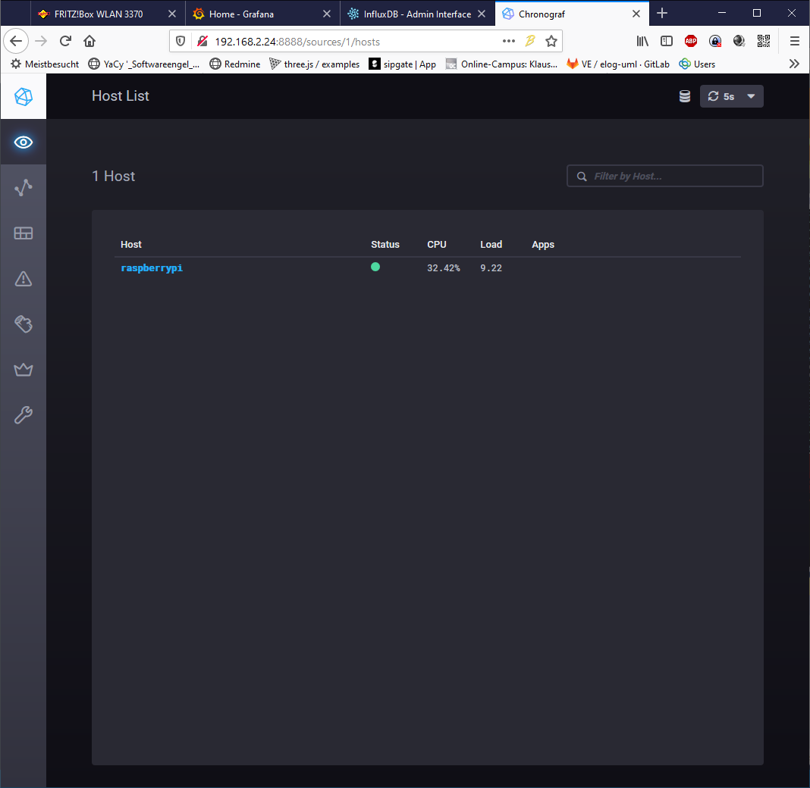

---
layout: post
title: influx Time series Db Telegraf grafana 
categories: [tools]
tags: [db, ui, graph, data analyse, TSDB]
--- 

# InfluxDB 

InfluxDB is a open source time series database

<https://portal.influxdata.com/downloads/> 

<https://hub.docker.com/_/influxdb> 

 
# Telegraf 

Telegraf is the open source server agent to help you collect metrics from your stacks, sensors and systems.

https://www.influxdata.com/time-series-platform/telegraf/ 

# Grafana

<https://github.com/torkelo/grafana>

    docker run -d -p 3000:3000 --name=grafana -e "GF_INSTALL_PLUGINS=grafana-clock-panel,grafana-simple-json-datasource" -e "GF_SECURITY_ADMIN_PASSWORD=secret" grafana/grafana

<https://blog.timescale.com/blog/grafana-webinar-1-recap/> : https://youtu.be/oPumWaoNw5s 

## Grafana on Raspi 

<https://grafana.com/tutorials/install-grafana-on-raspberry-pi/#3>

<https://github.com/fg2it/grafana-on-raspberry/>

<https://bintray.com/fg2it/deb/grafana-on-raspberry/v5.1.4>

,

# Grafana + Telegraf + Influx 

<https://www.bjoerns-techblog.de/2017/05/installation-von-influxdb-telegraf-und-grafana-auf-dem-raspberry-pi-3/#data-image-svg-xml-3Csvg-20xmlns-http-www-w3-org-2000-svg-20viewBox-0-200-20400-20197-3E-3C-svg-3E-933317> 

<https://canox.net/2018/01/installation-von-grafana-influxdb-telegraf-auf-einem-raspberry-pi/>

<http://padcom13.blogspot.com/2015/12/influxdb-telegraf-and-grafana-on.html>

Webinterface geht nur bis Version 1.5 (?!) 

## Grafana reset password 

sudo docker exec -it <container> bash 

Show all admin commands

    grafana-cli admin

Reset admin password

    grafana-cli admin reset-admin-password <new password> 

resets the password for the admin user using the CLI. You might need to do this if you lose the admin password.

## Chonograf 

Visualisierung von influx DB data 

<https://portal.influxdata.com/downloads/> 

## Python logging Skript für influxDB

<https://engineer.john-whittington.co.uk/2016/11/raspberry-pi-data-logger-influxdb-grafana/> 

Feeigaben Dev-Netz 

# memcached 

Sessionspeicher 

# redis

in memory db / Key - Val- Store 

# Mongo DB 

Dokument speicher auch für csv / JSON 

# Maria DB 

OSS Fork von MySQL 

# history 

engels@ubuntu18svr-01:~$ history

    1  sudo apt-get update
    2  cls
    3  clear
    4  exit
    5  sudo apt-get update
    6  sudo apt-get upgrade
    7  sudo apt-get update
    8  sudo apt-get upgrade
    9  sudo reboot now

       10  sudo shutdown
       11  sudo shutdown now
       12  ifconfig
       13  ping 10.0.2.15
       14  ifconfig
       15  ping 192.168.4.1
       16  ifconfig
       17  ping 192.168.4.1
       18  ifconfig
       19  sudo apt install mc
       20  sudo apt install apt-transport-https ca-certificates curl software-properties-common
       21  curl -fsSL https://download.docker.com/linux/ubuntu/gpg | sudo apt-key add -
       22  add-apt-repository "deb [arch=amd64] https://download.docker.com/linux/ubuntu $(lsb_release -cs) stable"
       23  sudo add-apt-repository "deb [arch=amd64] https://download.docker.com/linux/ubuntu $(lsb_release -cs) stable"
       24  apt-get update
       25  sudo apt-get update
       26  apt-cache policy docker-ce
       27  sudo apt install docker-ce
       28  sudo systemctl status docker
       29  docker run hello-world
       30  sudo docker run hello-world
       31  sudo shutdown now
       32  cat grafana-socker.sh
       33  dcker --version
       34  docker --version
       35  ps aux
       36  htop
       37  exit
       38  ifconfig
       39  ps
       40  mc
       41  echo docker run -d   -p 3000:3000   --name=grafana   -e "GF_SERVER_ROOT_URL=http://grafana.server.name"   -e "GF_SECURITY_ADMIN_PASSWORD=secret"   grafana/grafana >grafana-socker.sh
       42  mc
       43  ls
       44  chmod +x grafana-socker.sh
       45  mc
       46  sudo ./grafana-socker.sh
       47  sudo shutdown now
       48  [A
       49  ./grafana-socker.sh
       50  docker
       51  I
       52  IIIII
       53  docker container ls -a
       54  sudo docker container ls -a
       55  sudo docker container start 055bcc2493ad
       56  sudo docker container ls -a
       57  cat ./grafana-docker.sh
       58  sudo docker container
       59  sudo docker container ls
       60  sudo docker container stop 055bcc2493ad
       61  sudo docker container ls
       62  sudo docker container rm 055bcc2493ad
       63  sudo docker container ls -a
       64  ./grafana-docker.sh
       65  sudo ./grafana-docker.sh
       66  java
       67  java --version
       68  sudo apt install openjdk-8-jre-headless
   
      echo "version: '2.4'
   
            services:
             nginx:
               image: nginx:latest
               ports:
                 - "8080:80"
               volumes:
                 - ./log:/var/log/nginx
   
             filebeat:
               image: docker.elastic.co/beats/filebeat:7.2.0
               volumes:
                 - ./log/:/var/log/nginx
               command: >
                 ./filebeat -e -c /etc/motd
                 -E "filebeat.inputs=[{type:log,paths:['/var/log/nginx/access.log']}]"
                 -E "output.logstash.hosts=['logstash:5044']"
   
             logstash:
               image: docker.elastic.co/logstash/logstash:7.2.0
               expose:
                 - "5044"
               volumes:
                 - ./logstash:/usr/share/logstash/pipeline
   
             elasticsearch:
               image: docker.elastic.co/elasticsearch/elasticsearch:7.2.0
               ports:
                 - "9200:9200"
               environment:
               http.host: 0.0.0.0
               discovery.type: single-node
               ES_JAVA_OPTS: "-Xms750m -Xmx750m"
  
           kibana:
             image: docker.elastic.co/kibana/kibana:7.2.0
             ports:
               - "5601:5601"> docker-compose.yml
       ls
       ls -al
       touch docker-compose.yml
       mc
       docker-compose up -d
       sudo docker-compose up -d
       sudo apt  install docker-compose
       sudo docker-compose up -d
       mc
       sudo docker-compose up -d
        docker ls
        sudo docker container ls
        docker exec -ti  engels_filebeat_1
        docker exec -ti engels_filebeat_1
        docker exec -ti engels_filebeat_1 /bin/bash
        sudo docker exec -ti engels_filebeat_1 /bin/bash
        exit
        sudo docker ls
        sudo docker ps
        history
