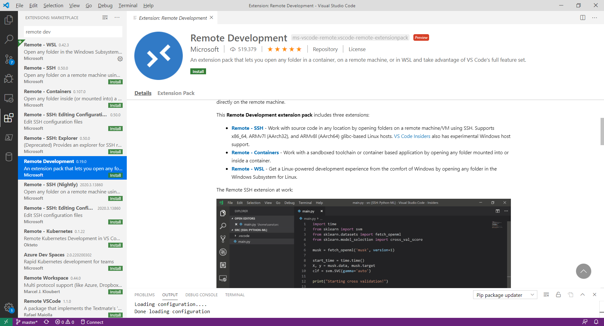
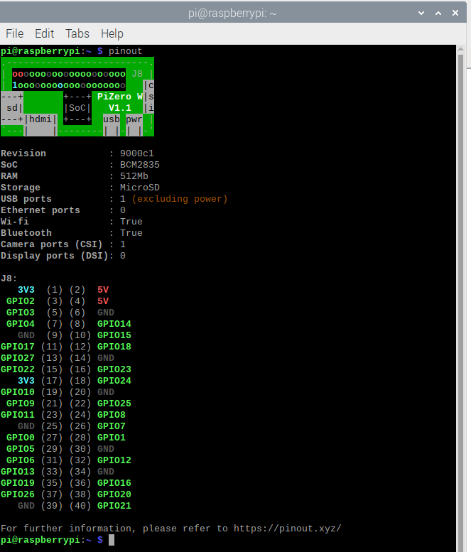

# Check Raspi/ESP for simple Coding Hacks 

Default Login: pi, defaultp Pass: raspberry

## LED Check Python, LED check in C 

## LED Check GPIO und LED Check Bash 

## Raspi ZEro W

## Links 

RASPI GPIO - Layout <http://www.netzmafia.de/skripten/hardware/RasPi/RasPi_GPIO.html>  

<https://elinux.org/RPi_GPIO_Code_Samples>

<http://cool-web.de/raspberry/den-raspberry-pi-ueber-die-wiringpi-api-in-c-programmieren.htm>

<http://cool-web.de/raspberry/erste-schritte-mit-gpio-und-led.htm#gpio>

<https://github.com/WiringPi/WiringPi/blob/master/wiringPi/wiringPi.h>

<https://bitbucket.org/sbub/raspberry-pi-gpio-web-control/src/master/>

Raspi Pinout guide:  <https://pinout.xyz/>

VNC Client: <https://www.realvnc.com/de/connect/download/viewer/windows/>

Raspbian image Download: <https://www.raspberrypi.org/downloads/raspbian/>

<https://tutorials-raspberrypi.de/raspberry-pi-einstieg-wie-starte-ich/> 

<https://tutorials-raspberrypi.de/raspberry-pi-amazon-alexa-deutsch-installieren/> 

<https://tutorials-raspberrypi.de/raspberry-pi-remote-desktop-verbindung/>

<https://pimylifeup.com/raspberry-pi-ebook-server/>

<https://www.raspberrypi.org/blog/programming-pi-zero-usb/>

(Video für Setup)

<https://blog.gbaman.info>

RASPI ZERO Programming over usb <https://blog.gbaman.info/?p=699#comment-189547>

Setting up Pi Zero OTG - The quick way 
(No USB keyboard, mouse, HDMI monitor needed, Win - install Bonjour :-( ) <https://gist.github.com/gbaman/975e2db164b3ca2b51ae11e45e8fd40a> 

<https://projects.raspberrypi.org/en/projects/see-like-a-bat>

<https://curriculum.raspberrypi.org/> 

<https://makemypi.wordpress.com/2018/02/19/iot-with-influxdb-telegraph-and-grafana-on-the-raspberry-pi-3/>

<https://hodgkins.io/windows-metric-dashboards-with-influxdb-and-grafana>

<https://blog.helmutkarger.de/category/projekte/raspberry-video-camera/> 

<https://books.google.de/books?id=WNh2DwAAQBAJ&pg=PT4&lpg=PT4&dq=isbn+978-3-645-22268-6&source=bl&ots=RNrS801o-F&sig=ACfU3U1XS6V1yo61cNHUt6Dy0QYip6YiBA&hl=de&sa=X&ved=2ahUKEwiLx4LHw6vnAhUdBGMBHZoiAlAQ6AEwAnoECAwQAQ#v=onepage&q=isbn%20978-3-645-22268-6&f=false>

## Rpi Zero WH 

<https://www.pollin.de/p/raspberry-pi-zero-wh-mit-bestuecktem-header-810885> 

<https://www.reichelt.de/raspberry-pi-zero-wh-v-1-1-1-ghz-512-mb-ram-wlan-bt-rasp-pi-zero-wh-p222531.html>

<https://blog.unixweb.de/raspberry-pi-zero-w-und-die-otg-funktion/>

## Skizze 

## Raspi Image Crator 

PIBakery <https://www.pibakery.org/> 

## ESP32

# Project EDU 

    4-5 Gruppen, (Analog-Schalter, Ampel 1-4)
    5 Raspi , MicroSD-Karte , 
    5 x Stromversorgung 
    Netzterkverbindung ,
    1 WLAN - Router + IP + DHCP 
    5 x 3 LEDs (Rot / Gelb / Grün ) mit Vorwiederstand , 
    3 x 5 Verbindungskabel LED 
    5 x Schalter 

    Software:
    ISO Image Rasberian 
    ISO Image Config : + Client Wlan zum WLANRouter + SSH-Server + RDP - Server, VPN Server 
    Putty + Winscp + RDP Client / REal - VNC Client 

## SSH
  
Datei mit dem Namen "**SSH**" anlegen 

## WLAN

<https://pi-buch.info/wlan-schon-vor-der-installation-konfigurieren/>
Datei mit dem Namen "**wpa_supplicant.conf**" anlegen mit UNIX (LF) mit 

    country=DE 
    ctrl_interface=DIR=/var/run/wpa_supplicant GROUP=netdev 
    update_config=1 
    network={
         ssid="softwareengel"
         scan_ssid=1
         psk="PaSSWoRd"
         key_mgmt=WPA-PSK
    }

## RDP 

    sudo apt-get purge realvnc-vnc-server

    sudo apt-get install xrdp

    sudo reboot

### RDP Clients 

Linux <http://www.rdesktop.org/>

Mac OS X <https://itunes.apple.com/de/app/microsoft-remote-desktop/id715768417?mt=12>

## Code 

Remote Debugging <https://www.hanselman.com/blog/RemoteDebuggingWithVSCodeOnWindowsToARaspberryPiUsingNETCoreOnARM.aspx>

### VS CODE REmote DEv Extension 

(funktioniert leider (noch ) nicht auf Raspi Zero (Arm V6)) soll März 2020 kommen 

<https://github.com/microsoft/vscode-remote-release/issues/2493>

<https://github.com/microsoft/vscode-remote-release/issues/669>

### Pinbelegung 

    pinout 

Interactive Pinout <https://pinout.xyz/pinout/>

### Python WebLed-Code 

    import RPi.GPIO as GPIO
    import time

    from http.server import BaseHTTPRequestHandler, HTTPServer
    import time

    print ("EDU - AMPEL") 
    print ("RPi: " , GPIO.RPI_REVISION, GPIO.RPI_INFO )
    # Webserver 

    hostName = "0.0.0.0"
    hostPort = 8000
    GPIO.setmode(GPIO.BCM) 
    isGruen = False

    def setLED (rot, gelb, gruen):
	    GPIO.setmode(GPIO.BCM) 
	    GPIO.setup(4, GPIO.OUT)
	    isGruen = gruen
	    if gruen :
		
		
		    GPIO.output (4, True)
	    else:
		    GPIO.output (4, False)
		
    class MyServer(BaseHTTPRequestHandler):
        def do_GET(self):
            self.send_response(200)
            self.send_header("Content-type", "text/html")
            self.end_headers()
            self.wfile.write(bytes('<html><head> <meta charset="UTF-8"><title>Title goes here.</title></head>', "utf-8"))
            self.wfile.write(bytes("<body>
Webserver Response
", "utf-8"))
            self.wfile.write(bytes("
You accessed path: %s
" % self.path, "utf-8"))
        
            if ("gruen" in self.path):
                setLED(0,0,1)
                self.wfile.write(bytes("
 %s
" % "Grün", "utf-8"))
            else:
                setLED(0,0,0)
                self.wfile.write(bytes("</body></html>", "utf-8"))

    myServer = HTTPServer((hostName, hostPort), MyServer)
    print(time.asctime(), "Server Starts - %s:%s" % (hostName, hostPort))

    try:
        myServer.serve_forever()
    except KeyboardInterrupt:
        pass

    myServer.server_close()
    print(time.asctime(), "Server Stops - %s:%s" % (hostName, hostPort))
    GPIO.cleanup()

