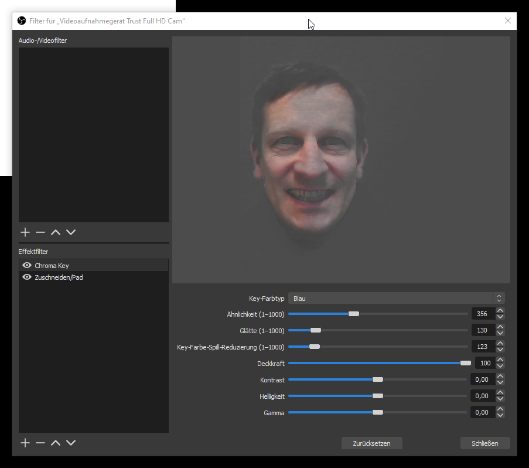
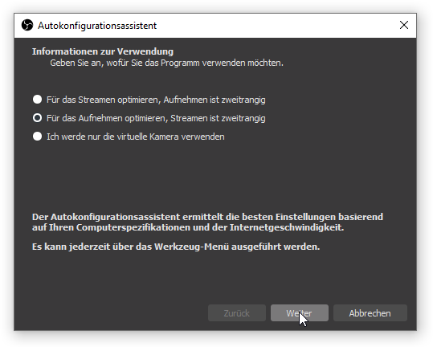
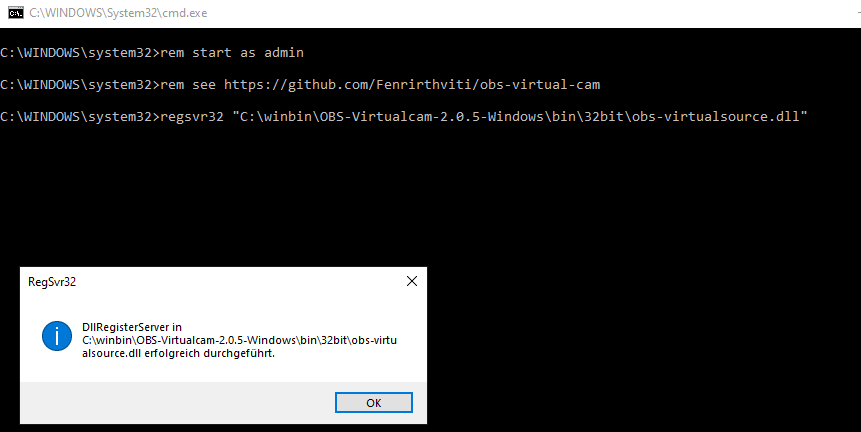

Video / Screen und Audio Bradcasting in Video - File oder Live Stream 

# OBS Studio - Open Brodcast Studio 

Video / Screen und Audio Broadcasting in Video - File oder in Live Streming Plattform wie Twich / Youtube ...

<https://obsproject.com/> 

# OBS Install Settings 
- für Aufnehmen optimieruren 

- Anzeige 1920x1080 , 30 fps

- Ausgabe 

# Virtual Cam 
 
Virtuelle Kamera für Zoom und Teams, funktioniert bei WebEx nicht 

<https://github.com/Fenrirthviti/obs-virtual-cam/releases>

Problems ... use OBS-Studio-26.1.1-Full-Installer-x64 instead : Virual Can ist working ...

# Screen Capute Problem 
- Settungs für Desktop Grafikkarte für OBS.exe auf integrierte Grafikkarte Setzen (bei Windows Grafikeinstellungen - Grund bei Nvidia-Control )
  

# Video Cam Filter 
- GreenScreen Effekt 

- Zuschneiden / Pad 

