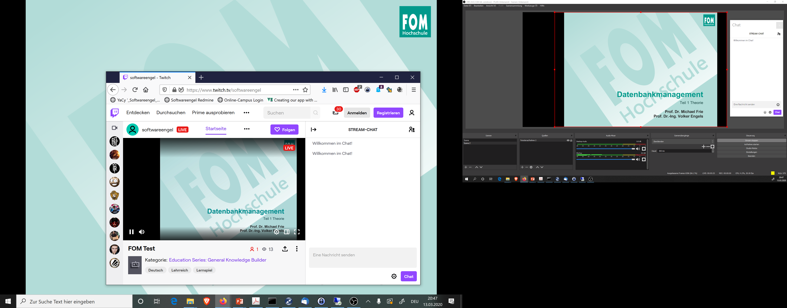
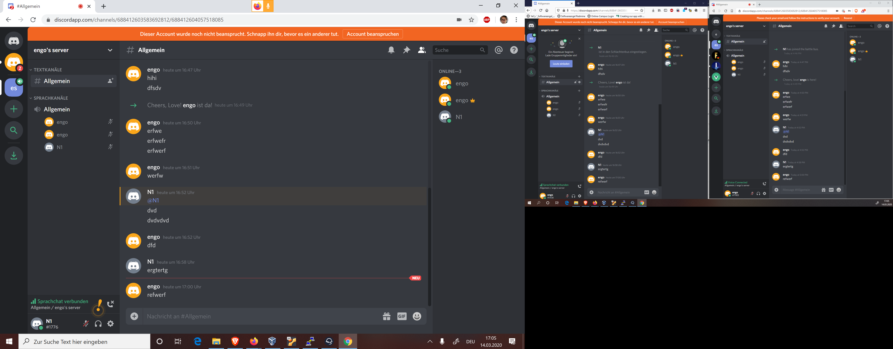

# Termine Abgesagt 

# Besuch FOM Dortmund 18h

Kein Einlass, auch keine Räume zur Verfügung zum Test von schnellem Upload für das Streamen.

# Suche nach Tools
OBS - Studio / Video -Adio - Aufnahme + Headset

Nginx könnte den Stream von OBS in Netz ohne dritte Intermediäre und Rechteproblematik für kleinen Kreis ins Netz streamen.

# Versuch Live - Video erfolgreich
OBS - Studio , neuer Szene Audio und Video von der Folie, Streming-anmeldung auf Twitch, Chat Spur - POC okay - läuft. REchtlich wegen Uhreberrecht Bild / Ton nicht geklärt, eher fraglich.

Standortproblem Privat ist zu langsames Upload-Internet , also kein Streaming (auch mit weniger Ton / Bild - Qualität) möglich

# Informationen zum Lehrbetrieb ab 13.03.2020

Die Hochschulleitung hat heute in Abstimmung mit der Geschäftsführung die Einstellung des Lehrbetriebs in Präsenz in den Hochschulzentren für alle Standorte bis zum 19. April 2020 beschlossen. 

# Audio Konferenz / Chat und Audio mit Discord 

Audio - Konferenz funktioniert ohne Anmeldung / Screenshare als WebVersion leider nicht. 

