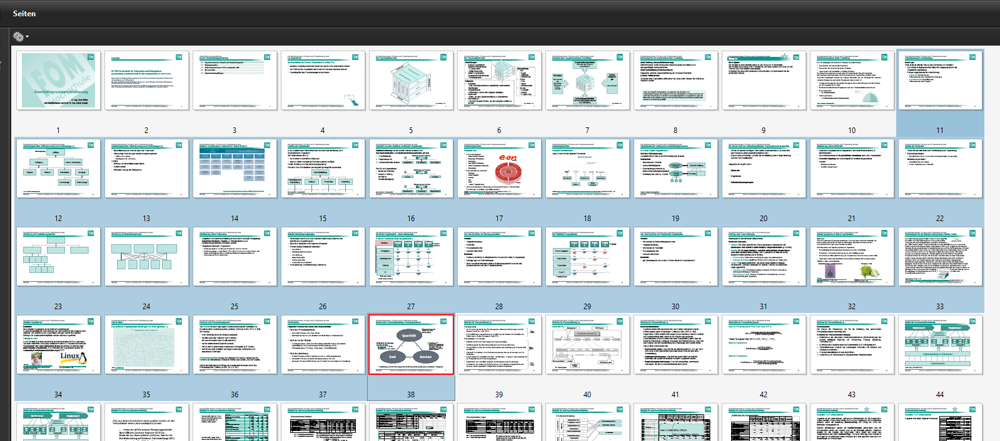

---
layout: post
title: Modul Geschäftsprozessmodellierung MS 2020 Update

--- 

EDU - WebBasedTeaching 2020 - Improvisation 

Hier werden die aktuellen Informationen für das Modul  Geschäftsprozessmodellierung MS 2020 gebündelt.

# Modul Geschäftsprozessmodellierung

Liebe Studierende, ich bin derzeit dabei, Ihnen Hinweise  zusammenzustellen, mit denen Sie die Lernziele erreichen können, die in unserem Modul für den Zeitraum vorgesehen waren, in denen die Präsenzveranstaltungen nun entfallen müssen. Die Situation ist für uns alle außergewöhnlich. Bitte haben Sie Verständnis, dass es noch ein wenig dauern wird, bis der Online-Campus vollständig für Ihr Selbstlernen verwendet werden kann. Verfolgen sie bitte die neu eingestellten Hinweise im OC.

# Termine ohne Präsenzveranstaltung 

# Bearbeitungsinhalt 

## Termin 17.03.2020: Seite 11-38, Foliennummer     

Bitte bearbeiten sie die Folien 75 - 77 aus dem Skript!

Methode: Eigenstudium, Webrecherche, Literaturstudium, wenn möglich (virtuelle) Kleingruppenarbeit 

Inhaltlich werde ich versuchen konkrete Fragen zu klären und Emails beantworten. Es wird also keine Online - Vorlesung geben.

Treffpunkt heute, 17.03.2020 um 18.00h: <https://discord.gg/6ncWV2>

## Lernhinweise und Fragen:  

* Was ist funktionale Differenzierung? 
* Was ist divisionale Differenzierung? Welche drei Produkteigenschaften werden häufig als Merkmal verwendet? 
* Welche Ebene ist bei der ersten Differenzierung interessant? Was könnte ein zweite Differenzierung sein? Analysieren sie das Beispiel von Eon (Folie 38)
* Was bedeutet Stabstelle? Was wäre eine Konfliktquelle aus der Persönlichkeitsstruktur heraus bei der Linie und des Stabes? 
* Welche Aufgaben sind im Stab und welche in der Linie angesiedelt?
* Woher kommt die Idee, eine stabstelle einzurichten? Recherchieren sie!
* Welche drei Möglichkeiten der Integration von differenzierten Unternehmen gibt es? Machen sie ein Beispiel! 
* Was bedeutet Ein-/ Mehrlinien-Organisation?  
* Was bedeutet Matrixorganisation? Welche Trennung der Weisung gibt es hier?
* Was ist eine projektierte Organisation? 
* Wie können sie einzelnen Organisationsform schnell auf Kundenwünsche reagieren? Überlegen sie sich den Marktbezug der einzelnen Stellen!
 
* Was ist ein Prozess? Wie funktioniert Prozessmanagement? 
* Welche Arten von Prozessen werden in Organisationen unterschieden? 

# Literaturhinweise

Kap 4 Organisation und Organisationsgestaltung in 

Hungenberg, Harald, and Torsten Wulf. 2015. Grundlagen der Unternehmensführung: Einführung für Bachelorstudierende. https://doi.org/10.1007/978-3-662-46997-2. 

