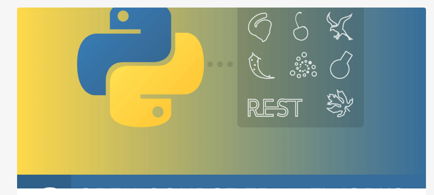

---
layout: post
title: Python Api Generators 
categories: [API]
tags: [Python, Api, Generator ]
--- 

# Python Api Generators 

<https://nordicapis.com/8-open-source-frameworks-for-building-apis-in-python/>

## Django

## Flask

## Pyramid

## Falcon 

## Eve 

## Cherrypy 

## Bottle

## Tornado

# Video Node API Devepopment 

Build RESTful APIs with Node.js express and MySQL | Authentication with JWT | In one Video

<https://www.youtube.com/watch?v=WfCJ3sHnLBM> 
