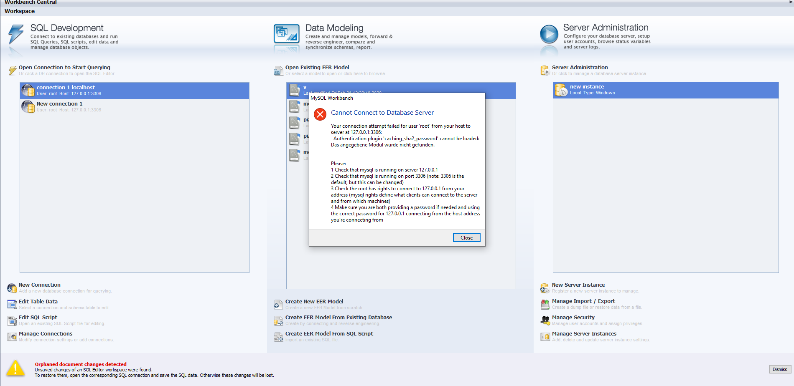

---
layout: post 
title: setup Mysql 8 by unzip, Problem Mysql Workbench 
categories: [Mysql]
tags: [mysql]
---

# Mysql 8 Install by unzip 

- MYsql CE Version 8

- unzip install 

## Setup mysql 8.0.19 

	mysqld --initialize-insecure --console

Achtung - MysqlWorkbench V6 und V5 problem 

start mysql:  mysqld

stop: mysqladmin -u root shutdown 

