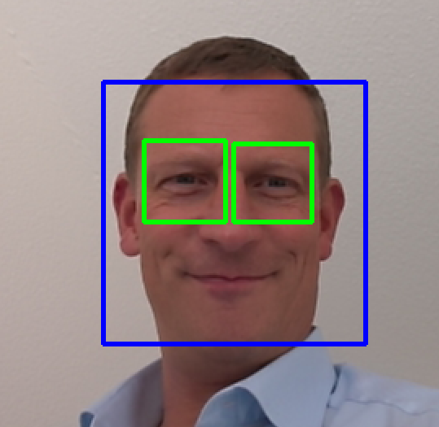

---
layout: post
title: OpenCV und Python 
categories: [computer vision]
tags: [opencv, python, ml, video, image, manipulatition]
--- 

# OpenCV und Python  

<https://de.wikipedia.org/wiki/OpenCV> 

Python opencv tutorial <https://opencv-python-tutroals.readthedocs.io/en/latest/>

<https://opencv.org/>

<https://github.com/opencv>

## Example

Python use opencv to save image from video capture 

<https://www.pyimagesearch.com/2019/09/16/install-opencv-4-on-raspberry-pi-4-and-raspbian-buster/>

    
```bash
# ? 
sudo pip3 install opencv-python 

sudo pip3 install numpy 
sudo apt install python3-opencv

# on linux/ Raspi 
sudo apt install libjasper1
sudo apt install libqtgui4 
```


```python 
# opencv 
import numpy as np
import cv2
print ("cv2 Version:", cv2.__version__)

cap = cv2.VideoCapture(0)
count = 10000
while(True):
    # Capture frame-by-frame
    ret, frame = cap.read()
    # Our operations on the frame come here
    gray = cv2.cvtColor(frame, cv2.COLOR_BGR2GRAY)
    # Display the resulting frame
    cv2.imshow('frame', gray)
    if cv2.waitKey(1) & 0xFF == ord('s'):
            count += 1
            filename = "frame"+ str(count) + ".png"
            print ("save" , filename)
            cv2.imwrite(filename, frame)
            filename = "frame"+ str(count) + "_sw.png"
            cv2.imwrite(filename, gray)
# When everything done, release the capture
cap.release()
cv2.destroyAllWindows()


```


## Install VS Code on Raspi4 

<https://www.hanselman.com/blog/HowToInstallVisualStudioCodeOnARaspberryPi4InMinutes.aspx>


## Beispiel Gesicht und Augen-Erkennung (2020-09-10)

```python 

import cv2
def generate():
    
    face_cascade = cv2.CascadeClassifier(cv2.data.haarcascades + 'haarcascade_frontalface_default.xml')
    eye_cascade = cv2.CascadeClassifier(cv2.data.haarcascades + 'haarcascade_eye.xml')

    camera = cv2.VideoCapture(0)
    writepgm = False
    count = 0
    while (True):
        ret, frame = camera.read()
        gray = cv2.cvtColor(frame, cv2.COLOR_BGR2GRAY)
        faces = face_cascade.detectMultiScale(gray, 1.3, 5)
        for (x,y,w,h) in faces:
            img = cv2.rectangle(frame,(x,y),(x+w,y+h),(255,0,0),2)
            if writepgm:
                f = cv2.resize(gray[y:y+h, x:x+w], (200, 200))
                cv2.imwrite('./data/%s.pgm' % str(count), f)
            count += 1
            roi_gray = gray[y:y+h, x:x+w] 
            
            eyes = eye_cascade.detectMultiScale(roi_gray, 1.03, 5, 0, (40,40))
            
            for (ex,ey,ew,eh) in eyes:
                cv2.rectangle(frame,(x+ex,y+ey),(x+ex+ew, y+ey+eh),(0,255,0),2)
        
        cv2.imshow("camera", frame)
        
        if cv2.waitKey(1000 // 12) & 0xff == ord("q"):
            break
    camera.release()
    cv2.destroyAllWindows()

if __name__ == "__main__":
    generate()


```




