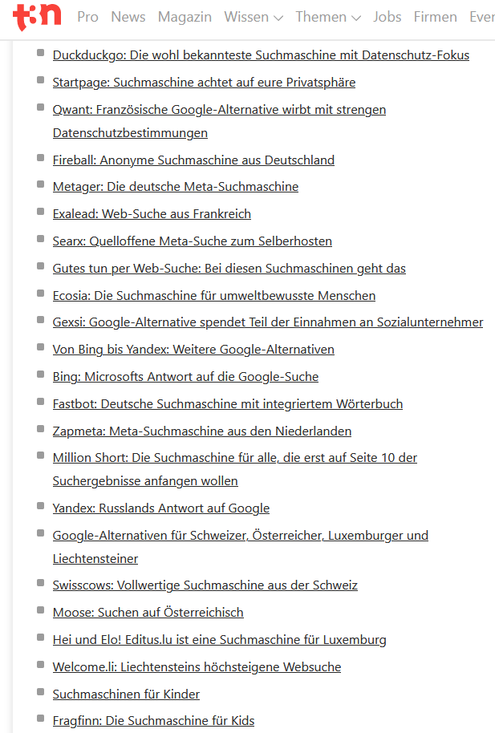

---
layout: post
title: Suchmaschinen 
categories: [search]
tags: [search engine]
--- 

# Suchmaschinen 
Die 30 besten Suchmaschinen im Kurztest 2021 
- <https://t3n.de/news/google-alternative-474551/>

Freie Suchmaschinensoftware 
- <https://www.nebel.de/projekte/Vortrag-20051021/FreieSuchmaschinensoftware.html>

CC - Content Search:
- <https://search.creativecommons.org/>

Startups Search: 
Search Less. Close More. Grow your revenue with all-in-one rospecting solutions powered by the leader in private-company data.

- <https://www.crunchbase.com/>

Viral content : 
- <https://app.buzzsumo.com/discover/trending>
Meta search saerx: https://searx.space/ 

# Self hosted

Self hosted seach engine: 
- <https://wiki.sgripon.net/doku.php/self_hosted_search_engine>

Crawler Apache Nutch 
- <https://cwiki.apache.org/confluence/display/nutch/NutchTutorial>

# Elastic Search

Search Elastic Search 
- <https://www.elastic.co/de/>

## UI for Elastic Search 

Suchoberfläche Calaca: 
- <https://github.com/romansanchez/Calaca>

# Ambar

- <https://ambar.cloud/>

- <https://github.com/RD17/ambar#building-the-images-yourself>

# Apache Solr
Apache Solr™ 9.2.1 - Solr is the popular, blazing-fast, open source enterprise search platform built on Apache Lucene™

<https://lucene.apache.org/solr/> 

# Apache Nutch

<https://www.apache.org/dyn/closer.lua/nutch/1.16/apache-nutch-1.16-bin.zip>

# Scrapy (Python) 

Scrapy is a fast high-level web crawling and web scraping framework, used to crawl websites and extract structured data from their pages. It can be used for a wide range of purposes, from data mining to monitoring and automated testing. 
- <https://scrapy.org/>

- <https://github.com/scrapy/scrapy>

# Heritrix (Java)

Heritrix is the Internet Archive's open-source, extensible, web-scale, archival-quality web crawler project.

- <https://github.com/internetarchive/heritrix3/wiki>

# WebSPHINX (Java)

WebSPHINX ( Website-Specific Processors for HTML INformation eXtraction) is a Java class library and interactive development environment for web crawlers. A web crawler (also called a robot or spider) is a program that browses and processes Web pages automatically.

# openseachserver

- <https://www.opensearchserver.com/>

- <https://github.com/jaeksoft/opensearchserver>

# Links

http://www.intellspot.com/open-source-web-crawlers/ 
