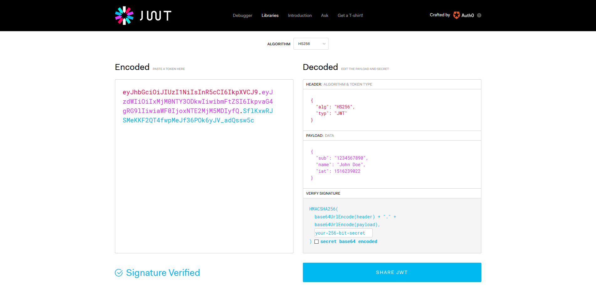
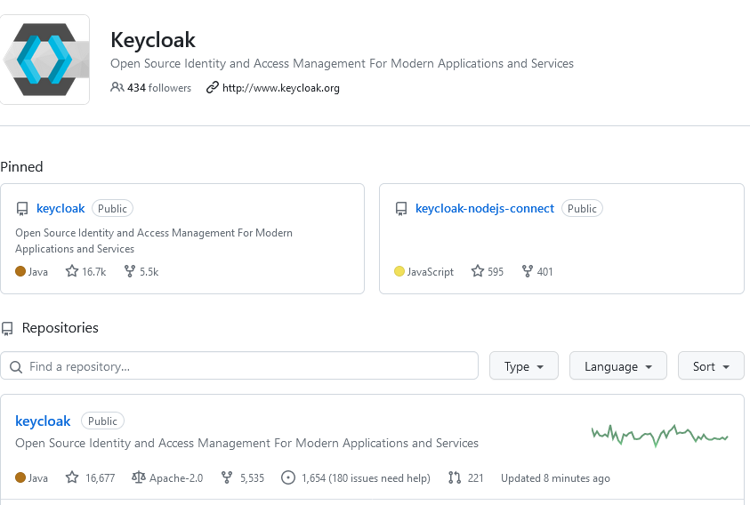
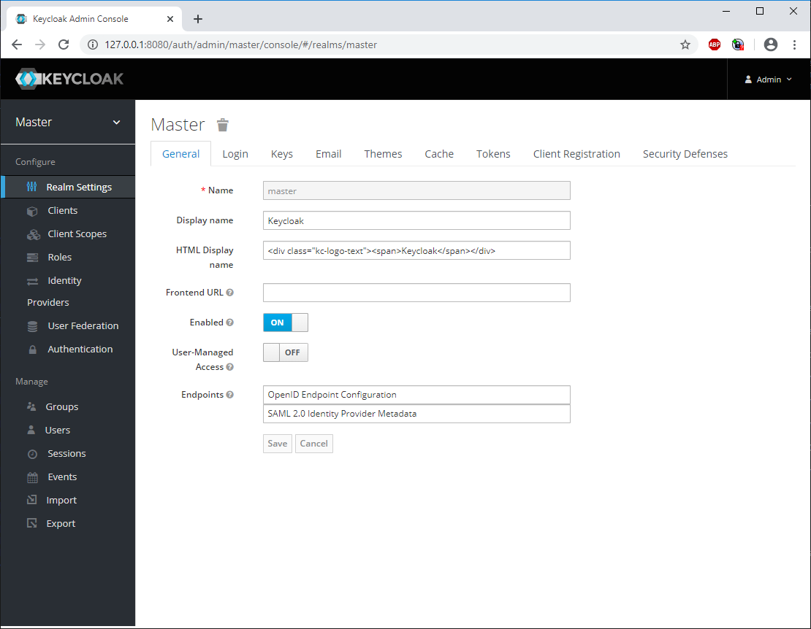

---
layout: post
title: JSON Web Tokens - JWT - Keycloak
categories: [IAM, Authorisation, Keycloak]
tags: [JWT, OAuth, Identity Management, Authentication,Java, Server,OSS ]
---

# JWT JSON Web Tokens 

* Authorization
* Single Sign On easy add on

Why should we use JSON Web Tokens?

Let's talk about the benefits of JSON Web Tokens (JWT) when compared to Simple Web Tokens (SWT) and Security Assertion Markup Language Tokens (SAML).

RFC 7519

<https://tools.ietf.org/html/rfc7519>

<https://jwt.io/introduction>

<https://www.oose.de/blogpost/oauth-openid-connect-und-jwt-wie-haengt-das-alles-zusammen-teil-2/> 

# Keycloak 

- <https://github.com/keycloak> 
- <https://github.com/keycloak/keycloak>

- <https://www.keycloak.org/>

 

- <https://stackoverflow.com/questions/55189130/does-nginx-open-source-support-openid-and-jwt> 

- <https://docs.nginx.com/nginx/admin-guide/security-controls/configuring-jwt-authentication/#>

# Python Test 

tytest-cov 

# Api Endpoint Gateway 
- specify microservices 
- expose as an api 
- secure api with key 

