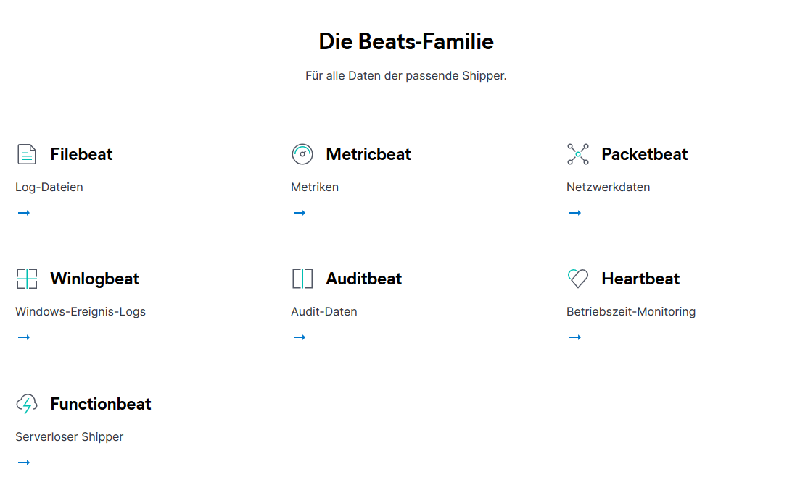

# Raspi - ELK - Filebeat

## install docker on Raspi (not working)

    sudo apt-get update && sudo apt-get upgrade

    sudo curl -fsSL https://get.docker.com | sh
    curl -fsSL https://get.docker.com -o - | sudo sh

    sudo reboot now 

    sudo usermod -aG docker pi

    newgrp docker

    docker run hello-world

    sudo apt-get install -y libffi-dev libssl-dev

    sudo apt-get install -y python3 python3-pip

    sudo apt-get remove python-configparser

    sudo pip3 -v install docker-compose

## uninstall Docker 

    sudo apt-get purge docker-ce

Delete containers 

    sudo rm -rf /var/lib/docker

## install doker ISO Raspi 

https://blog.hypriot.com/post/releasing-HypriotOS-1-11/

## Install docker ELK 

    git clone https://github.com/deviantony/docker-elk.git
    
    cd /docker-elk
    
    # not working: ERROR: Service 'elasticsearch' failed to build: no matching manifest for linux/arm/v7 in the manifest list entries
    docker-compose up -d 

    docker-compose ps

The Elasticsearch service should be accessible by accessing http://localhost:9200 using a HTTP client like Postman. Use auth to access it with elastic as the username and changeme as the password, and add application/json for Content-Type header.

The Kibana app should be accessible by accessing http://localhost:5601 using your favorite browser. When you got something like Kibana server is not ready yet on the browser, it means you really have to wait for the server to be ready. Just wait for about 10-15 minutes, then you can refresh the page and you will see the kibana login screen.

You can use the same elastic and changeme credential as username and password to enter.

he Logstash server should be accessible in http://localhost:5000 . I'm still new to ELK stack, so I will provide you example to use this service later or maybe on a specific blog post.

    systemctl restart elasticsearch

## Maual ELK Raspi 

    sudo apt-get install default-jre

     sudo mkdir /usr/sh    are/elasticsearch
     cd /usr/share/elasticsearch
     wget https://packages.elastic.co/GPG-KEY-elasticsearch
     sudo apt-get install elasticsearch

    sudo nano /etc/elasticsearch/elasticsearch.yml

network.host: 0.0.0.0

sudo service elasticsearch restart

## neuer Versuch install elk (WORKING)

    git clone https://github.com/stefanwalther/rpi-docker-elk.git

    docker-compose up

## Manual Logstash 

$ sudo apt-get install apt-transport-https
$ echo "deb https://artifacts.elastic.co/packages/5.x/apt stable main" | sudo tee -a /etc/apt/sources.list.d/elastic-5.x.list
$ sudo apt-get update
$ sudo apt-get install logstash
$ sudo service logstash start

## Beats 

## MetricBeat 

    curl -L -O https://artifacts.elastic.co/downloads/beats/metricbeat/metricbeat-6.1.2-darwin-x86_64.tar.gz

    tar xzvf metricbeat-6.1.2-darwin-x86_64.tar.gz

configuration:

    metricbeat.modules:
    - module: system
      metricsets:
        - cpu
        - filesystem
        - memory
        - network
        - process
      enabled: true
      period: 10s
      processes: ['.*']
      cpu_ticks: false

    fields:
      env: dev

    output.elasticsearch:
      # Array of hosts to connect to.
      hosts: ["localhost:9200"]

restart 

    sudo chown root metricbeat.yml 
    sudo chown root modules.d/system.yml 
    sudo ./metricbeat -e -c metricbeat.yml -d "publish"

test 

    curl -XGET 'localhost:9200/_cat/indices?v&pretty'
