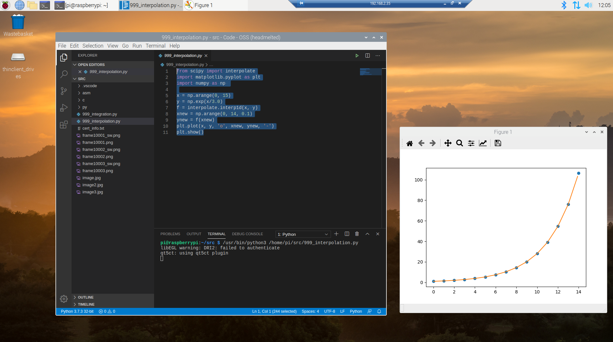
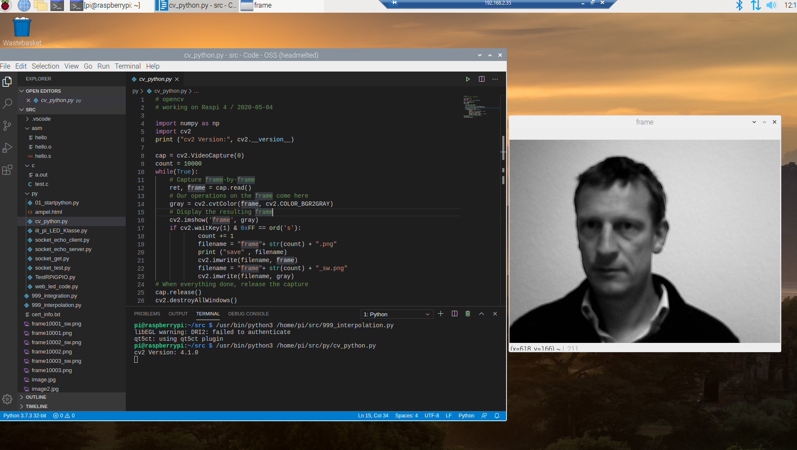
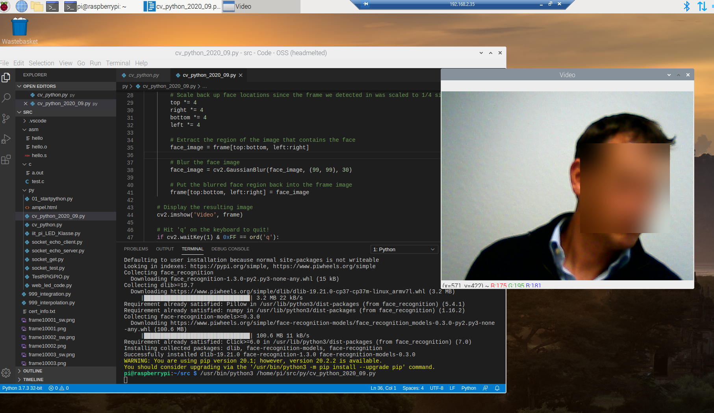

---
layout: post
title: Raspi Python Dev 
categories: [Raspberry Pi, Python, Dev]
tags: [Raspberry Pi, Python, Dev]
---

# Raspi 4 , 4GB Ram , RDP 

## MatplotLib 

    from scipy import interpolate
    import matplotlib.pyplot as plt
    import numpy as np 

    x = np.arange(0, 15)
    y = np.exp(x/3.0)
    f = interpolate.interp1d(x, y)
    xnew = np.arange(0, 14, 0.1)
    ynew = f(xnew)
    plt.plot(x, y, 'o', xnew, ynew, '-')
    plt.show()

## OpenCV 

    # opencv 
    # working on Raspi 4 / 2020-05-04

    import numpy as np
    import cv2
    print ("cv2 Version:", cv2.__version__)

    cap = cv2.VideoCapture(0)
    count = 10000
    while(True):
        # Capture frame-by-frame
        ret, frame = cap.read()
        # Our operations on the frame come here
        gray = cv2.cvtColor(frame, cv2.COLOR_BGR2GRAY)
        # Display the resulting frame
        cv2.imshow('frame', gray)
        if cv2.waitKey(1) & 0xFF == ord('s'):
                count += 1
                filename = "frame"+ str(count) + ".png"
                print ("save" , filename) 
                cv2.imwrite(filename, frame)
                filename = "frame"+ str(count) + "_sw.png"
                cv2.imwrite(filename, gray)
    # When everything done, release the capture
    cap.release()
    cv2.destroyAllWindows()

# Face recognition 

https://github.com/ageitgey/face_recognition 

    pip3 install face_recognition

    import face_recognition
    import cv2

    # This is a demo of blurring faces in video.

    # PLEASE NOTE: This example requires OpenCV (the `cv2` library) to be installed only to read from your webcam.
    # OpenCV is *not* required to use the face_recognition library. It's only required if you want to run this
    # specific demo. If you have trouble installing it, try any of the other demos that don't require it instead.

    # Get a reference to webcam #0 (the default one)
    video_capture = cv2.VideoCapture(0)

    # Initialize some variables
    face_locations = []

    while True:
        # Grab a single frame of video
        ret, frame = video_capture.read()

        # Resize frame of video to 1/4 size for faster face detection processing
        small_frame = cv2.resize(frame, (0, 0), fx=0.25, fy=0.25)

        # Find all the faces and face encodings in the current frame of video
        face_locations = face_recognition.face_locations(small_frame, model="cnn")

        # Display the results
        for top, right, bottom, left in face_locations:
            # Scale back up face locations since the frame we detected in was scaled to 1/4 size
            top *= 4
            right *= 4
            bottom *= 4
            left *= 4

            # Extract the region of the image that contains the face
            face_image = frame[top:bottom, left:right]

            # Blur the face image
            face_image = cv2.GaussianBlur(face_image, (99, 99), 30)

            # Put the blurred face region back into the frame image
            frame[top:bottom, left:right] = face_image

        # Display the resulting image
        cv2.imshow('Video', frame)

        # Hit 'q' on the keyboard to quit!
        if cv2.waitKey(1) & 0xFF == ord('q'):
            break

    # Release handle to the webcam
    video_capture.release()
    cv2.destroyAllWindows() 

 

