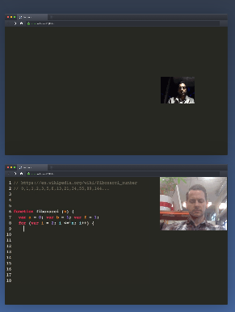

---
layout: post
title: Muti - User - Online - Development 
categories: []
tags: [ Visual Studio Live Share]
---

- [Github Codespaces](#github-codespaces)
- [Gitpod](#gitpod)
- [Visual Studio Live Share](#visual-studio-live-share)
- [Codeshare.io](#codeshareio)
- [Codesandbox.io](#codesandboxio)
- [Atom / Teletype](#atom--teletype)
- [Links](#links)

# Github Codespaces

<https://github.blog/2020-05-06-new-from-satellite-2020-github-codespaces-github-discussions-securing-code-in-private-repositories-and-more/> 

# Gitpod
<https://www.gitpod.io/#get-started> 

# Visual Studio Live Share

Für VS Code und VS 

<https://docs.microsoft.com/en-us/visualstudio/liveshare/quickstart/share> 

Anmeldung bei LiveShare / Github nötig 

https://docs.microsoft.com/en-us/visualstudio/liveshare/troubleshooting#sign-in 

# Codeshare.io

<https://codeshare.io/>

# Codesandbox.io

für  Web - Anwendungen

<https://codesandbox.io/s/>

# Atom / Teletype

<https://teletype.atom.io/>

<https://atom.io/>

braucht installation (??)

# Links

<https://webdesign.tutsplus.com/articles/real-time-code-collaboration-tools-for-developers--cms-30494>
