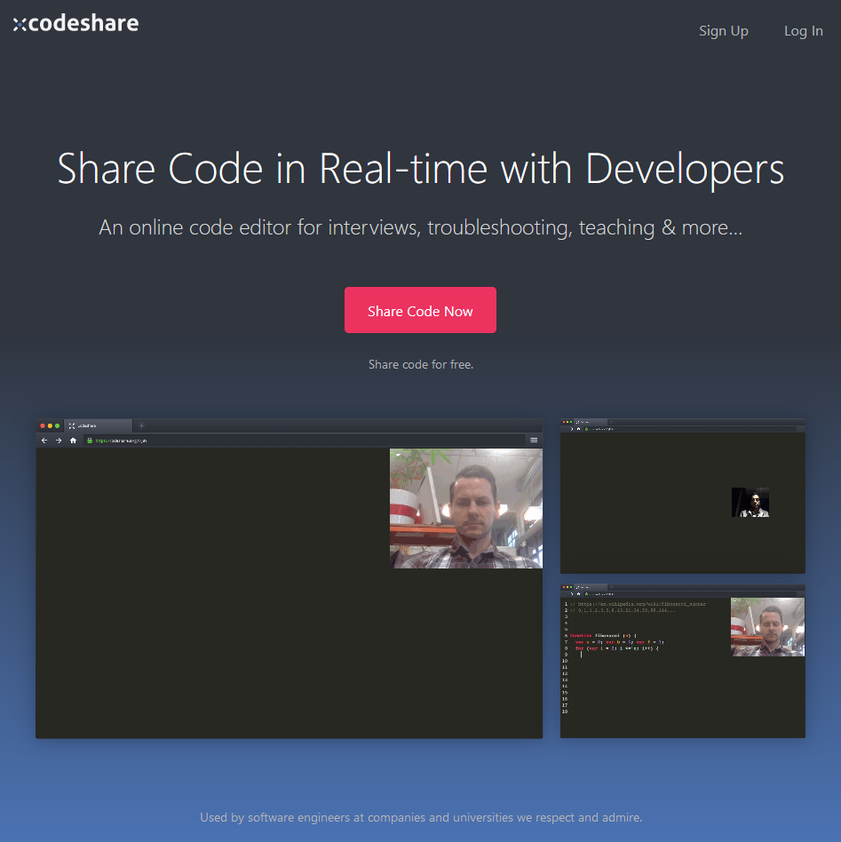
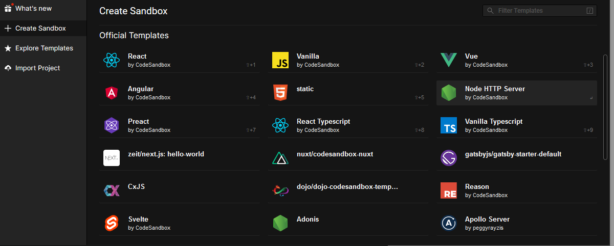

# Visual Studio Live Share

Für VS Code und VS , 

<https://docs.microsoft.com/en-us/visualstudio/liveshare/quickstart/share> 

Anmeldung bei LiveShare nötig 

https://docs.microsoft.com/en-us/visualstudio/liveshare/troubleshooting#sign-in 

# codeshare.io 

<https://codeshare.io/>

# codesandbox.io

für Web - Anwendungen 

<https://codesandbox.io/s/>

# Atom / Teletype 

<https://teletype.atom.io/>

<https://atom.io/>

braucht installation (??)

# Refs

https://webdesign.tutsplus.com/articles/real-time-code-collaboration-tools-for-developers--cms-30494 
