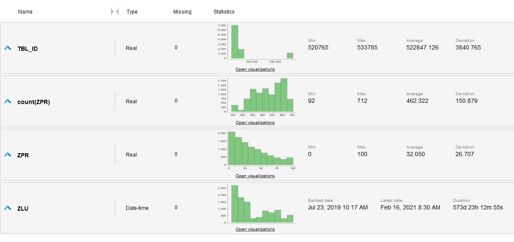
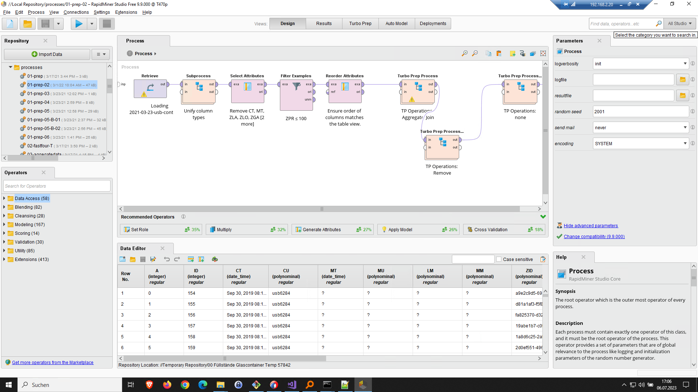
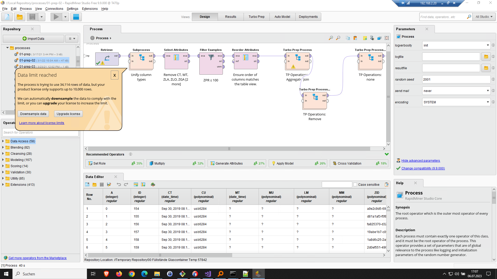
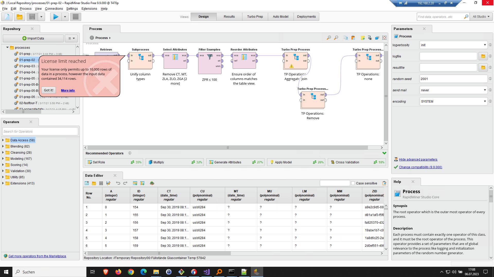
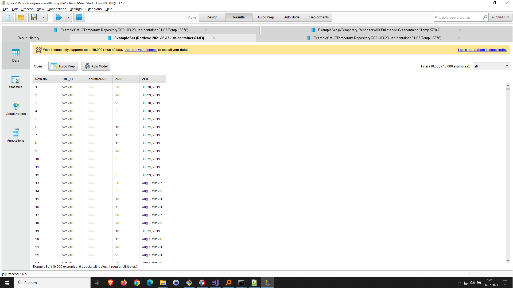
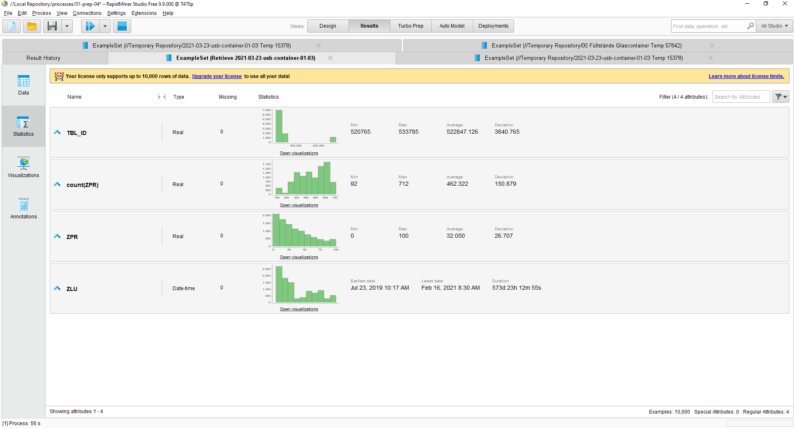
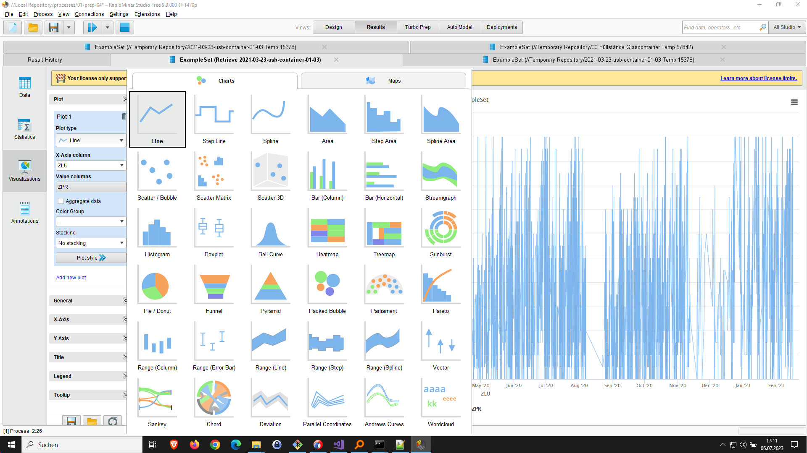
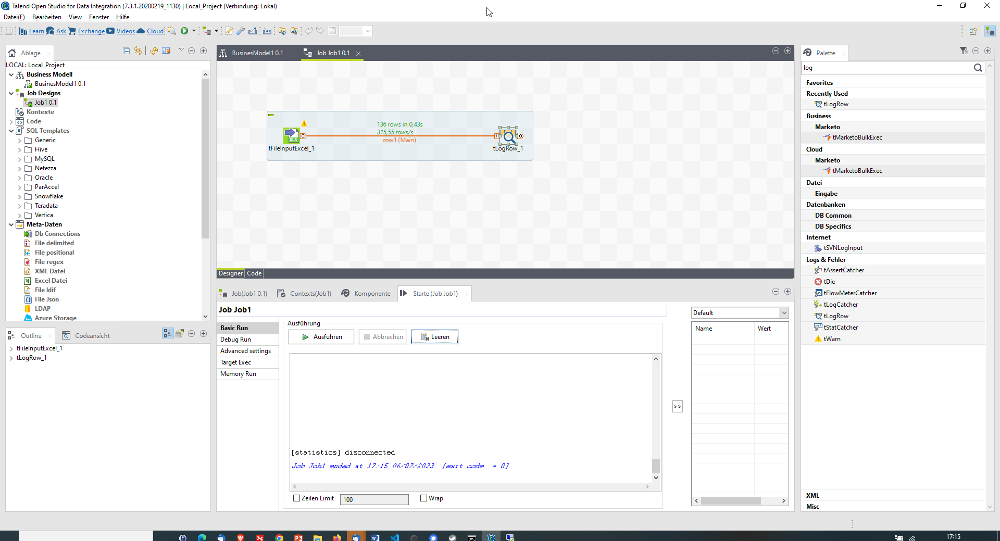

# Analytics Platformen- Knime, Talend, Rapidminer
Die drei genannten Analytics-Plattformen, KNIME, Talend und RapidMiner, sind in der Lage, komplexe Datenanalyse und Datenintegrationsaufgaben zu bewältigen. Hier ist eine kurze Übersicht über jede Plattform:

1. KNIME:
KNIME ist eine Open-Source-Analytics-Plattform, die Datenintegration, Datenanalyse und maschinelles Lernen unterstützt. Sie bietet eine grafische Benutzeroberfläche, die es Benutzern ermöglicht, Datenflussdiagramme zu erstellen, indem sie vorgefertigte Knoten für Datenmanipulation, Transformation, Modellierung und Visualisierung kombinieren. KNIME unterstützt auch die Integration von R, Python und anderen Programmiersprachen. Es ist eine flexible Plattform, die es Benutzern ermöglicht, individuelle Workflows zu erstellen und anzupassen.

2. Talend:
Talend ist eine umfassende Integrationsplattform, die Datenintegration, Datenqualität und Datenmanagement unterstützt. Sie bietet eine Reihe von Tools für die Extraktion, Transformation und das Laden von Daten (ETL) sowie für die Datenqualitätsprüfung und -bereinigung. Talend unterstützt auch Big Data-Integration und die Verbindung mit verschiedenen Datenquellen und -zielen. Die Plattform verfügt über eine benutzerfreundliche grafische Benutzeroberfläche und ermöglicht auch die Integration von Code für fortgeschrittene Anpassungen.

3. RapidMiner:
RapidMiner ist eine Predictive Analytics-Plattform, die maschinelles Lernen, Textmining und statistische Analysen unterstützt. Sie bietet eine grafische Benutzeroberfläche, um Workflows für Datenintegration, Datenmodellierung und Datenvisualisierung zu erstellen. RapidMiner enthält eine Reihe von vorgefertigten Analysewerkzeugen und Algorithmen, die Benutzer für ihre Projekte verwenden können. Die Plattform unterstützt auch die Integration von R und Python sowie die Automatisierung von Workflows.

Diese Plattformen sind beliebt für ihre Fähigkeiten zur Datenintegration, Datenanalyse und maschinellen Lernens. Sie bieten vielseitige Funktionen und Werkzeuge, um komplexe Analyseaufgaben zu bewältigen und aussagekräftige Erkenntnisse aus den Daten zu gewinnen.
## Rapidminer

<https://rapidminer.com/>

## Talend 

<https://www.talend.com/>

## Knime 

<https://www.knime.com/knime-analytics-platform>

