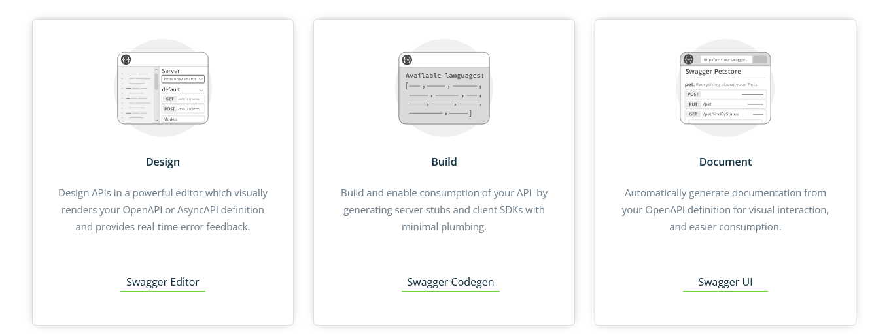
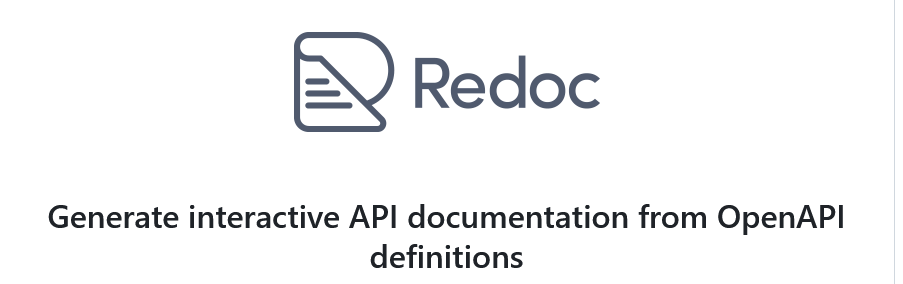

# Api Documentation - Spec Swagger / Open Api 

<https://en.wikipedia.org/wiki/OpenAPI_Specification >

<https://en.wikipedia.org/wiki/Swagger_(software)>

<https://swagger.io/>

# Redoc 

<https://github.com/Redocly/redoc>

st29Tum6GpbT9jJ