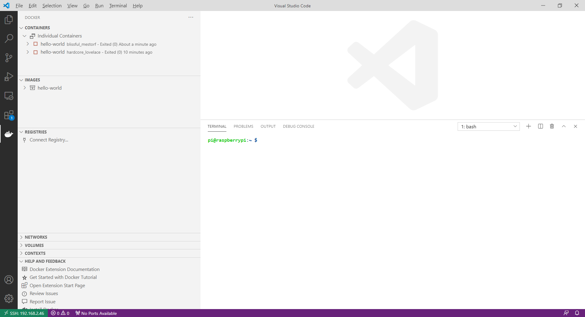


## clipboards

https://ditto-cp.sourceforge.io/ 

## carto 
Unlock the power of spatial analysis
The world's leading Location Intelligence platform

https://carto.com/ 

## Google data expolrer 

https://www.google.com/publicdata/directory

## OSS Kan borard

https://kanboard.org/ 

# scrum / kanban for redmine 

https://www.scrumexpert.com/tools/scrum-and-kanban-plugins-for-redmine/ 

https://redmine.ociotec.com/attachments/536/scrum-v0.19.0.tar.gz

## update docker readmine 3.3.10 + scrum plugin 

    sudo docker ps
    sudo docker exec -it f831edadec99 bash
    wget https://redmine.ociotec.com/attachments/536/scrum-v0.19.0.tar.gz 
    chmod -R redmine:redmine *

restart 

  
# dell e7240 cmos battery 

<https://www.youtube.com/watch?v=6acrpAjQ6IU>

<https://www.parts-people.com/blog/2014/11/19/dell-latitude-e7240-cmos-battery-removal-and-installation/ >

<https://www.youtube.com/watch?v=zNGfT-b1Ejk>

## dell notebook self diag 

Power + d (Display Check)

Poser + Fn 

# Locust - An open source load testing tool.

Define user behaviour with Python code, and swarm your system with millions of simultaneous users. 

<https://locust.io/>

# k8s - ingress controllers 

    Kubernetes Documentation
    Concepts
    Services, Load Balancing, and Networking
    Ingress Controllers 

<https://kubernetes.io/docs/concepts/services-networking/ingress-controllers/> 

# k8s Dashboard Web UI 
    Kubernetes Documentation
    Tasks
    Access Applications in a Cluster
    Web UI (Dashboard)

https://kubernetes.io/docs/tasks/access-application-cluster/web-ui-dashboard/
  
# python fire  - command line maker 

Python Fire is a library for automatically generating command line interfaces (CLIs) from absolutely any Python object.

<https://github.com/google/python-fire>

# Firefox shortcuts 

<https://support.mozilla.org/en-US/kb/keyboard-shortcuts-perform-firefox-tasks-quickly>

<https://developer.mozilla.org/de/docs/Tools/Keyboard_shortcuts>

# logistik summit 

<https://www.youtube.com/watch?v=q8W5KnmbWBg&feature=youtu.be&t=1388>

# kodexplorer - web 

KodExplorer is a file manager for web. It is also a web code editor, which allows you to develop websites directly within the web browser.You can run KodExplorer either online or locally,on Linux, Windows or Mac based platforms. The only requirement is to have PHP 5 available.

<https://github.com/kalcaddle/KodExplorer>

## fhek - home automation + fritz box  + telegram chat 

# docker elk on raspi 4 2020-11-18

<https://dev.to/rohansawant/installing-docker-and-docker-compose-on-the-raspberry-pi-in-5-simple-steps-3mgl>

1. Install Docker

    curl -sSL https://get.docker.com | sh
    
2. Add permission to Pi User to run Docker Commands

    sudo usermod -aG docker pi

Reboot here or run the next commands with a sudo

3. Test Docker installation

    newgrp docker 
    docker run hello-world

4. IMPORTANT! Install proper dependencies

    sudo apt-get install -y libffi-dev libssl-dev

    sudo apt-get install -y python3 python3-pip

    sudo apt-get remove python-configparser

5. Install Docker Compose

    sudo pip3 -v install docker-compose 

--- okay 2020-11-18 on raspi 4 raspberianos 

## remote docker Extension in Raspi with  VS Code - Working 

## elk 

<https://logz.io/learn/complete-guide-elk-stack/#installing-elk>

<https://logz.io/blog/elk-stack-raspberry-pi/>

## Logstash Alternativen 

https://sematext.com/blog/logstash-alternatives/

## usb drive raspi 

    sudo apt-get install usbmount 
    sudo reboot now 
    sudo lsblk -o UUID,NAME,FSTYPE,SIZE,MOUNTPOINT,LABEL,MODEL 
    sudo blkid
<https://raspberrypi.stackexchange.com/questions/100312/raspberry-4-usbmount-not-working>

<https://www.elektronik-kompendium.de/sites/raspberry-pi/1911271.htm> 

    lsblk
    sudo mount /dev/sda1 /media/usb 

    
## git install raspi 

    sudo apt-get install git 

## Jenkins Raspi 

<https://khushil.io/2020/04/23/jenkins-on-raspberry-pi-4/>

<https://j-grote.de/?p=108>

<https://developer-blog.net/raspberry-pi-als-jenkins-server/>

<http://192.168.2.46:8080/> 

<https://www.vogella.com/tutorials/Jenkins/article.html>

    docker pull jenkins/jenkins:lts 

    docker run -p 8080:8080 -p 50000:50000 -v [yourjenkinshome]:/var/jenkins_home jenkins/jenkins:lts

Dockerfile 

    FROM jenkins/jenkins:lts
    # if we want to install via apt
    USER root
    RUN apt-get update && apt-get install -y maven
    # drop back to the regular jenkins user - good practice
    USER jenkins

    docker build -t jenkins-maven .

## Prometheus Raspi 

<https://devconnected.com/the-definitive-guide-to-prometheus-in-2019/> 

<http://192.168.2.46:9090/metrics> 

## Prometheus node exporter 

<https://github.com/prometheus/node_exporter>

    docker run -d \
      --net="host" \
      --pid="host" \
      -v "/:/host:ro,rslave" \
      quay.io/prometheus/node-exporter \
      --path.rootfs=/host

<http://192.168.2.46:9100/metrics> 

## nginx basic status 

<http://192.168.2.46/basic_status>