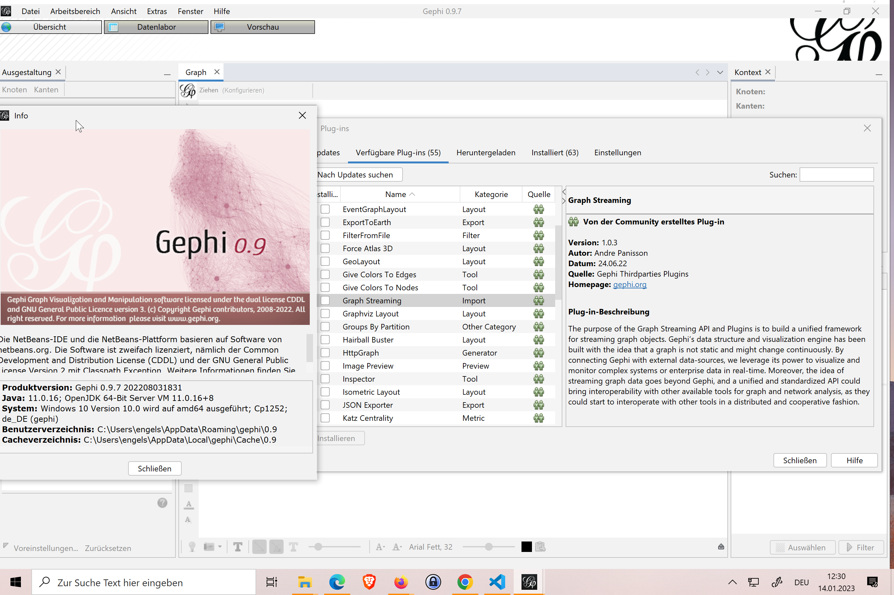

---
layout: post
title:  Data Flow Analyse Dokumentation - Visualisation 
categories: [visualisation]
marp: true
tags: [gephi, data, graph,layout]
---

# Data Flow Analyse Dokumentation

Graph Analyse mit PowerBI und MSSQL Edge + Node

<https://www.mssqltips.com/sqlservertip/5208/graph-analysis-using-force-directed-graphs-in-power-bi-desktop/>

# Neo4J - Graph DB 

<https://neo4j.com/developer/tools-graph-visualization/#neo4j-vis-vendors>

<https://neo4j.com/developer/relational-to-graph-modeling/>

# OrientDB - Graph DB

<https://orientdb.org/> 

<https://github.com/orientechnologies/orientdb> 

<http://192.168.2.23:2480/studio/index.html> 

## use gremlin with orientdb

<http://orientdb.com/docs/3.1.x/gremlin/Gremlin.html>

## Graph Editor Gephi

Gephi tutorial

<https://gephi.org/tutorials/gephi-tutorial-visualization.pdf> 

## Graph Streming Plugin

- Gephi Version 0.1.0:  kein Graph Streaming plugin mehr (2023-01-14)
- Gephi Version 0.9

  

<https://gephi.org/users/install/>

# Links

<http://192.168.2.23:2480/gephi/demodb/sql/select%20from%20ArchaeologicalSites/-1>
<http://192.168.2.23:2480/gephi/demodb/sql/select%20from%20IsFromCountry/-1>

<http://127.0.0.1:2480/gephi/demodb/sql/select%20from%20IsFromCountry>
<http://192.168.2.23:2480/gephi/demodb/sql/select%20from%20select%20*%20from%20HasFriend>

    select * from HasFriend 
    select * from `Countries` 
<http://192.168.2.23:2480/gephi/demodb/sql/>

<http://192.168.2.23:2480/gephi/demodb/sql/select%20from%20Customers/-1>

<http://192.168.2.23:2480/gephi/demodb/sql/select%20from%20Customers/-1>

I guess with gs-gephi you will need to use xyz and size attributes, but I am not sure.
gephi connect

add nodes sql 
<http://192.168.2.23:2480/gephi/DogewoDB/sql/select%20from%20v/-1>

add nodes gremlin 

add edges 
http://localhost:2480/gephi/DogewoDB/sql/select%20from%20e/-1

http://orientdb.com/docs/3.1.x/gremlin/Gremlin.html

http:///192.168.2.23:2480/gephi/DogewoDB?operation=getGraph

http://192.168.2.23:2480/gephi/DogewoDB/sql/select%20from%20v/-1

select from (traverse * from #71:60) where $depth <=2

## Gephi Graph Streaming 

https://github.com/gephi/gephi/wiki/GraphStreaming

    an: Add node
    cn: Change node
    dn: Delete node
    ae: Add edge
    ce: Change edge
    de: Delete edge

# Apache tinkerpop 

<http://tinkerpop.apache.org/>

<https://kelvinlawrence.net/book/Gremlin-Graph-Guide.html>

