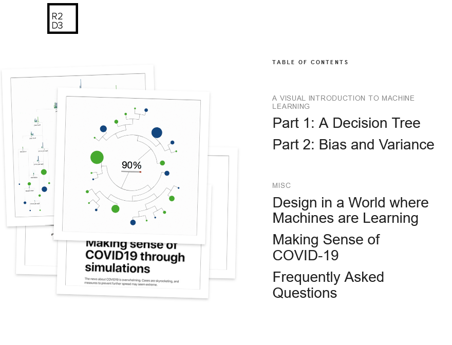

---
layout: post
title: Data Analytics - Image Classification on ImageNet (Papers with Code)
categories: []
tags: []
--- 

- [Image Classification on ImageNet (Papers with Code)](#image-classification-on-imagenet-papers-with-code)
- [Learning](#learning)
  - [Elementsofai](#elementsofai)
  - [r2d3](#r2d3)

# Image Classification on ImageNet (Papers with Code)

<https://paperswithcode.com/sota/image-classification-on-imagenet>

# Learning

## Elementsofai
Unser Ziel ist es, eine Tür zu KI zu öffnen

Hinter „The Elements of AI“ verbirgt sich eine Reihe kostenloser Onlinekurse, entwickelt von der finnischen Unternehmensberatung MinnaLearn und der Universität Helsinki. Ziel ist es, das Thema KI möglichst vielen Menschen näherzubringen: Was ist KI? Was kann KI (und was nicht)? Und wie werden KI-Methoden entwickelt?

Die Kurse kombinieren theoretische Wissensvermittlung mit praktischen Übungen, und die Teilnehmer können ihr Lerntempo selbst bestimmen.

- <https://www.elementsofai.de/>
## r2d3

A visual introduction to machine learning

In machine learning, computers apply statistical learning techniques to automatically identify patterns in data. These techniques can be used to make highly accurate predictions.

<http://www.r2d3.us/visual-intro-to-machine-learning-part-1/>
