<figure class="video_container">
  <video width="100%"  controls="true" allowfullscreen="true" poster="/pic/Screenshot_2021-01-28%20mentimeter%20Interactive%20presentation%20software-login.png">
    <source src="/mov/2021-03-03-08-11-34-mentimeter.mp4" type="video/mp4">
  </video>
</figure>

Tools for Webinars
- [Webinar Tools](#webinar-tools)
- [Tweedback](#tweedback)
- [WonderMe](#wonderme)
- [Arsnova OSS (ohne Anmeldung)](#arsnova-oss-ohne-anmeldung)
- [Partify (ohne Anmeldung)](#partify-ohne-anmeldung)
- [Pingo (Anmeldung)](#pingo-anmeldung)
- [Socrative (Anmeldung)](#socrative-anmeldung)
- [Metimeter (Anmeldung)](#metimeter-anmeldung)
- [Sprintbetter.de](#sprintbetterde)
- [Miro Whiteboard](#miro-whiteboard)
- [Mural Multiuser Whiteboard](#mural-multiuser-whiteboard)
- [https://deon.de/de/](#httpsdeondede)
- [https://www.figma.com](#httpswwwfigmacom)
- [Random Wheel Picker](#random-wheel-picker)
  - [Beispiel ohne Vorbereitung](#beispiel-ohne-vorbereitung)
- [Sonstiges](#sonstiges)
  - [Lenmethode Inverted Classroom](#lenmethode-inverted-classroom)
  - [https://www.brightful.me/](#httpswwwbrightfulme)
  - [https://www.workshop-spiele.de/](#httpswwwworkshop-spielede)

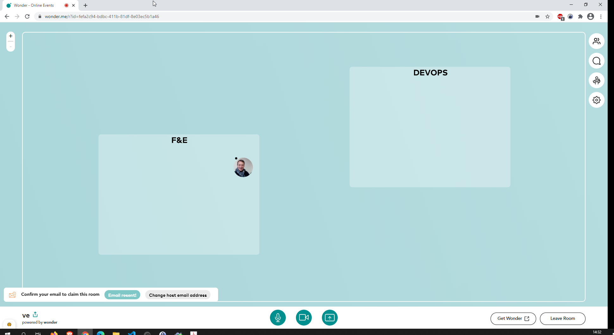

# Webinar Tools

# Tweedback

Login: admin + user ohne Anmeldung

ohne Anmeldung Abfragen

<https://tweedback.de/>

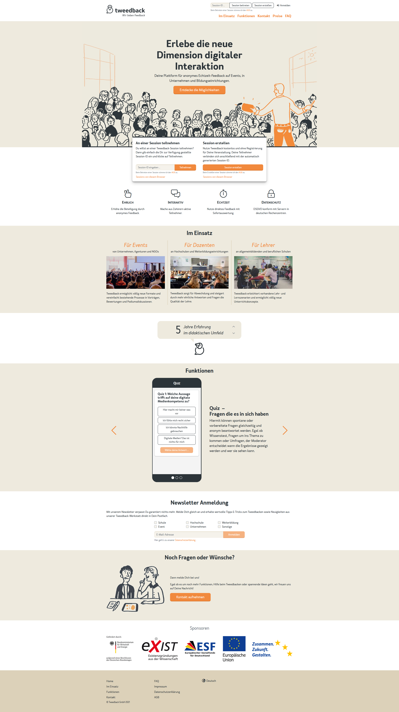

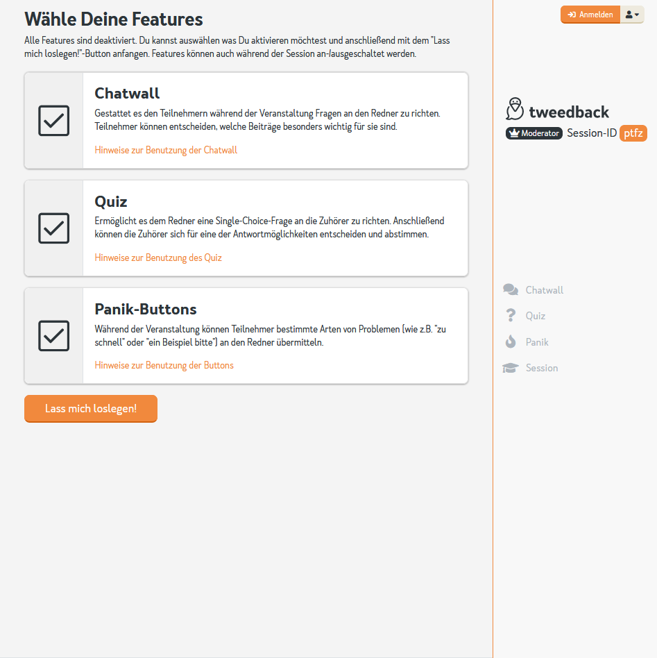

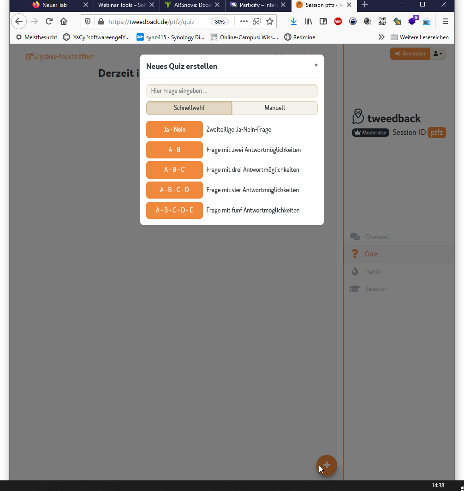

# WonderMe 
Admin: Email - funktioniert auch ohne Verifikation 
User: Anon

<https://www.wonder.me/>

- Bewegen in Weboberfläche in unterschiedliche Bereiche, dann "lokale VideoChats" 
- Broadcast vom Moderator: senden video an alle 
- chat: lokal, global, privat 

Funktioniert am besten mit Chrome, Probleme bei FF / Edge / Safari 

# Arsnova OSS (ohne Anmeldung)

Audience Response system 

<https://arsnova.thm.de/blog/arsnova-handbuch/#dozent>

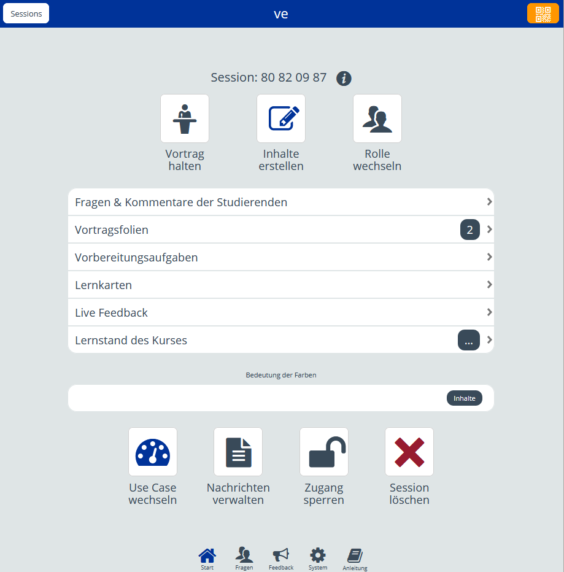

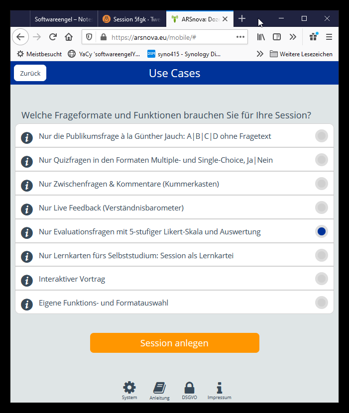

<https://youtu.be/K16JN619PVA>

Open Source 

<https://github.com/thm-projects/arsnova-backend>

# Partify (ohne Anmeldung)
online chat "Kommentare" mit Bewertung , Abstimmung 

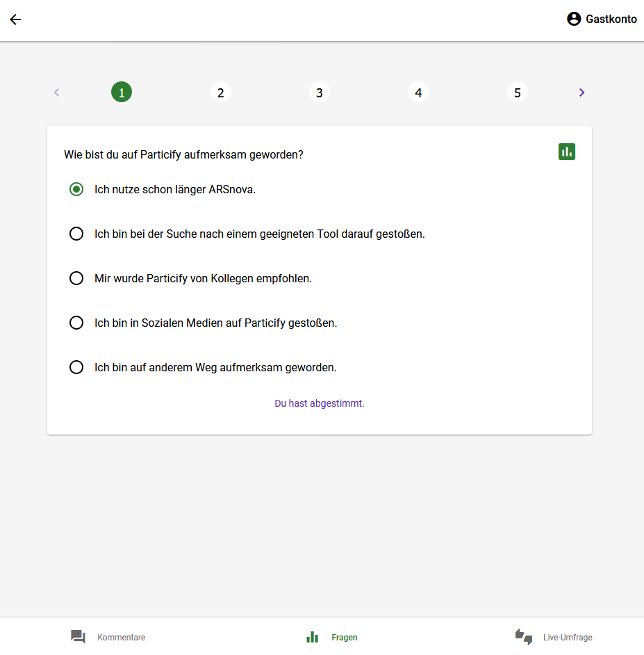

# Pingo (Anmeldung)

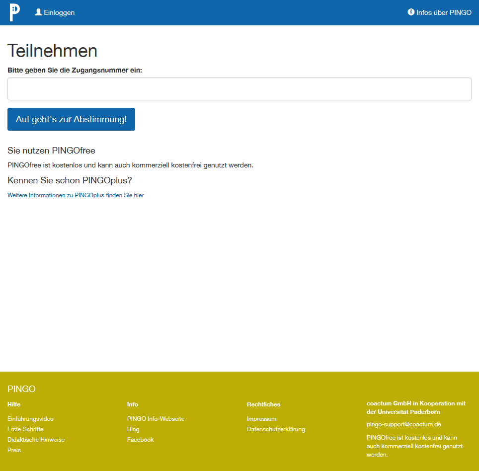

<https://github.com/PingoUPB>
(Uni Paderborn) 

<https://pingo.coactum.de/tutorial/tutorial.html>

# Socrative (Anmeldung)

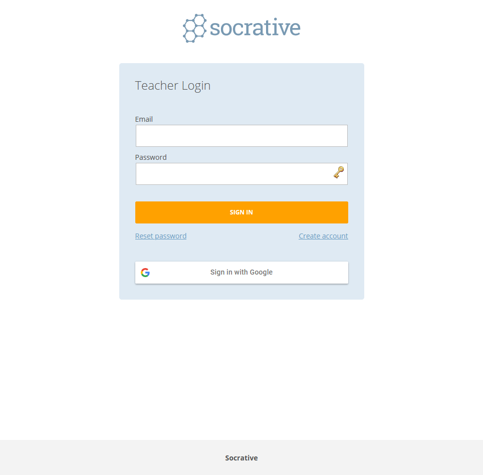

# Metimeter (Anmeldung)

<https://www.mentimeter.com>

"Create interactive presentations & meetings, wherever you are

Use live polls, quizzes, word clouds, Q&As and more to get real-time input - regardless if you’re remote, hybrid or face-to-face
"

<figure class="video_container">
  <video width="100%"  controls="true" allowfullscreen="true" poster="/pic/Screenshot_2021-01-28%20mentimeter%20Interactive%20presentation%20software-login.png">
    <source src="/mov/2021-03-03-08-11-34-mentimeter.mp4" type="video/mp4">
  </video>
</figure>

# Sprintbetter.de 

# Miro Whiteboard 

<http://miro.com/>

# Mural Multiuser Whiteboard 

Admin : Anmeldung / EDU 
User: Anon per Link 
- Abstimmung und Punkte kleben auf Objekte 

<https://www.mural.co/>

https://app.mural.co/t/fom20217484/m/fom20217484/1614764269254/2f493dae80c3f39712279c3f31c158058ec52a22

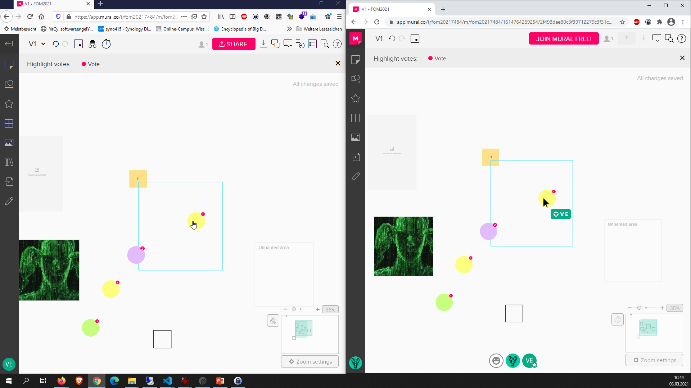

# https://deon.de/de/ 

Desktop App

# https://www.figma.com 

Login admin:  Anmeldung, Free: nur 2 Colab User

<https://www.figma.com>

# Random Wheel Picker

<https://tools-unite.com/tools/random-picker-wheel>

<figure class="video_container">
  <video width="100%"  controls="true" allowfullscreen="true" >
    <source src="/mov/2021-03-03-09-16-50-randomwheelpicker.mp4" type="video/mp4">
  </video>
</figure>

## Beispiel ohne Vorbereitung

<https://tools-unite.com/tools/random-picker-wheel?names=A,B,C,D,E,F>

# Sonstiges

## Lenmethode Inverted Classroom 

<https://www.e-teaching.org/lehrszenarien/vorlesung/inverted_classroom/index_html>

## https://www.brightful.me/ 
"Have fun, build trust, boost teamwork.

Just because you've moved your meetings online, it doesn't mean that you have to lose the human connection. Play our games to spark excitement and laughter in your virtual gathering. "

## https://www.workshop-spiele.de/

<https://www.workshop-spiele.de/5-tools-fuer-online-warm-ups/>

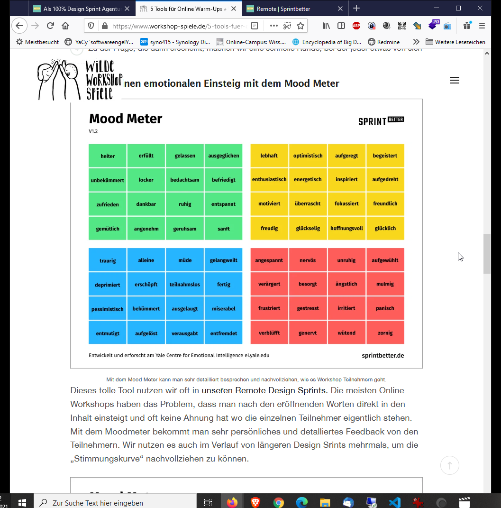

