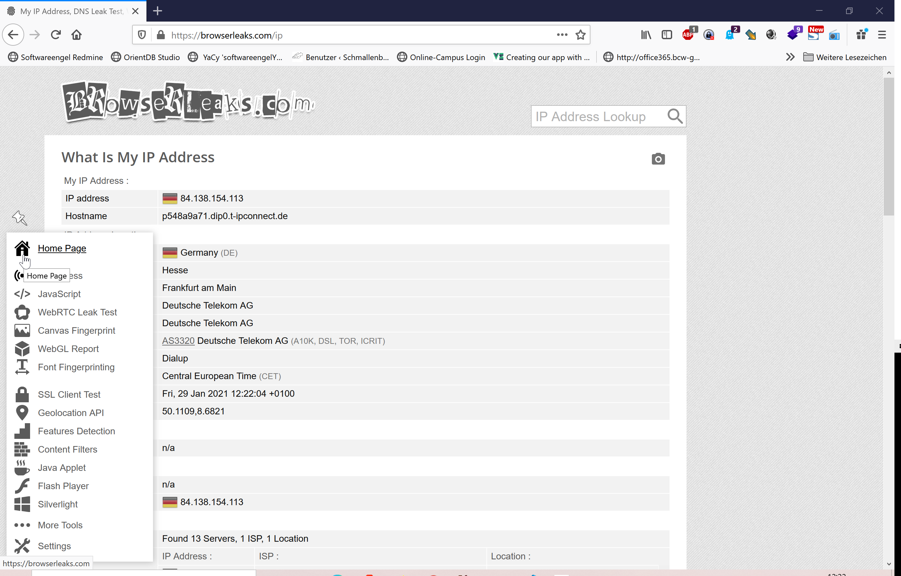
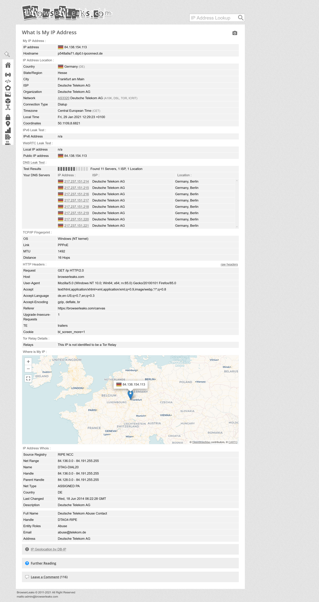
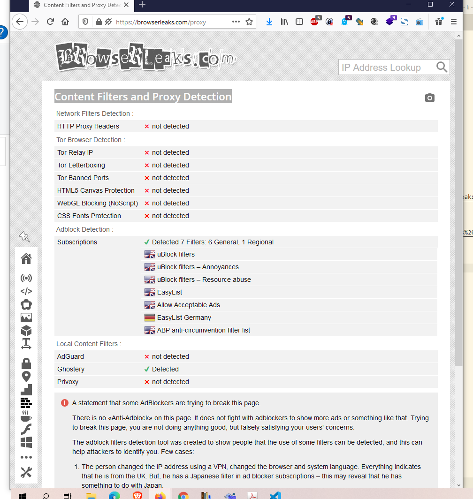
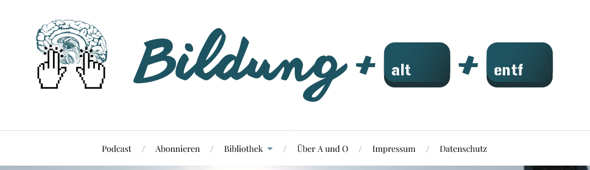

---
layout: post
title: Notes 2021-01 on Browserleaks, Webflow, Betterposter
categories: [ notes]
tags: [ Browserleaks, Webflow, Betterposter]
--- 

- [Browserleaks](#browserleaks)
- [Webflow](#webflow)
- [Podcast Bildung a + o](#podcast-bildung-a--o)
- [Betterposter](#betterposter)

# Browserleaks

get info of your browser

<https://browserleaks.com/>

IP Adress Full

Canvas Fingerprinting

Content Filters and Proxy Detection

# Webflow

Build with the power of code — without writing any
website building and hosting
Take control of HTML, CSS, and JavaScript in a visual canvas. Webflow generates clean, semantic code that’s ready to publish or hand to developers.

<https://webflow.com/>

The modern way to build for the web

# Podcast Bildung a + o 

<https://bldg-alt-entf.de/tag/yotribe/>

# Betterposter
Another Better Scientific Poster Using R Markdown and pagedown

<https://github.com/GerkeLab/betterposter>
