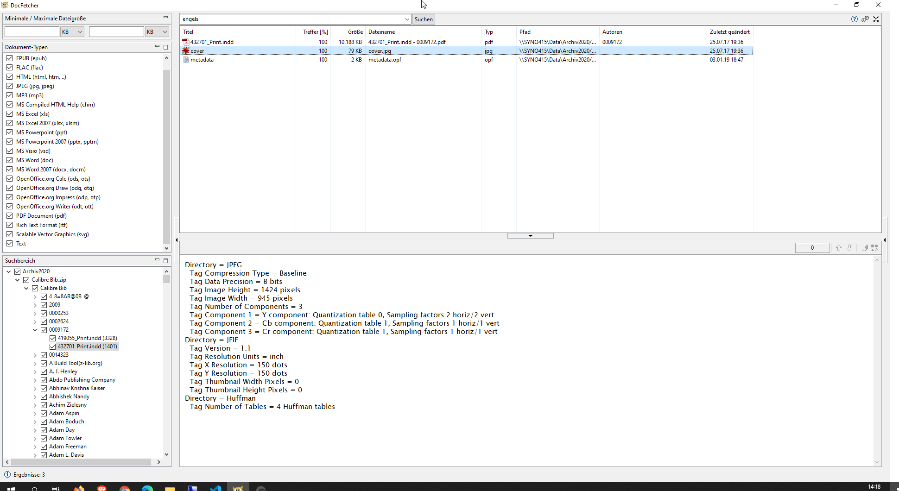
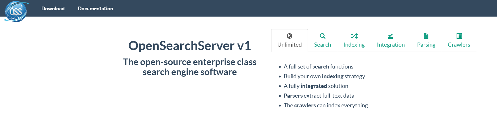

---
layout: post
title: Notes on OmniAuth, Open Semantic Desktop Search
categories: [Notes]
tags: [OmniAuth, Open Semantic Desktop Search , DocFetcher, open search server , Keycloak OSS SSO ]
--- 

- [OmniAuth: Standardized Multi-Provider Authentication in Ruby](#omniauth-standardized-multi-provider-authentication-in-ruby)
- [Open Semantic Desktop Search](#open-semantic-desktop-search)
- [DocFetcher](#docfetcher)
- [Filesearch](#filesearch)
- [Summa](#summa)
- [Open Search Server](#open-search-server)

# OmniAuth: Standardized Multi-Provider Authentication in Ruby

OmniAuth is a library that standardizes multi-provider authentication for web applications. It was created to be powerful, flexible, and do as little as possible. Any developer can create strategies for OmniAuth that can authenticate users via disparate systems. OmniAuth strategies have been created for everything from Facebook to LDAP.

In order to use OmniAuth in your applications, you will need to leverage one or more strategies. These strategies are generally released individually as RubyGems, and you can see a community maintained list on the wiki for this project.

One strategy, called Developer, is included with OmniAuth and provides a completely insecure, non-production-usable strategy that directly prompts a user for authentication information and then passes it straight through. You can use it as a placeholder when you start development and easily swap in other strategies later.

<https://github.com/omniauth/omniauth>

# Open Semantic Desktop Search

Search, analyze and explore large document collections by Open Source Search Engine, Text Mining, Document analysis and Text Analytics Explore

<https://opensemanticsearch.org/doc/admin/install>

<https://github.com/opensemanticsearch>

# DocFetcher

<https://www.heise.de/download/product/docfetcher-58427>

<https://sourceforge.net/p/docfetcher/wiki/Source%20code/>

<http://docfetcher.sourceforge.net/de/index.html>

# Filesearch

Multithread File Search

- <https://sourceforge.net/projects/file-search/>

<https://sourceforge.net/projects/file-search/files/v0.3.2/FileSearch-v0.3.2-portable.7z/download>

# Summa
Summa is an open source search engine developed by the State and University Library of Denmark. It is released under the Apache License, Version 2.0.

This project is developed for internal use at State and University Library. While it is certainly possible to use it elsewhere, it is not very polished and documentation is lacking.

- <http://wiki.statsbiblioteket.dk/summa> 

- <https://github.com/statsbiblioteket/summa>

# Open Search Server

OpenSearchServer is a powerful, enterprise-class, search engine software based on Lucene. Using the web user interface, the crawlers (web, file, database, ...) and the JSON webservice you will be able to integrate quickly and easily advanced full-text search capabilities in your application. OpenSearchServer runs on Linux/Unix/BSD/Windows.

- <https://github.com/jaeksoft/opensearchserver>

- <https://www.opensearchserver.com/#download>

