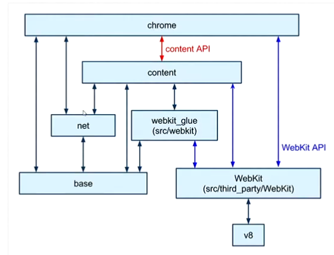

---
layout: post
title: Cross Platform
categories: [Cross Platform]
tags: [ Cross Platform ]
--- 

- [Cross Platform](#cross-platform)
- [Links](#links)
- [Electron](#electron)
  - [Electron Apps](#electron-apps)
- [NW.js vs. Electron](#nwjs-vs-electron)
- [Nw.js](#nwjs)

# Cross Platform 

# Links

<https://stackoverflow.com/questions/62241119/architecture-of-vs-code>

A Walk Through Electron's Internals - Brendan Forster

<https://www.youtube.com/watch?v=oTDjyMTZU1s >

# Electron

<https://www.electronjs.org/>

<https://github.com/sindresorhus/awesome-electron#boilerplates>

## Electron Apps 
<https://www.electronjs.org/apps >

<https://github.com/sindresorhus/awesome-electron >

# NW.js vs. Electron 

<https://www.electronjs.org/docs/development/electron-vs-nwjs>

# Nw.js 

<https://nwjs.io/>