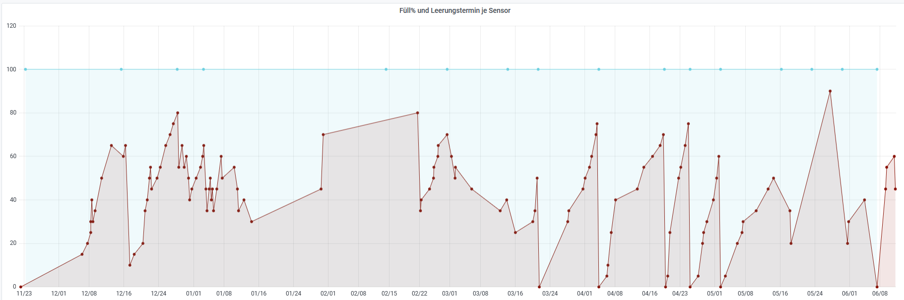
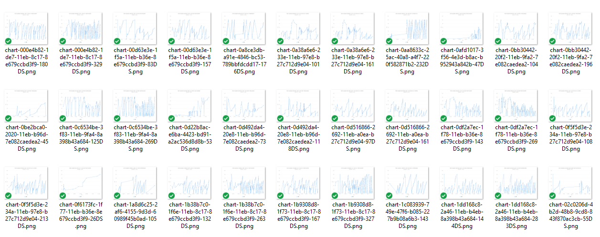
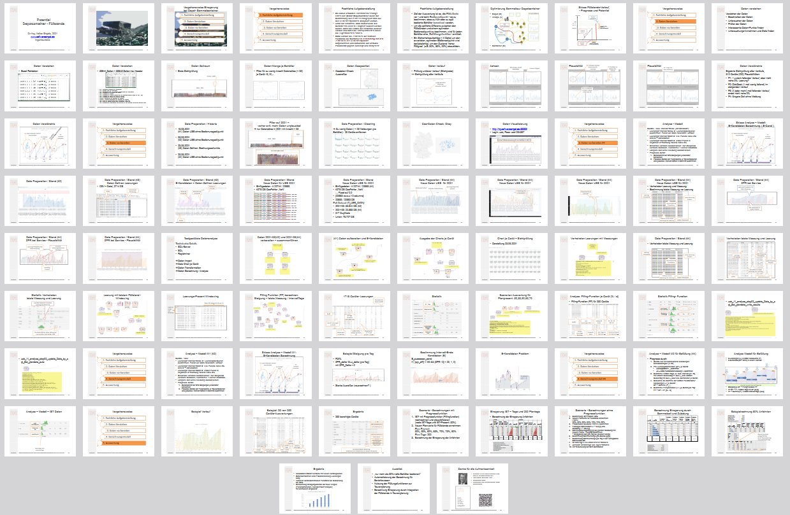

# Füllstandsprognose bei dynamischen IoT-Container-Füllständen (CRISP)

- Verlaufshistorie je IoT-Behälter analysieren 

- Leerungstermine automatisch bestimmen  
  

- Auswertung, Analysen, Statisitik, Progrosefunktionen, Fehlerbestimmung, Potential  

