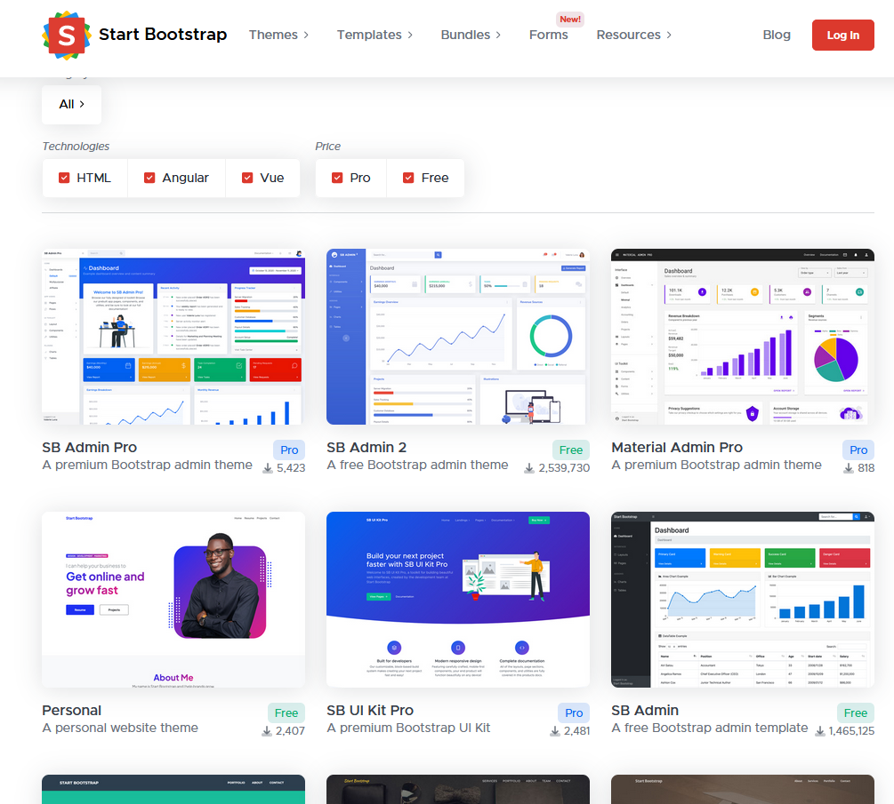

# Startbootstrap
## Bootstrap themes, templates, and UI tools to help you start your next project!

Start Bootstrap creates free, open source, MIT license, Bootstrap [themes](https://startbootstrap.com/themes), [templates](https://startbootstrap.com/templates), and [code snippets](https://startbootstrap.com/snippets) for you to use on any project, [guides](https://startbootstrap.com/guides) to help you learn more about designing and developing with the Bootstrap framework, and [premium Bootstrap UI products](https://startbootstrap.com/shop). 

<https://startbootstrap.com/>

# Chat RocketChat OSS und App

[Rocket.Chat](https://rocket.chat) is an open-source fully customizable communications platform developed in JavaScript for organizations with high standards of data protection.

We are the ultimate **Free Open Source Solution** for team communications, enabling real-time conversations between colleagues, with other companies or with your customers, regardless of how they connect with you. The result is an increase in productivity and customer satisfaction rates.

Every day, tens of millions of users in over 150 countries and in organizations such as Deutsche Bahn, The US Navy, and Credit Suisse trust Rocket.Chat to keep their communications completely private and secure.

~~<https://f-droid.org/en/packages/chat.rocket.android/>~~

<https://github.com/RocketChat/Rocket.Chat#quick-start-for-code-developers>