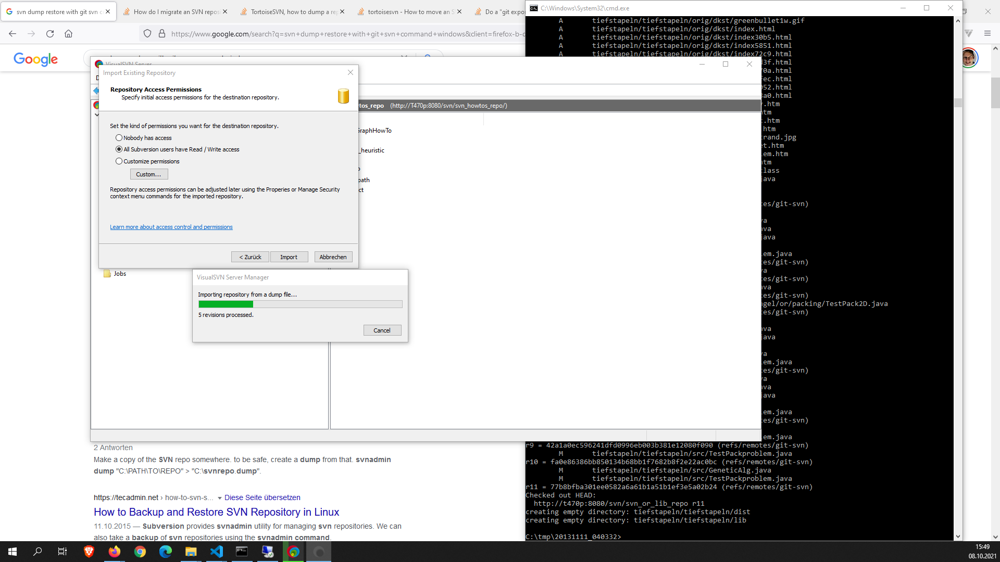

# Restore old svn dump files

- Start Visualsvn Server
  
- import dump - files in visualsvnserver



- git svn checkout 
```
git svn clone http://T470p:8080/svn/svn_or_lib_repo/ svn_or_lib_repo
```

## Links

https://www.visualsvn.com/server/getting-started/