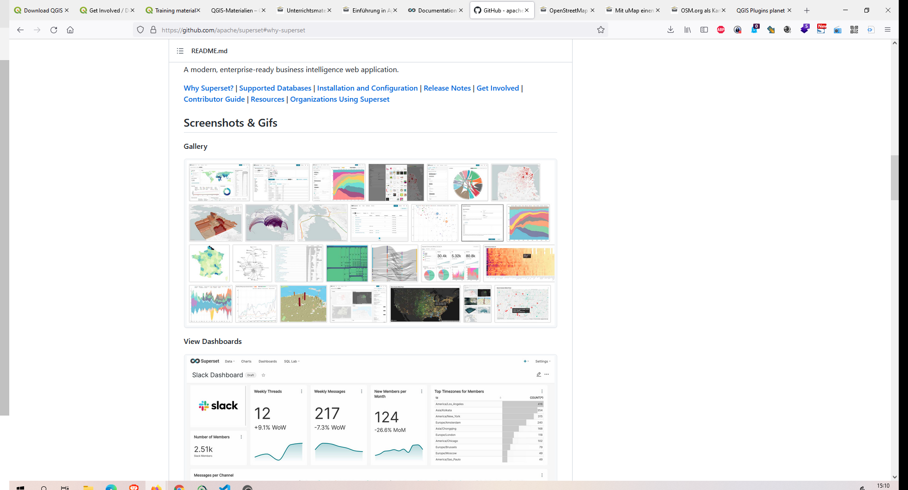
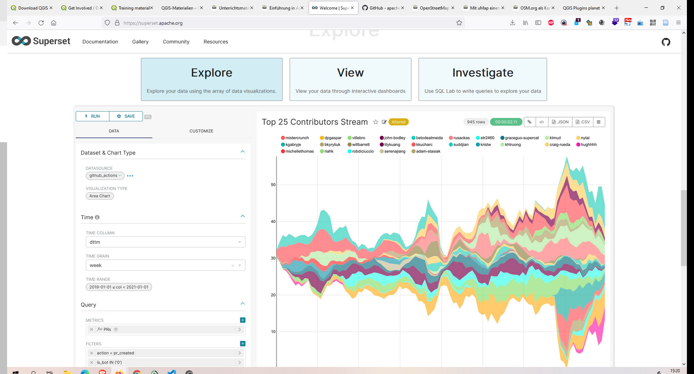
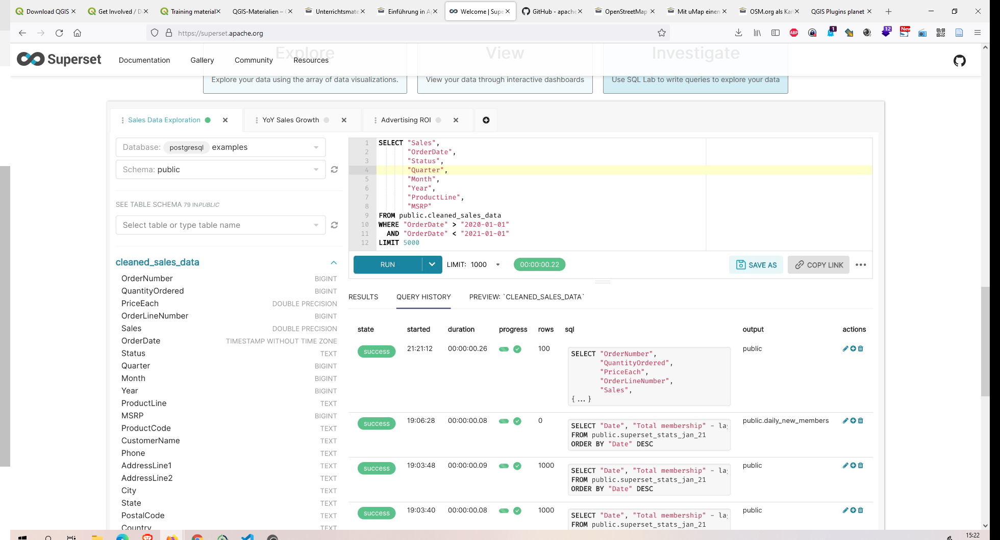
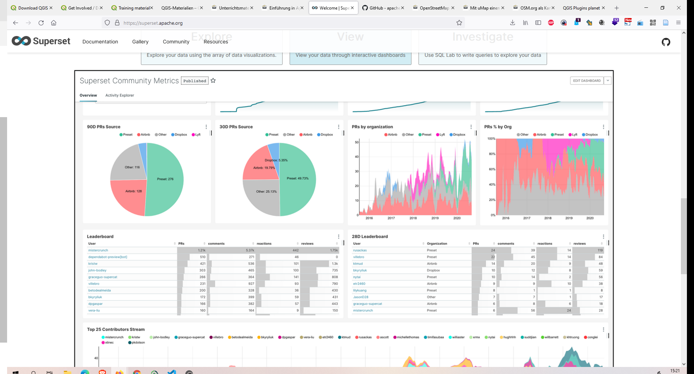

# Qgis - OSM - WebMap

## umap Karteneditor

Karteneditor  web  

https://umap.osm.ch/de

## Apache Superset - Grafana Alternative

https://github.com/apache/superset#why-superset

## Links

- OpenschoolMaps

https://openschoolmaps.ch/pages/materialien.html

- Geo Python qgis processing workshop

https://github.com/geometalab/GeoPythonConf2018-QGIS-Processing-Workshop

Slides 

https://github.com/geometalab/GeoPythonConf2018-QGIS-Processing-Workshop/blob/master/Workshop%20Slides/GeoPython%20Conference%202018.pdf
