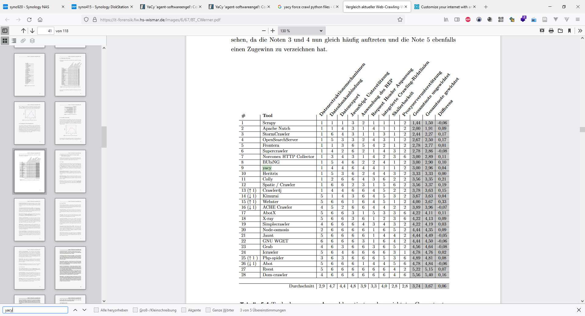

- [Compare Crawler / Spider](#compare-crawler--spider)
  - [Links](#links)
  - [opensourceconnections.com for solr](#opensourceconnectionscom-for-solr)

# Compare Crawler / Spider

## Links

- Compare BT 

<https://it-forensik.fiw.hs-wismar.de/images/6/67/BT_CWerner.pdf>

- Scrapy
<https://docs.scrapy.org/en/latest/>

- Apache Nutch 
<https://github.com/apache/nutch>
<https://cwiki.apache.org/confluence/display/NUTCH/NutchTutorial>

- Apache Nutch + Solr 
<https://spontan-wild-und-kuchen.de/archive/2772>

- Large scale crawling with Apache Nutch

<https://www.youtube.com/watch?v=pzMpwW4ppRM>

- solr Frontends 

## opensourceconnections.com for solr 
<https://opensourceconnections.com/>

https://github.com/Anant/awesome-solr

- solr Admin UI 

https://solr.apache.org/guide/6_6/overview-of-the-solr-admin-ui.html