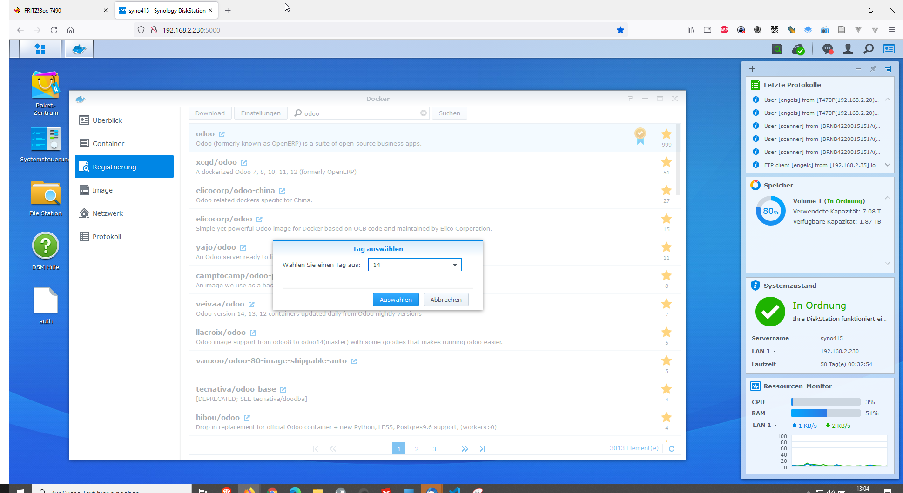
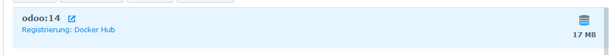
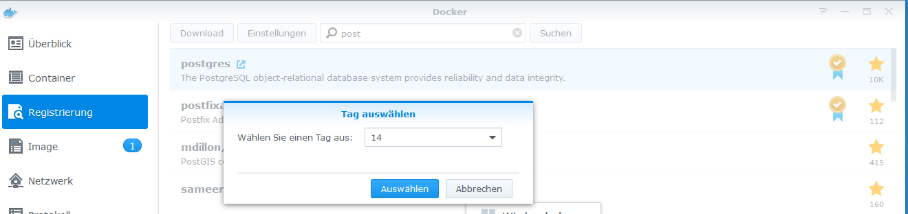
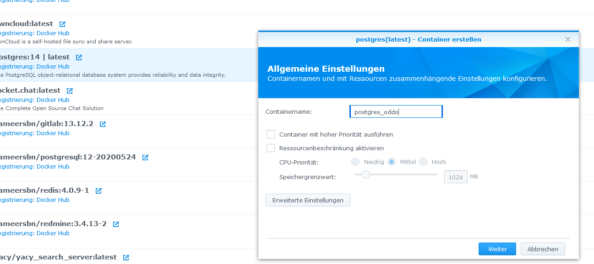
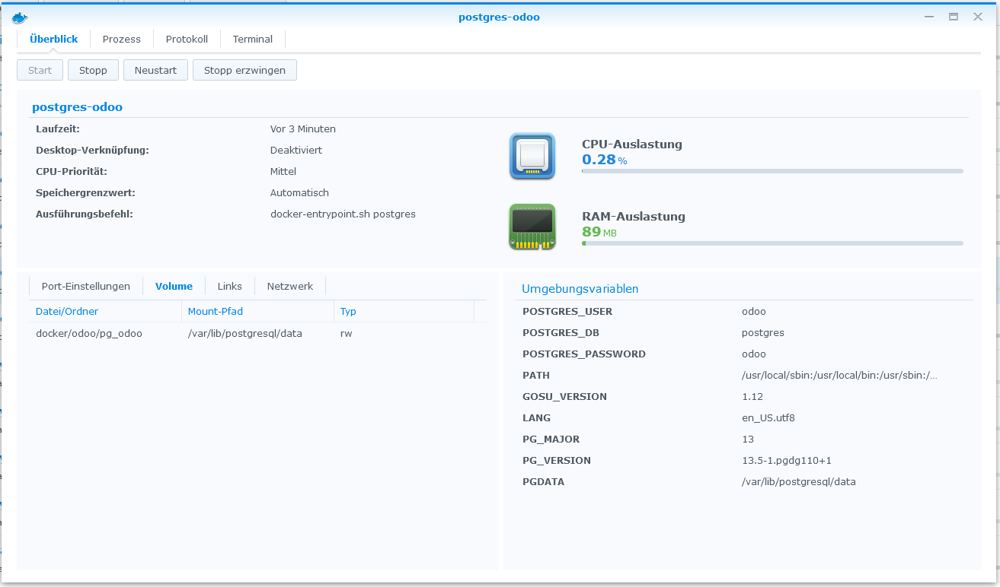
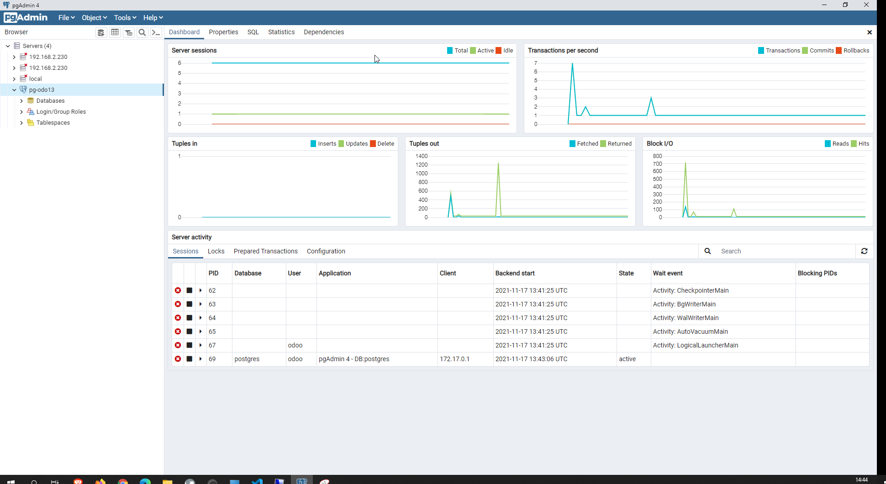
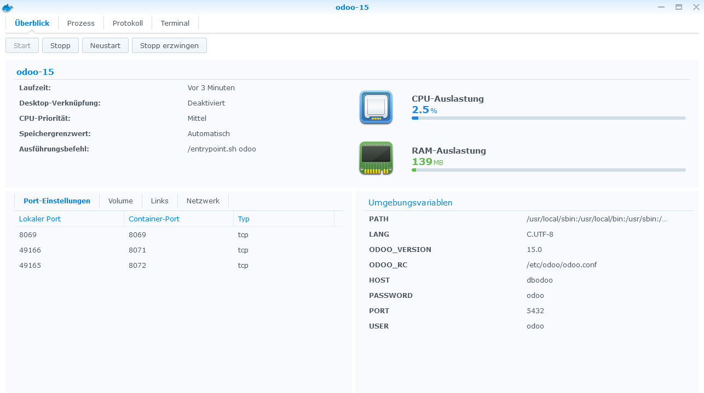
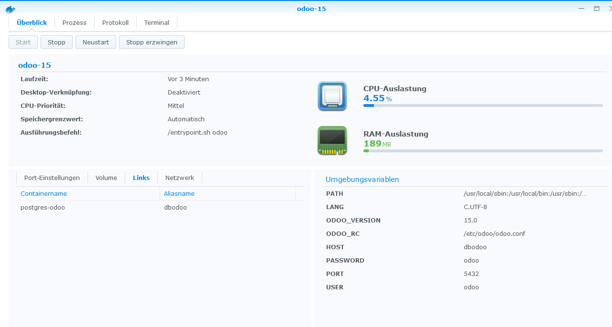

---
layout: post
title: Odoo - ERP
categories: [Odoo  ]
tags: [Odoo, ERP ]
--- 
- [Odoo - ERP](#odoo---erp)
  - [Odoo install auf Synology 415+ - Docker - Working](#odoo-install-auf-synology-415---docker---working)
  - [Links](#links)

# Odoo - ERP

## Odoo install auf Synology 415+ - Docker - Working 

Register Odoo Version 14, Postgres sql 13

## Links

<https://github.com/initOS/dob>
