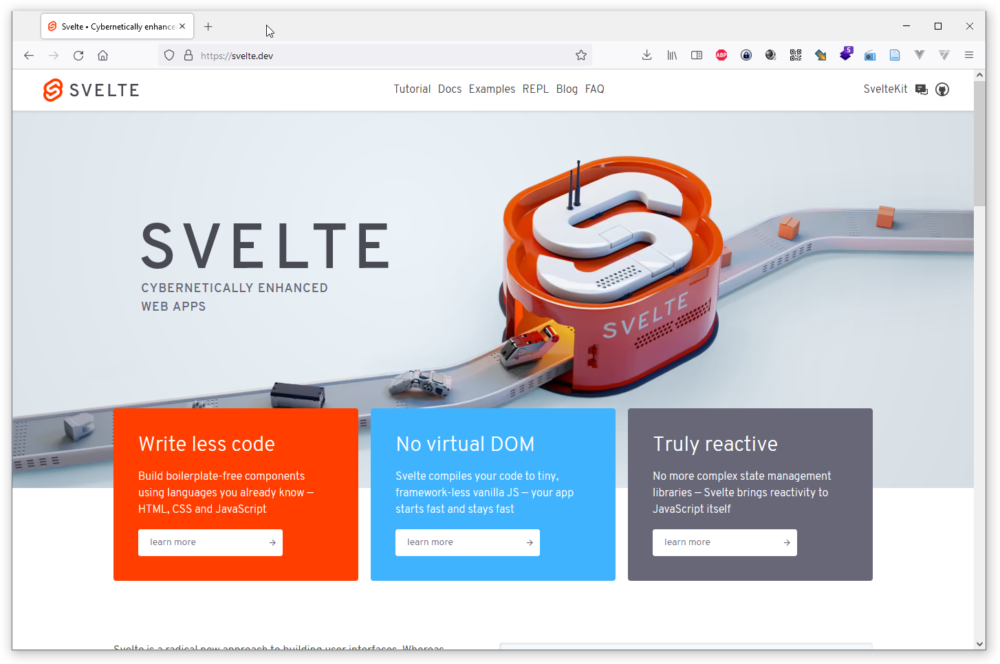
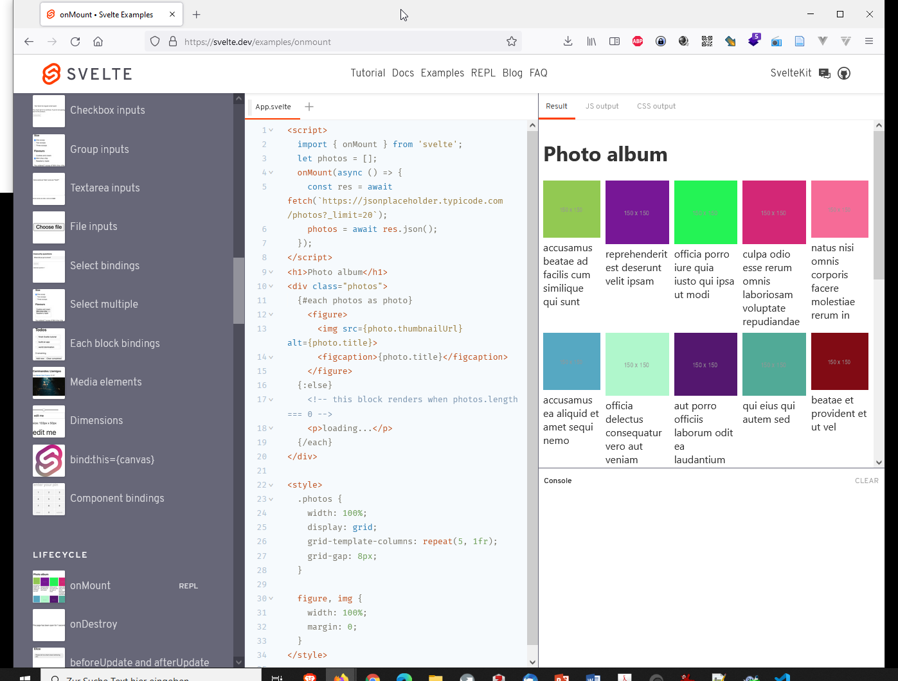

---
layout: post
title: Sevelte JS Framework
categories: [JS, Sevelte, Framework]
tags: [JS, TS, oss]
--- 



# Sevelte JS

- Write less code



Build boilerplate-free components using languages you already know — HTML, CSS and JavaScript

- No virtual DOM

- Truly reactive

No more complex state management libraries — Svelte brings reactivity to JavaScript itself


Svelte is a radical new approach to building user interfaces. Whereas traditional frameworks like React and Vue do the bulk of their work in the browser, Svelte shifts that work into a compile step that happens when you build your app.

Instead of using techniques like virtual DOM diffing, Svelte writes code that surgically updates the DOM when the state of your app changes.

We're proud that Svelte was recently voted the most loved web framework with the most satisfied developers in a pair of industry surveys. We think you'll love it too. Read the introductory blog post to learn more.

```bash
    npx degit sveltejs/template my-svelte-project
    cd my-svelte-project
    npm install
    npm run dev
```

## Links

- <https://svelte.dev/>

- <https://svelte.dev/blog/the-easiest-way-to-get-started>

Examples

- <https://svelte.dev/examples/hello-world>
