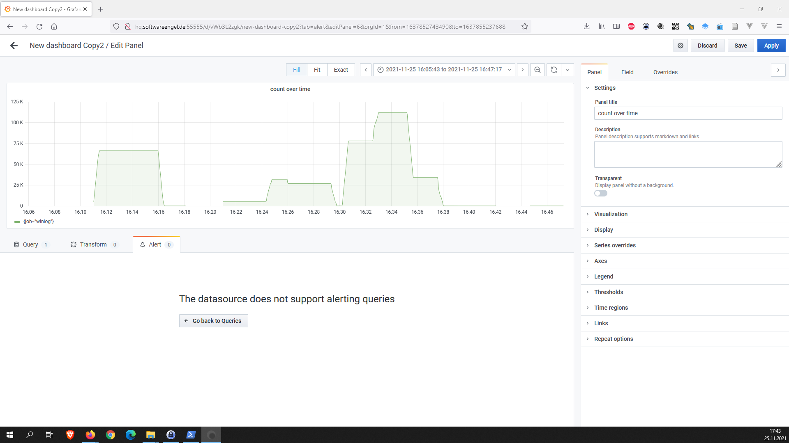

# grafana-loki-luent-bit


## Grafana

- Loki Abfrage

    {job="winlog"}!="Windows-Security-Auditing" |="Aufgabe"
    
    count_over_time({job="winlog"}[5m])
    
- leider ünterstützt Loki kein Alert 



## Loki


## Fluent-bit

win-to-loki.conf 
```
[SERVICE]
    flush     1
    log_level info
    HTTP_Server  On
    HTTP_Listen  0.0.0.0
    HTTP_PORT    2020

[INPUT]
    Name                   winlog
    Channels               System,Security,Application,Setup
    Interval_Sec           1
    DB                     winlog.sqlite

[OUTPUT]
    name                   loki
    match                  *
    host                   192.168.2.43
    port                   3100
    labels                 job=winlog
```

start als Admin

.\bin\fluent-bit.exe -c .\conf\win-to-loki.conf


## Links 


