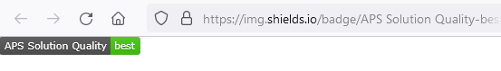
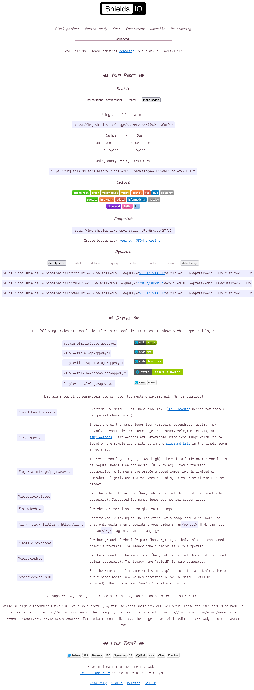
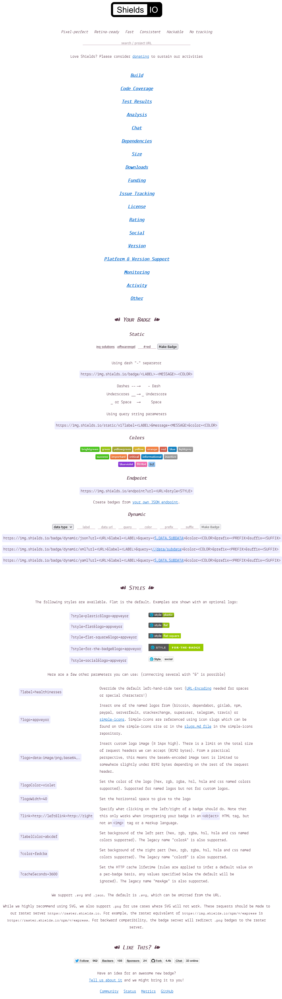

---
layout: post
title: schields - github readme - schilder 
categories: [tools, editor, webservice]
tags: [github, markdown]
--- 

# shileds.io - Github-Schilder

Schilder für Github - Readme 

Links: 

https://shields.io/
