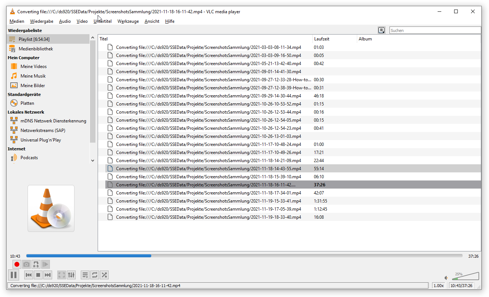
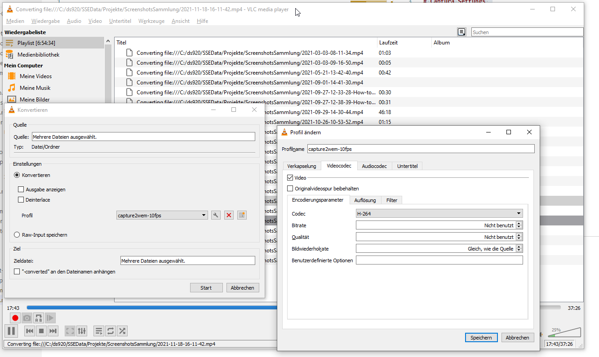
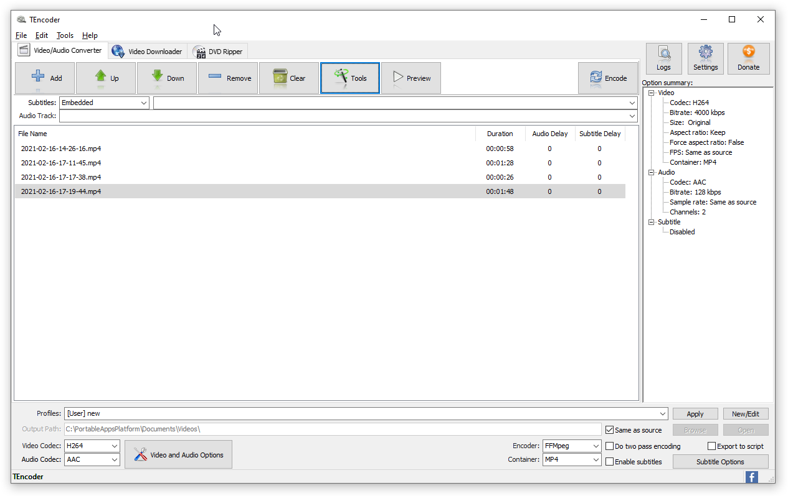
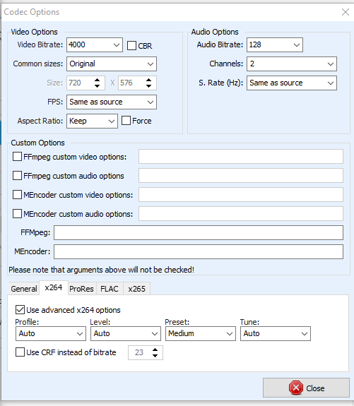
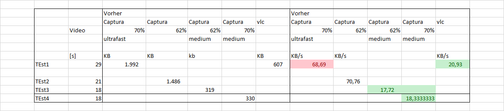

# Captura Settungs 

FPS: 10 
Quality 62 % (vorher 70%)
Settings FFmpeg: 
Pixel Format: yuv420p   
Preset:medium  (vorher = ultrafast )

# alte Video konvertieren mit vlc

von captura ultrafast auf 30 % Size mit VLC 

Alle Werte gleich lassen "speichern/konvertieren" 

# alternative TEncoder 

- und den oprions: medium 

# Ergebnis

- nur Preset von ultrafast auf medium stellen :
  

