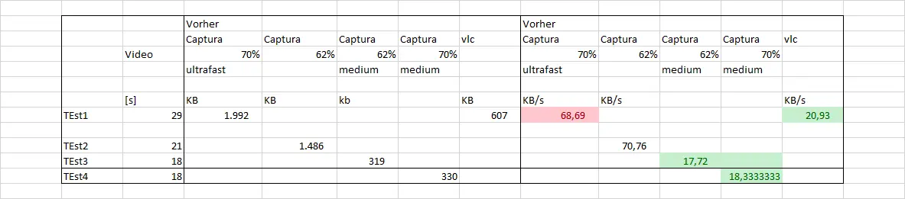
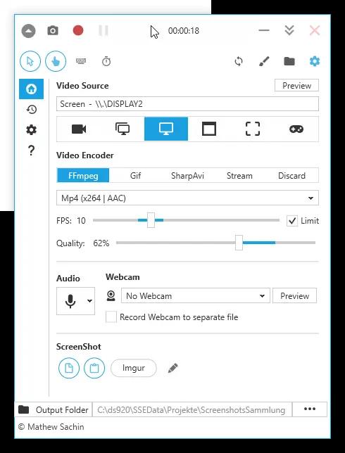
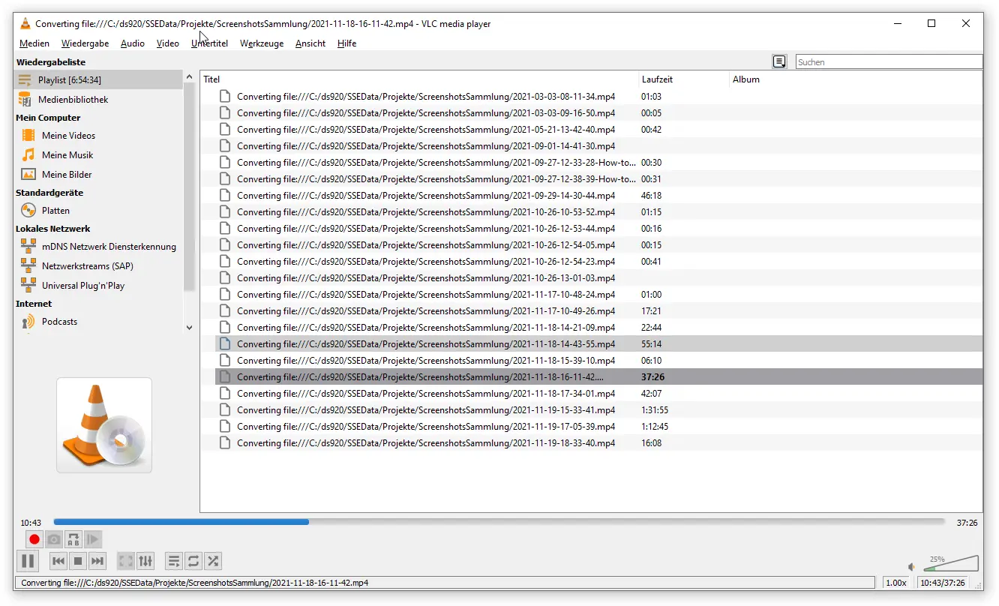
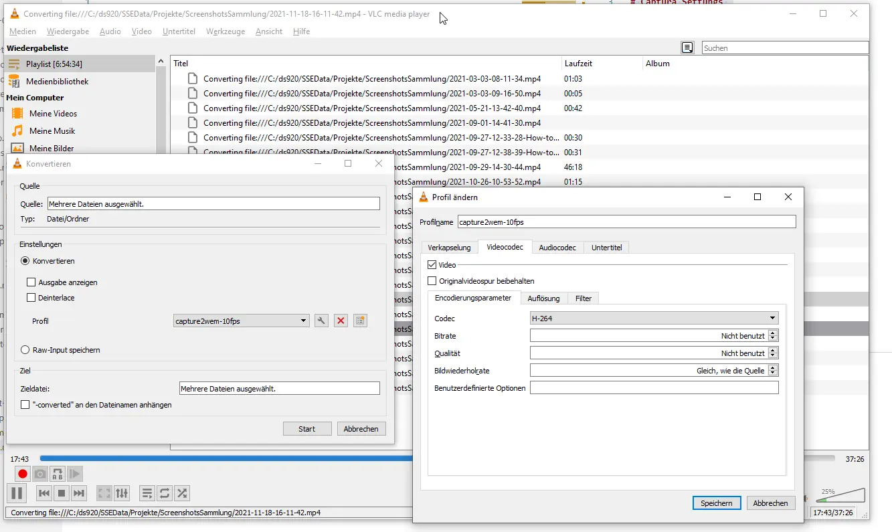
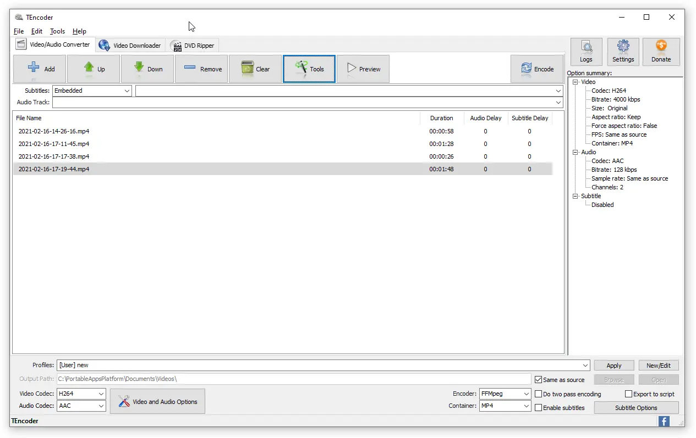
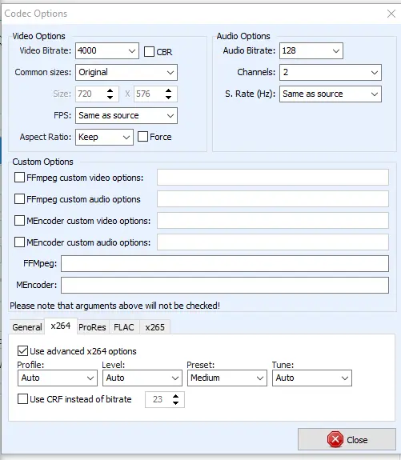

---
layout: post
title: Screen Recorder Web Optimized Output - Comparison 
categories: [Screenrecorder]
tags: [screen,recorder,tools, captura, TEncoder]
--- 

- [Screen Recorder Web Optimized Output - Quick Comparison vlc vs. TEncoder](#screen-recorder-web-optimized-output---quick-comparison-vlc-vs-tencoder)
  - [Captura Settings](#captura-settings)
  - [Alte Videos konvertieren mit vlc](#alte-videos-konvertieren-mit-vlc)
  - [Alternative TEncoder](#alternative-tencoder)
  - [Ergebnis](#ergebnis)

# Screen Recorder Web Optimized Output - Quick Comparison vlc vs. TEncoder
- input captura video 
- vlc
- TEncoder

##  Captura Settings

    FPS: 10 
    Quality 62 % (vorher 70%)
    Settings FFmpeg: 
    Pixel Format: yuv420p   
    Preset:medium  (vorher = ultrafast )

## Alte Videos konvertieren mit vlc

von captura ultrafast auf 30 % Size mit VLC 

Alle Werte gleich lassen "speichern/konvertieren"

## Alternative TEncoder 

- und den oprions: medium 

## Ergebnis

- nur Preset von Ultrafast auf Medium stellen:
  

