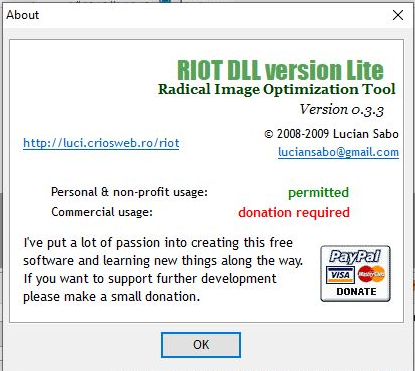
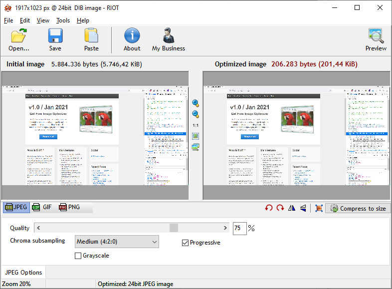
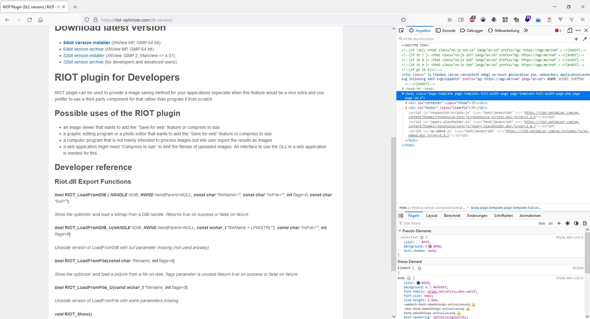
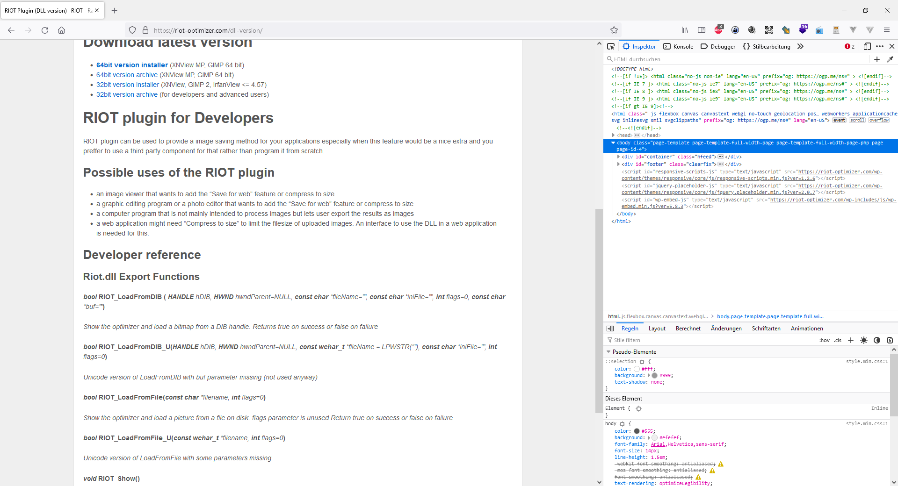

# RIOT Image Optimizer

Radical Image Optimization Tool (RIOT for short) is a free image optimizer that will let you to visually adjust compression parameters while keeping minimum filesize.

## Irfanview PLugin

Riot DLL Version 0.3.3

Start

Show Options

## Example 1: jpg (239kb -> 199 kb shrink, default settings )

Example jpg input:

Example jpg output:

## Example 2: PNG (172kb -> 173kb, growing size with default values !)

PNG Example in:

PNG Example out with default values:

Links:

* <https://riot-optimizer.com/>