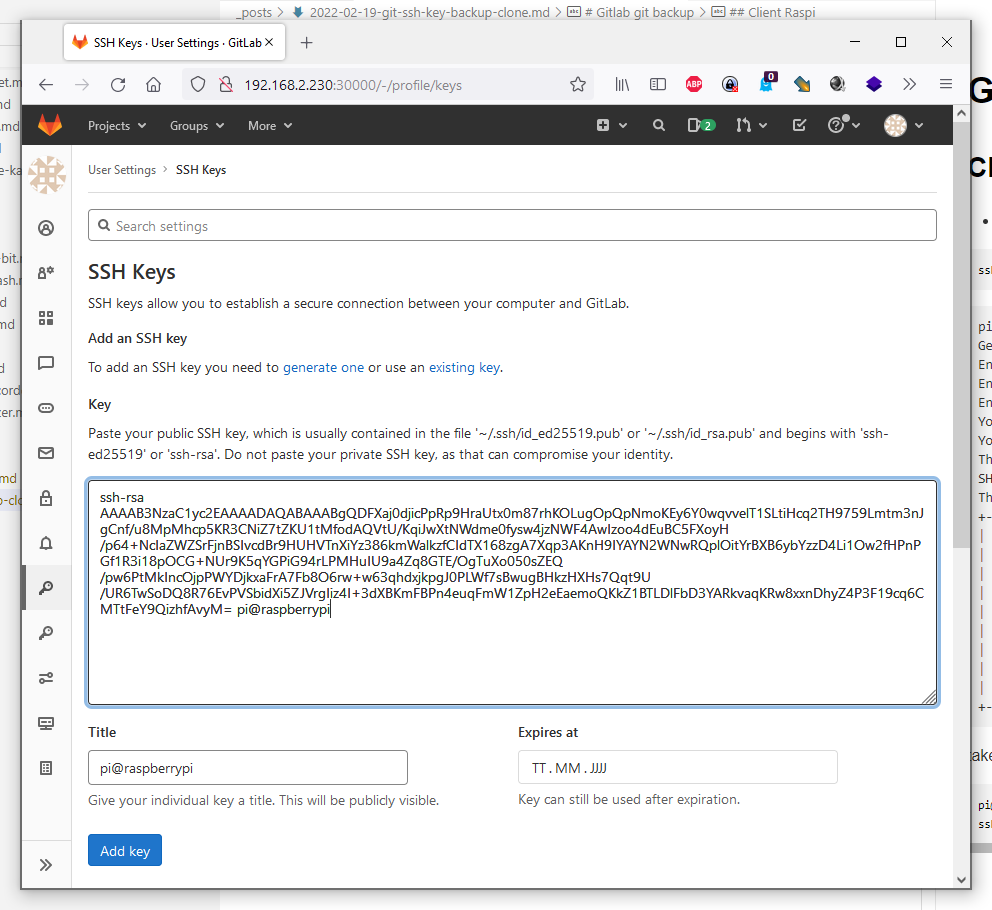
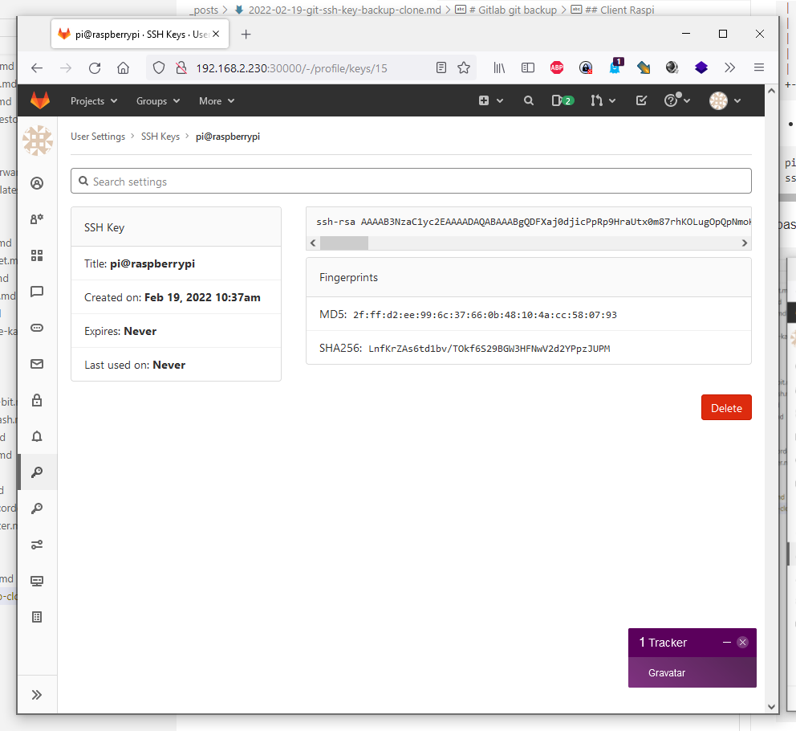

---
layout: post
title:  Gitlab git backup 
categories: [git, backup]
tags: [git, checkout, backup]
--- 
# Gitlab git backup 

## Client Raspi 

- create ssh client key 

```
ssh-keygen 
```

```bash 
pi@raspberrypi:~/git $ ssh-keygen 
Generating public/private rsa key pair.
Enter file in which to save the key (/home/pi/.ssh/id_rsa): 
Enter passphrase (empty for no passphrase): 
Enter same passphrase again: 
Your identification has been saved in /home/pi/.ssh/id_rsa
Your public key has been saved in /home/pi/.ssh/id_rsa.pub
The key fingerprint is:
SHA256:LnfKrZAs6td1bv/TOkf6S29BGW3HFNwV2d2YPpzJUPM pi@raspberrypi
The key's randomart image is:
+---[RSA 3072]----+
|             .+B&|
|            . o*X|
|             = +E|
|              Bo |
|        S     .. |
|     . o. .    ..|
|    ..=.oo.    =.|
|   ....= +o   = =|
| .o.    +o....oO+|
+----[SHA256]-----+
``` 

- take pub key from raspi client  

``` bash 
pi@raspberrypi:~/git $ cat /home/pi/.ssh/id_rsa.pub
ssh-rsa AAAAB3NzaC1yc2EAAAADAQABAAABgQDFXaj0djicPpRp9HraUtx0m87rhKOLugOpQpNmoKEy6Y0wqvvelT1SLtiHcq2TH9759Lmtm3nJgCnf/u8MpMhcp5KR3CNiZ7tZKU1tMfodAQVtU/KqiJwXtNWdme0fysw4jzNWF4AwIzoo4dEuBC5FXoyH/p64+NcIaZWZSrFjnBSIvcdBr9HUHVTnXiYz386kmWalkzfCIdTX168zgA7Xqp3AKnH9IYAYN2WNwRQplOitYrBXB6ybYzzD4Li1Ow2fHPnPGf1R3i18pOCG+NUr9K5qYGPiG94rLPMHuIU9a4Zq8GTE/OgTuXo050sZEQ/pw6PtMkIncOjpPWYDjkxaFrA7Fb8O6rw+w63qhdxjkpgJ0PLWf7sBwugBHkzHXHs7Qqt9U/UR6TwSoDQ8R76EvPVSbidXi5ZJVrgIiz4I+3dXBKmFBPn4euqFmW1ZpH2eEaemoQKkZ1BTLDlFbD3YARkvaqKRw8xxnDhyZ4P3F19cq6CMTtFeY9QizhfAvyM= pi@raspberrypi
```

paste pub key in gitlab user profile





- test client 

``` bash
pi@raspberrypi:~/git $ git clone ssh://git@hq.softwareengel.de/en/do.git
Cloning into 'do'...
remote: Enumerating objects: 393, done.
remote: Counting objects: 100% (393/393), done.
remote: Compressing objects: 100% (233/233), done.
remote: Total 803 (delta 233), reused 281 (delta 149), pack-reused 410
Receiving objects: 100% (803/803), 5.27 MiB | 278.00 KiB/s, done.
Resolving deltas: 100% (503/503), done.
```

- install python_gitlab

``` bash
pi@raspberrypi:~/xaas $ pip install python_gitlab
Looking in indexes: https://pypi.org/simple, https://www.piwheels.org/simple
Collecting python_gitlab
  Downloading https://www.piwheels.org/simple/python-gitlab/python_gitlab-3.1.1-py3-none-any.whl (119 kB)
     |████████████████████████████████| 119 kB 512 kB/s 
Collecting requests-toolbelt>=0.9.1
  Downloading https://www.piwheels.org/simple/requests-toolbelt/requests_toolbelt-0.9.1-py2.py3-none-any.whl (54 kB)
     |████████████████████████████████| 54 kB 494 kB/s 
Requirement already satisfied: requests>=2.25.0 in /usr/lib/python3/dist-packages (from python_gitlab) (2.25.1)
Installing collected packages: requests-toolbelt, python-gitlab
  WARNING: The script gitlab is installed in '/home/pi/.local/bin' which is not on PATH.
  Consider adding this directory to PATH or, if you prefer to suppress this warning, use --no-warn-script-location.
Successfully installed python-gitlab-3.1.1 requests-toolbelt-0.9.1
```

```bash 
pi@raspberrypi:~/xaas $ pip install python_gitlab[autocompletion]
Looking in indexes: https://pypi.org/simple, https://www.piwheels.org/simple
Requirement already satisfied: python_gitlab[autocompletion] in /home/pi/.local/lib/python3.9/site-packages (3.1.1)
Requirement already satisfied: requests>=2.25.0 in /usr/lib/python3/dist-packages (from python_gitlab[autocompletion]) (2.25.1)
Requirement already satisfied: requests-toolbelt>=0.9.1 in /home/pi/.local/lib/python3.9/site-packages (from python_gitlab[autocompletion]) (0.9.1)
Collecting argcomplete<3,>=1.10.0
  Downloading https://www.piwheels.org/simple/argcomplete/argcomplete-2.0.0-py2.py3-none-any.whl (37 kB)
Installing collected packages: argcomplete
Successfully installed argcomplete-2.0.0
```