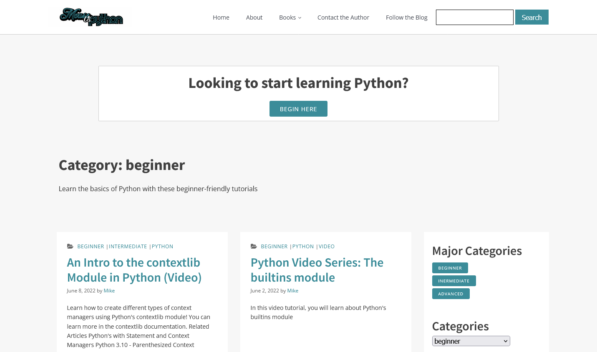

# Python links 

- Heise Orientierung im Python-Dschungel 
https://www.heise.de/select/ix/2017/06/softlinks/124 

- Python Books 
  https://pythonbooks.revolunet.com/

- Python 3  Standanrd Lib content  https://docs.python.org/3/library/index.html

-  Python 3 The Language Reference https://docs.python.org/3/reference/index.html

## Python Learning Lib 

https://www.blog.pythonlibrary.org/category/beginner/

  

## awesome-python

Python Tools and Libs 

https://github.com/vinta/awesome-python

  
